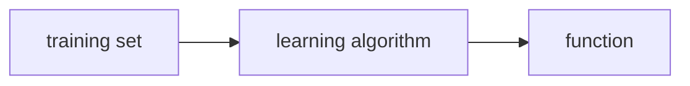

# MLS - C1 - Week 1
## Overview
Welcome to the Machine Learning Specialization! You're joining millions of others who have taken either this or the original course, which led to the founding of Coursera, and has helped millions of other learners, like you, take a look at the exciting world of machine learning!

---

### Learning Objectives
- Define machine learning
- Define supervised learning
- Define unsupervised learning
- Write and run Python code in Jupyter Notebooks
- Define a regression model
- Implement and visualize a cost function
- Implement gradient descent
- Optimize a regression model using gradient descent

---
---

## What is [[Machine Learning]]? 🤖
```ad-quote
"Machine learning is the field of study that gives computers the ability to learn without being explicitly programmed."
Arthur Samuel, 1950
```

#question If Arthur Samuel's checkers-playing program had been allowed to play only 10 games (instead of tens of thousands games) against itself, how would this have affected its performance?
- Would have made it worse ✅
- Would have made it better

> In general, the more opportunities you give a learning algorithm to learn, the better it will perform. 

There 2 main types of ML:
1. [[Supervised Learning]]
2. [[Unsupervised Learning]]

By far, the most used types of learning algorithms today are supervised learning, unsupervised learning, and recommender systems. In machine learning, making sure you have the tools is really important and so is making sure that you know how to apply the tools of machine learning effectively. 

---

## [[Supervised Learning]] Part 1
Supervised machine learning or more commonly, supervised learning, refers to algorithms that learn $x$ to $y$ or `input -> output` mappings. The key characteristic of supervised learning is that ==you give your learning algorithm examples to learn from==. That includes the *right answers*, whereby right answer, the correct label $y$ for a given input $x$, and is by seeing correct pairs of input $x$ and desired output label $y$ that the learning algorithm eventually learns to take just the input alone without the output label and gives a reasonably accurate prediction or guess of the output.

Some examples of such algorithms:

| Input             | Output            | Application             |
| ----------------- | ----------------- | ----------------------- |
| email             | spam (0/1)        | [[Spam Filter]]         |
| audio clip        | text transcript   | [[Speech Recognition]]  |
| English           | Spanish           | [[Machine Translation]] |
| ad, user info     | click (0/1)       | [[Online Advertising]]  |
| image, radar info | positions of cars | [[Autonomous Vehicle]]  |
| image of product  | defect (0/1)      | [[Visual Inspection]]   |

In all of these applications, you will first train your model with examples of inputs $x$ and the right answers, that is the labels $y$. After the model has learned from these input, output, or $x$ and $y$ pairs, they can then take a brand new input $x$, something it has never seen before, and try to produce the appropriate corresponding output $y$. 

---

### Predicting Housing Prices 🏘️
Say you want to predict housing prices based on the size of the house. You've collected some data and say you plot the data and it looks like this. 

<p align="center"></p>

One thing a learning algorithm might be able to do is fitting a straight line. But fitting a straight line isn't the only learning algorithm you can use. There are others that could work better for this application. For example, instead of fitting a straight line, you might decide that it's better to fit a curve, a function that's slightly more complicated or more complex than a straight line. ==The task of the learning algorithm is to produce more right answers.==

To define a little bit more terminology, this housing price prediction is the particular type of supervised learning called [[Regression (Statistics)]]. By regression, I mean we're trying to predict a number from infinitely many possible numbers such as the house prices in our example, which could be 150,000 or 70,000 or 183,000 or any other number in between. 

But there's also a second major type of supervised learning problem called [[Classification (Statistics)]].

---

## [[Supervised Learning]] Part 2
There's a second major type of supervised learning algorithm called a classification algorithm. Take breast cancer detection as an example of a classification problem. Using a patient's medical records your machine learning system tries to figure out if a tumor that is a lump is:
- **malignant:** meaning cancerous or dangerous
- **benign:** meaning that it's just a lump that isn't cancerous and isn't that dangerous

So maybe your dataset has tumors of various sizes. And these tumors are labeled as either benign, which I will designate in this example with a 0 or malignant, which will designate in this example with a 1 (the online graph doesn't match description).

<p align="center"></p>

---

### Regression vs. Classification 🆚
One reason that this is different from regression is that ==we're trying to predict only a small number of possible outputs or categories==, unlike regression where you can have infinite number of possibilities. so the fact that there are only two possible outputs is what makes this classification. 

It turns out that in classification problems you can also have more than two possible output categories. Maybe you're learning algorithm can output multiple types of cancer diagnosis if it turns out to be malignant. 

> Classes or categories both refer to the outputs and are the same thing.

So to summarize: ==classification algorithms predict categories.== Categories don't have to be numbers. It could be non numeric for example, it can predict whether a picture is that of a cat or a dog. And it can predict if a tumor is benign or malignant. Categories can also be numbers like 0, 1 or 0, 1, 2. You can also use more than one input value to predict an output. So the learning algorithm has to decide how to fit a boundary line through this data. 

Supervised learning maps input x to output y, where the learning algorithm learns from the quote right answers. In a regression application like predicting prices of houses, the learning algorithm has to predict numbers from infinitely many possible output numbers. Whereas in classification the learning algorithm has to make a prediction of a category, all of a small set of possible outputs. 

#question Supervised learning is when we give our learning algorithm the right answer $y$ for each example to learn from.  Which is an example of supervised learning?
- Calculating the average age of a group of customers.
- Spam filtering ✅

> For instance, emails labeled as "spam" or "not spam" are examples used for training a supervised learning algorithm. The trained algorithm will then be able to predict with some degree of accuracy whether an unseen email is spam or not.


Next there's a second major type of machine learning called [[Unsupervised Learning]].

---
---

## [[Unsupervised Learning]] Part 1
When the given data isn't associated with output labels such as $y$, our job would be ==to find some structure== or some pattern or just find something interesting in the data. This is unsupervised learning, we call it unsupervised because we're not trying to supervise the algorithm. 

An unsupervised learning algorithm, might decide that the data can be assigned to two different groups or two different clusters. And so it might decide, that there's one cluster what group over here, and there's another cluster or group over here. This is a particular type of unsupervised learning, called a [[Clustering (Analysis)]] algorithm. Because it places the unlabeled data, into different clusters and this turns out to be used in many applications. 

In unsupervised learning, we're not telling the algorithm in advance, that there is a type one person with certain characteristics. Or a type two person with certain characteristics, instead what we're saying is here's a bunch of data. I don't know what the different types of people are but can you automatically find structure into data.

To summarize a clustering algorithm: ==is a type of unsupervised learning algorithm, takes data without labels and tries to automatically group them into clusters.==

---

## [[Unsupervised Learning]] Part 2
Whereas in supervised learning, the data comes with both inputs $x$ and input labels $y$, in unsupervised learning, the data comes only with inputs $x$ but not output labels $y$, and the algorithm has to find some structure or some pattern or something interesting in the data. 

In this specialization, you'll learn about clustering as well as two other types of unsupervised learning:
1. [[Anomaly Detection]]: which is used to detect unusual events. This turns out to be really important for fraud detection in the financial system, where unusual events, unusual transactions could be signs of fraud and for many other applications.
2. [[Dimensionality Reduction]]: This lets you take a big data-set and almost magically compress it to a much smaller data-set while losing as little information as possible. 

#question Of the following examples, which would you address using an unsupervised learning algorithm?  (Check all that apply.)
- Given a set of news articles found on the web, group them into sets of articles about the same stories. ☑️ ✅
- Given email labeled as spam/not spam, learn a spam filter.
- Given a database of customer data, automatically discover market segments and group customers into different market segments. ☑️ ✅
- Given a dataset of patients diagnosed as either having diabetes or not, learn to classify new patients as having diabetes or not.

> Both answers are examples of clustering algorithms. However, the other 2 are supervised learning problems.

---
---

## Jupyter Notebooks 🐍
Just some explanations regarding how Jupyter Notebooks work.

---

### Optional Lab:  Brief Introduction to Python and Jupyter Notebooks
Welcome to the first optional lab! 
Optional labs are available to:
- provide information - like this notebook
- reinforce lecture material with hands-on examples
- provide working examples of routines used in the graded labs

#### Goals
In this lab, you will:
- Get a brief introduction to Jupyter notebooks
- Take a tour of Jupyter notebooks
- Learn the difference between markdown cells and code cells
- Practice some basic python

The easiest way to become familiar with Jupyter notebooks is to take the tour available above in the Help menu.

Jupyter notebooks have two types of cells that are used in this course. Cells such as this which contain documentation called `Markdown Cells`. The name is derived from the simple formatting language used in the cells. You will not be required to produce markdown cells. Its useful to understand the `cell pulldown` shown in graphic below. Occasionally, a cell will end up in the wrong mode and you may need to restore it to the right state.

The other type of cell is the `code cell` where you will write your code:

```python
#This is  a 'Code' Cell
print("This is  code cell")
```
`This is code cell`

#### Python
You can write your code in the code cells. 
To run the code, select the cell and either
- hold the shift-key down and hit 'enter' or 'return'
- click the 'run' arrow above

#### Print statement
Print statements will generally use the python f-string style.  
Try creating your own print in the following cell.  
Try both methods of running the cell.

```python
# print statements
variable = "right in the strings!"
print(f"f strings allow you to embed variables {variable}")
```
`f strings allow you to embed variables right in the strings!`

---
---

## Quiz: [[Supervised Learning]] vs. [[Unsupervised Learning]] 
1. Which are the two common types of supervised learning? (Choose two)
	1. Classification ☑️✅
	2. Regression ☑️✅
	3. Clustering
2. Which of these is a type of unsupervised learning?
	1. Clustering ✅
	2. Classification
	3. Regression

---
---

## [[Linear Regression]] Model Part 1
Linear regression means fitting a straight line to your data. It's probably the most widely used learning algorithm in the world today. Let's look at a house price and size graph:

<p align="center"></p>

---

### Create Models from Datasets
One thing you could do this, you can build a linear regression model from this dataset. Your model will fit a straight line to the data. We call this supervised learning because you are first training a model by giving a data that has right answers because you get the model examples of houses with both the size of the house, as well as the price that the model should predict for each house. 

This linear regression model is a particular type of supervised learning model. It's called regression model because it predicts numbers as the output like prices in dollars. Any supervised learning model that predicts a number such as 220,000 or 1.5 or negative 33.2 is addressing what's called a regression problem. Linear regression is one example of a regression model. 

```ad-tip
title: Reminder
Just to remind you, in contrast with the regression model, the other most common type of supervised learning model is called a classification model. Classification model predicts categories or discrete categories, such as predicting if a picture is of a cat, meow or a dog, woof, or if given medical record, it has to predict if a patient has a particular disease. 

---

As a reminder about the difference between classification and regression, in classification, there are only a small number of possible outputs; whereas in regression, there are infinitely many possible numbers that the model could output
```

Let's draw the data table for our graph:

| Item | $x$ Size ($\rm{feet}^{2})$ | $y$ Price ($1,000 \, \$$) |
| ---- | -------------------------- | ------------------------- |
| 1    | 2104                       | 400                       |
| 2    | 1416                       | 232                       |
| 3    | 852                        | 178                       |
| ...  | ...                        | ...                       |
| 47   | 3210                       | 870                       | 

Notice that the horizontal and vertical axis correspond to these two columns, the size and the price. 

The dataset that you just saw and that is used to train the model is called a [[Training Set (AI)]]. Note that your client's house is not in this dataset because it's not yet sold, so no one knows what the price is. To predict the price of your client's house, you first train your model to learn from the training set and that model can then predict your client's houses price. 

The standards in ML are:
- $x$ = "input" variable, feature, input feature
- $y$ = "output" variable, "target" variable
- $m$ = total number of training examples
- $\left( x , y \right)$ = single training example
- $\left( x^{(i)} , y^{(i)} \right)$ = $i^{\rm{th}}$ training example

Therefore, in our example, we can write the second training example as:
$$\left( x^{(2)} , y^{(2)} \right) = \left( 1416, 232 \right)$$

```ad-attention
Don't mistake this notation with exponentiation!
```

Just to note, this superscript $i$ in parentheses (or  $x^{(i)}$) is not an [[Exponential Function]]. When I write this, this is not $x^2$ (or x to the power 2). It just refers to the second training example. This $i$, is just an index into the training set and refers to row $i$ in the table. 

---

### [[Linear Regression]] Model Part 2
Recall that a training set in supervised learning includes:
1. **input features:** such as the size of the house
2. **output targets:** such as the price of the house

The output targets are the right answers to the model we'll learn from. To train the model, you feed the training set, both the input features and the output targets to your learning algorithm. Then your supervised learning algorithm will produce some function. 



We denote our function as $f$. Historically, this function used to be called a hypothesis, but I'm just going to call it a function f in this class.

The job of $f$ is to take a new input $x$ and output an estimate or a prediction, known as $\hat{y}$ (y-hat), and it's written like the variable y with this little hat symbol on top. ==The convention in machine learning is that $\hat{y}$ is the **estimate/prediction** for $y$==. The function $f$ is called the *model*. $x$ is called the *input* or the *input feature*, and the output of the model is the *prediction*, $\hat{y}$.

$$x \longrightarrow f \longrightarrow \hat{y}$$

The model's prediction is the estimated value of $y$. When the symbol is just the letter $y$, then that refers to the target, which is the *actual true value* in the training set. In contrast, $\hat{y}$ is an *estimate*. It may or may not be the actual true value. Well, if you're helping your client to sell the house, well, the true price of the house is unknown until they sell it. 

Now what is the math formula for our function? For now, let's stick with $f$ being a straight line. The function can be written as: 
$$f_{w, b} (x) = wx + b$$

For now, $w$ and $b$ are numbers, and the values chosen for them will determine the prediction $\hat{y}$ based on the input feature $x$. This $f_{w , b}$ of $x$ means $f$ is a function that takes $x$ as input, and depending on the values of $w$ and $b$, will output some value of a prediction $\hat{y}$. For the sake of simplicity: 
$$f_{w, b} (x) = f(x) = wx + b$$

Here's what this function is doing, it's making predictions for the value of $y$ using a streamline function of $x$. Since this is a straight-line, it's called a [[Linear Regression]]. More specifically, this is linear regression with *one variable*, where the phrase one variable means that there's a **single input variable** or feature $x$, namely the size of the house. Another name for a linear model with one input variable is *univariate* linear regression, where *uni* means one in Latin, and where *variate* means variable. 

#question For linear regression, the model is represented by $f_{w,b} (x) = wx+b$.  Which of the following is the output or "target" variable?
- $x$
- $y$ ✅
- $\hat{y}$
- $m$

> $y$ is the true value for that training example, referred to as the output variable, or “target”.

---

```ad-note
title:Optional Lab
```
### Optional Lab: Model Representation
#### Goals
In this lab you will:
- Learn to implement the model $f_{w,b}$ for linear regression with one variable

#### Notation
Here is a summary of some of the notation you will encounter.  

| General  <br />  Notation   | Description | Python (if applicable) |
| :---------------------------------------------------------: | ---------------------------: | -: |
| $a$ | scalar, non bold                                                      ||
| $\mathbf{a}$ | vector, bold                                                      ||
| **Regression** |         |    |     |
|  $\mathbf{x}$ | Training Example feature values (in this lab - Size (1000 sqft))  | `x_train` |   
|  $\mathbf{y}$  | Training Example  targets (in this lab Price (1000s of dollars)).  | `y_train` 
|  $x^{(i)}$, $y^{(i)}$ | $i_{th}$Training Example | `x_i`, `y_i`|
| m | Number of training examples | `m`|
|  $w$  |  parameter: weight,                                 | `w`    |
|  $b$           |  parameter: bias                                           | `b`    |     
| $f_{w,b}(x^{(i)})$ | The result of the model evaluation at $x^{(i)}$ parameterized by $w,b$: $f_{w,b}(x^{(i)}) = wx^{(i)}+b$  | `f_wb` | 

The python libraries needed:
```python
import numpy as np
import matplotlib.pyplot as plt
plt.style.use('./deeplearning.mplstyle')
```

Our initial 2 points:

| Size (1000 sqft)     | Price (1000s of dollars) |
| :-------------------:| :------------------------: |
| 1.0               | 300                      |
| 2.0               | 500                      |

Create your `x_train` and `y_train` variables. The data is stored in one-dimensional NumPy arrays.
```python
# x_train is the input variable (size in 1000 square feet)
# y_train is the target (price in 1000s of dollars)
x_train = np.array([1.0, 2.0])
y_train = np.array([300.0, 500.0])
print(f"x_train = {x_train}")
print(f"y_train = {y_train}")
```
`x_train = [1. 2.]`
`y_train = [300. 500.]`

> **Note**: The course will frequently utilize the python 'f-string' output formatting described [here](https://docs.python.org/3/tutorial/inputoutput.html) when printing. The content between the curly braces is evaluated when producing the output.

#### Number of training examples `m`
You will use `m` to denote the number of training examples. Numpy arrays have a `.shape` parameter. `x_train.shape` returns a python tuple with an entry for each dimension. `x_train.shape[0]` is the length of the array and number of examples as shown below.
```python
# m is the number of training examples
print(f"x_train.shape: {x_train.shape}")
m = x_train.shape[0]
print(f"Number of training examples is: {m}")
```
`x_train.shape: (2,)`
`Number of training examples is: 2`

Or use `len()`:
```python
# m is the number of training examples
m = len(x_train)
print(f"Number of training examples is: {m}")
```
`Number of training examples is: 2`

#### Training example `x_i, y_i`
You will use (x$^{(i)}$, y$^{(i)}$) to denote the $i^{th}$ training example. Since Python is zero indexed, (x$^{(0)}$, y$^{(0)}$) is (1.0, 300.0) and (x$^{(1)}$, y$^{(1)}$) is (2.0, 500.0). 

To access a value in a Numpy array, one indexes the array with the desired offset. For example the syntax to access location zero of `x_train` is `x_train[0]`.
Run the next code block below to get the $i^{th}$ training example.
```python
i = 0 # Change this to 1 to see (x^1, y^1)

x_i = x_train[i]
y_i = y_train[i]
print(f"(x^({i}), y^({i})) = ({x_i}, {y_i})")
```
`(x^(0), y^(0)) = (1.0, 300.0)`

If you change `i=1`, you'll get:
`(x^(1), y^(1)) = (2.0, 500.0)`

You can plot these two points using the `scatter()` function in the `matplotlib` library, as shown in the cell below. 
- The function arguments `marker` and `c` show the points as red crosses (the default is blue dots).

You can use other functions in the `matplotlib` library to set the title and labels to display
```python
# Plot the data points
plt.scatter(x_train, y_train, marker='x', c='r')
# Set the title
plt.title("Housing Prices")
# Set the y-axis label
plt.ylabel('Price (in 1000s of dollars)')
# Set the x-axis label
plt.xlabel('Size (1000 sqft)')
plt.show()
```

> Since it's time consuming to to represent each graph or result, I'll just paste the python code here, but not the outputs of it. All OpenLab files can be found and accessed easily.

As described in lecture, the model function for linear regression (which is a function that maps from `x` to `y`) is represented as 
$$f_{w,b}(x^{(i)}) = wx^{(i)} + b$$

```python
w = 100
b = 100
print(f"w: {w}")
print(f"b: {b}")
```

Now, let's compute the value of $f_{w,b}(x^{(i)})$ for your two data points. You can explicitly write this out for each data point as:
- for $x^{(0)}$, `f_wb = w * x[0] + b`
- for $x^{(1)}$, `f_wb = w * x[1] + b`

For a large number of data points, this can get unwieldy and repetitive. So instead, you can calculate the function output in a `for` loop as shown in the `compute_model_output` function below.
> **Note**: The argument description `(ndarray (m,))` describes a Numpy n-dimensional array of shape (m,). `(scalar)` describes an argument without dimensions, just a magnitude.  
> **Note**: `np.zero(n)` will return a one-dimensional numpy array with $n$ entries   

```python
def compute_model_output(x, w, b):
    """
    Computes the prediction of a linear model
    Args:
      x (ndarray (m,)): Data, m examples 
      w,b (scalar)    : model parameters  
    Returns
      y (ndarray (m,)): target values
    """
    m = x.shape[0]
    f_wb = np.zeros(m)
    for i in range(m):
        f_wb[i] = w * x[i] + b
        
    return f_wb
```

Call the function:
```python
tmp_f_wb = compute_model_output(x_train, w, b,)

# Plot our model prediction
plt.plot(x_train, tmp_f_wb, c='b',label='Our Prediction')

# Plot the data points
plt.scatter(x_train, y_train, marker='x', c='r',label='Actual Values')

# Set the title
plt.title("Housing Prices")
# Set the y-axis label
plt.ylabel('Price (in 1000s of dollars)')
# Set the x-axis label
plt.xlabel('Size (1000 sqft)')
plt.legend()
plt.show()
```

For `w=b=100` the line does *not* fit the data. We can try to manually change the numbers. After some tweaking, one can find the best fit line by having `w=200`, `b=100`

After finding the proper `w` and `b`:
```python
w = 200                         
b = 100    
x_i = 1.2
cost_1200sqft = w * x_i + b    

print(f"${cost_1200sqft:.0f} thousand dollars")
```

#### Congratulations! 🎉
In this lab you have learned:
 - Linear regression builds a model which establishes a relationship between features and targets
     - In the example above, the feature was house size and the target was house price
     - for simple linear regression, the model has two parameters $w$ and $b$ whose values are 'fit' using *training data*.
     - once a model's parameters have been determined, the model can be used to make predictions on novel data.

---
---

## [[Cost Function (Mathematics)]] Formula
In order to implement linear regression the first key step is first to define something called a [[Cost Function (Mathematics)]]. The cost function will tell us how well the model is doing so that we can try to get it to do better. 

To introduce a little bit more terminology, $w$ and $b$ are called the *parameters* of the model. In machine learning, parameters of the model are the variables you can adjust during training in order to improve the model. Sometimes you also hear the parameters $w$ and $b$ referred to as *coefficients* or as *weights*. Depending on the values you've chosen for $w$ and $b$, you get a different function $f(x)$, which generates a different line on the graph.

<br>

---

### The Use of Linear Regression
With linear regression, what you want to do is to choose values for the parameters $w$ and $b$ so that the straight line you get from the function $f$ somehow fits the data well.

<br>

---

### How to Find $w$ & $b$?
As we defined earlier:
$$\hat{y}^{(i)} = f_{w,b} \left( x^{(i)} \right) = w x^{(i)} + b$$

Now the question is how do you find values for $w$ and $b$ so that the prediction $\hat{y}^{(i)}$ is close to the true target $y^{(i)}$ for many or maybe all training examples $\left( x^{(i)} , y^{(i)} \right)$? 

To answer that question, let's first take a look at how to measure how well a line fits the training data. To do that, we're going to construct a [[Cost Function (Mathematics)]]. The cost function takes the prediction $\hat{y}$ and compares it to the target $y$ by:
$${\rm{error}} := \hat{y}^{(i)} - y^{(i)}$$

This difference is called the *error*. We're measuring how far off to prediction is from the target. Next, let's compute the square of this error. Also, we're going to want to compute this term for different training examples $i$ in the training set. Finally, we want to measure the error across the entire training set. In particular, the summation of squared errors. We'll sum from $i = 1$ all the way up to $m$ (and remember that $m$ is the number of training examples). Notice that if we have more training examples $m$ is larger and your cost function will calculate a bigger number. By convention, we will compute the *average squared error* instead of the total squared error and we do that by dividing by $m$, also, the cost function that machine learning people use actually divides by $2m$. The extra division by 2 is just meant to make some of our later calculations look neater, but the cost function still works whether you include this division by 2 or not. 
$$J(w,b) = \frac{1}{2m} \sum_{i=1}^{m} \left( \hat{y}^{(i)} - y^{(i)} \right)^2$$

> This is also called the squared error cost function, and it's called this because you're taking the square of these error terms. 

Just a quick note, we can rewrite the $J$ function as:
$$J(w,b) = \frac{1}{2m} \sum\limits_{i=1}^{m} (f_{w,b}(x^{(i)}) - y^{(i)})^2$$

#question Based on the cost function used for linear regression, which of these are the parameters of the model that can be adjusted?
$$J(w,b) = \frac{1}{2m} \sum\limits_{i=1}^{m} (f_{w,b}(x^{(i)}) - y^{(i)})^2$$
- $w$ and $b$ ✅
- $f_{w,b}(x^{(i)})$
- $w$ only, because we should choose $b=0$
- $\hat{y}$

> $w$ and $b$ are parameters of the model, adjusted as the model learns from the data. They’re also referred to as “coefficients” or “weights”

But what is $J(w,b)$ really computing?

---

## [[Cost Function (Mathematics)]] Intuition
Depending on the values chosen for the parameters $w$ and $b$, you get different straight lines. You want to find values for your parameters, so that the straight line fits the training data well. To measure how well a choice of the parameters fit the training data, you have a cost function $J$. What the cost function $J$ does is, it measures the difference between the model's predictions, and the actual true values for $y$. 
- Model: $$f_{w,b} (x) = wx + b$$
- Parameters: $$w \quad \textrm{and} \quad b$$
- Cost function: $$J(w,b) = \frac{1}{2m} \sum\limits_{i=1}^{m} (f_{w,b}(x^{(i)}) - y^{(i)})^2$$
- Goal: $$\underset{w,b}{\textrm{minimize}} \ J(w,b)$$

Now we try to simplify this procedure using only $w$ (i.e. $b=0$) and write:
- Model: $$f_w (x) = wx$$
- Parameters: $$w \quad (b=0)$$
- Cost function: $$J(w) = \frac{1}{2m} \sum\limits_{i=1}^{m} (f_{w}(x^{(i)}) - y^{(i)})^2$$

When the parameter $w$ is fixed, that is, is always a constant value, then $f_w$ is only a function of $x$, which means that the estimated value of y depends on the value of the input $x$. 

---

### Graphing Time! 📈
Let's say our real data points are: $(1,1) , (2,2) , (3,3)$, meaning that $m=$.
Now, if we let $w=1$, then we would have the 🔵 line. Since this would fit the line perfectly to our data (because of how we chose this example), the error would be zero, or:
$$J(0) = \frac{1}{2 \times 3} \sum\limits_{i=1}^{3} (f_{0}(x^{(i)}) - y^{(i)})^2 = \frac{1}{6} \times 0 = 0$$

You can choose $w$ as other values as well, such as $w=0.5$, which would give you $J(0.5) \approx 0.58$ like the 🟢 line

If you draw the graph both for $f(x)$ and $J$, you would get:
#### $f_w (x)$ as a Function of $x$
<p align="center"><iframe src="https://www.desmos.com/calculator/ps27fo9ipv?embed" width="500" height="500" style="border: 1px solid #ccc" frameborder=0></iframe></p>

[link to Desmos](https://www.desmos.com/calculator/ps27fo9ipv)

---

#### $J(w)$ as a Function of $w$
<p align="center"><iframe src="https://www.desmos.com/calculator/q4xpn6frpo?embed" width="500" height="500" style="border: 1px solid #ccc" frameborder=0></iframe></p>

[link to Desmos](https://www.desmos.com/calculator/q4xpn6frpo)

---

==The objective is to minimize the cost function as much as possible== (the closer it gets to zero, the better). As you vary $w$ and/or $b$, you end up with different straight lines and when that straight line passes across the data. The goal of linear regression is to find the parameters that results in the smallest possible value for the cost function $J$. 

#question When does the model fit the data relatively well, compared to other choices for parameter w?
- When $x$ is at or near a minimum.
- When $f_w(x)$ is at or near a minimum for all the values of $x$ in the training set.
- When $w$ is close to zero.
- When the cost $J$ is at or near a minimum ✅

> When the cost is relatively small, closer to zero, it means the model fits the data better compared to other choices for $w$ and $b$.

---
---

## Visualizing the [[Cost Function (Mathematics)]]
Let's go back to the original model without setting $b$ to zero.
- Model: $$f_{w,b} (x) = wx + b$$
- Parameters: $$w \quad \textrm{and} \quad b$$
- Cost function: $$J(w,b) = \frac{1}{2m} \sum\limits_{i=1}^{m} (f_{w,b}(x^{(i)}) - y^{(i)})^2$$
- Goal: $$\underset{w,b}{\textrm{minimize}} \ J(w,b)$$

Now let's check the housing price example once again. Let's say our original guess for the model is: $$f_{w,b} (x) = 0.06x + 50$$

![[/img/MLS_C1_HousePrice_CostFunction1.jpg]]

---

### The Bowl Shape 🍜
Now if you plot the graph for $J$ with respect to $w$ and $b$, it would be a 3D graph that looks like a soup bowl.

![[MLS_C1_HousePrice_CostFunction2.jpg]]

---

### Mount Fuji 🗻
Now, if you were to look at this shape from the top, you could use a [[Contour Map]] to find all the points on the line that have the same height. Just like how we can find the similar points on Mount Fuji, where the red lines represent the contour lines.

![[MLS_C1_HousePrice_CostFunction3.jpg]]

![[MLS_C1_HousePrice_CostFunction4.jpg]]

---

### Contours for the Houses
Now using the previous technique, let's see how different parameters behave.

![[MLS_C1_HousePrice_CostFunction5.jpg]]

On the upper right is a contour plot of this exact same cost function as that shown at the bottom. The two axes on this contour plots are $b$, on the vertical axis, and $w$ on the horizontal axis. What each of these ovals, also called ellipses, shows, is the center points on the 3D surface which are at the exact same height. In other words, the set of points which have the same value for the cost function $J$. To get the contour plots, you take the 3D surface at the bottom and you use a knife to slice it horizontally. You take horizontal slices of that 3D surface and get all the points, they're at the same height. Therefore, each horizontal slice ends up being shown as one of these ellipses or one of these oval.

![[MLS_C1_HousePrice_CostFunction6.jpg]]

> The bottom of the bowl, where the cost function $J$ is at a minimum, is this point right here (the blue "minimum" sign), at the center of this concentric ovals. 

---
---

## Visualization Examples
Now let's try out some different values for $w$ and $b$, and see how they behave and whether or not they're the best parameters that can minimize our cost function $j$, which would give us the best fitting line for the actual model $f_{w,b} (x)$.
1. `w=-0.15, b=800`: as you can see, it's not a very good prediction because its error is too big, and it's very distant from the center of the ovals.

![[MLS_C1_HousePrice_CostFunction7.jpg]]

2. `w=0, b=360`: even though this is better than the previous one, it's still not that good.

![[MLS_C1_HousePrice_CostFunction8.jpg]]

3. `w=0.13, b=71`: now these parameters are very good, since they're pretty close to the minimum, and the line fits the data very well (the summation of the errors is little).

![[MLS_C1_HousePrice_CostFunction9.jpg]]

---

### Is there another way to find these parameters?
Now in linear regression, rather than having to manually try to read a contour plot for the best value for w and b, which isn't really a good procedure and also won't work once we get to more complex machine learning models. What you really want is *an efficient algorithm* that you can write in code for automatically finding the values of parameters $w$ and $b$ they give you the best fit line that minimizes the cost function $J$. There is an algorithm for doing this called [[Gradient Descent]]. This algorithm is one of the most important algorithms in machine learning. Gradient descent and variations on gradient descent are used to train, not just linear regression, but some of the biggest and most complex models in all of AI. 

---

```ad-note
The rest are from the Jupyter notebook provided by Coursera.
```

### Optional Lab:  Cost Function
#### Introduction
- This optional lab will show you how the cost function is implemented in code. And given a small training set and different choices for the parameters you’ll be able to see how the cost varies depending on how well the model fits the data.
- In the optional lab, you'll also get to play with an interactive contour plot. You can use your mouse cursor to click anywhere on the contour plot, and you see the straight line defined by the values you chose, for parameters w and b. 
- Finally the optional lab also has a 3D surface plot that you can manually rotate and spin around, using your mouse cursor, to take a better look at what the cost function looks like.

```python
import numpy as np
%matplotlib widget
import matplotlib.pyplot as plt
from lab_utils_uni import plt_intuition, plt_stationary, plt_update_onclick, soup_bowl
plt.style.use('./deeplearning.mplstyle')


x_train = np.array([1.0, 2.0])           #(size in 1000 square feet)
y_train = np.array([300.0, 500.0])           #(price in 1000s of dollars)


def compute_cost(x, y, w, b): 
    """
    Computes the cost function for linear regression.
    
    Args:
      x (ndarray (m,)): Data, m examples 
      y (ndarray (m,)): target values
      w,b (scalar)    : model parameters  
    
    Returns
        total_cost (float): The cost of using w,b as the parameters for linear regression
               to fit the data points in x and y
    """
    # number of training examples
    m = x.shape[0] 
    
    cost_sum = 0 
    for i in range(m): 
        f_wb = w * x[i] + b   
        cost = (f_wb - y[i]) ** 2  
        cost_sum = cost_sum + cost  
    total_cost = (1 / (2 * m)) * cost_sum  

    return total_cost

plt_intuition(x_train,y_train)
```

![[MLS_C1_lab3_fig1.jpg]]
<br>
```python
x_train = np.array([1.0, 1.7, 2.0, 2.5, 3.0, 3.2])
y_train = np.array([250, 300, 480,  430,   630, 730,])


plt.close('all') 
fig, ax, dyn_items = plt_stationary(x_train, y_train)
updater = plt_update_onclick(fig, ax, x_train, y_train, dyn_items)
```

![[MLS_C1_lab3_fig2.jpg]]
<br>
```python
soup_bowl()
```

![[MLS_C1_lab3_fig3.jpg]]

---

### Congratulations!  🎉
You have learned the following:
 - The cost equation provides a measure of how well your predictions match your training data.
 - Minimizing the cost can provide optimal values of $w$, $b$.

---
---

## Quiz: [[Regression (Statistics)]]
1. For linear regression, the model is $f_{w,b}(x) = wx + b$. Which of the following are the inputs, or features, that are fed into the model and with which the model is expected to make a prediction?
	1. $w$ and $b$
	2. $m$
	3. $x$ ✅
	4. $(x,y)$
2. For linear regression, if you find parameters $w$ and $b$ so that $J(w,b)$ is very close to zero, what can you conclude?
	1. The selected values of the parameters cause the algorithm to fit the training set really poorly.
	2. This is never possible -- there must be a bug in the code.
	3. The selected values of the parameters cause the algorithm to fit the training set really well. ✅

> - The $x$, the input features, are fed into the model to generate a prediction $f_{w,b}(x)$
> - When the cost is small, this means that the model fits the training set well.

---
---

## [[Gradient Descent]]
It would be nice if we had a more systematic way to find the values of $w$ and $b$, that results in the smallest possible cost, $J(w,b)$. It turns out there's an algorithm called "gradient descent" that you can use to do that. Gradient descent is used all over the place in machine learning, not just for linear regression, but for training for example some of the most advanced [[Artificial Neural Network]] models, also called [[Deep Learning]] models. 
- have some function: $$J(w,b)$$
- want to: $$\underset{w,b}{\textrm{min}} \ J(w,b)$$

It turns out that gradient descent applies to more general functions, including other cost functions that work with models that have more than two parameters. 
- have higher number of parameters: $$J(w_1 , w_2, \ldots,b)$$
- want to: $$\underset{w_1 , w_2, \ldots,b}{\textrm{min}} \ J(w_1 , w_2, \ldots,b)$$

What you're going to do is just to start off with some initial guesses for $w$ and $b$. In linear regression, it won't matter too much what the initial value are, so a common choice is to set them both to 0. Then, you'll keep on changing the parameters a bit every time to try to reduce the cost $J(w,b)$ until hopefully $J$ settles at or near a minimum. 

One thing I should note is that ==for some functions $J$ that may not be a bow shape or a hammock shape, it is possible for there to be more than one possible minimum==.

For linear regression with the squared error cost function, you always end up with a bow shape or a hammock shape. But this is a type of cost function you might get if you're training a neural network model. 

![[MLS_C1_GradientDescent1.jpg]]

---

### What is our Goal? ⛳
Now, let's imagine that this surface plot is actually a view of a slightly hilly outdoor park or a golf course where the high points are hills and the low points are valleys like so. I'd like you to imagine that you are physically standing at this point on the hill. ==Your goal is to start up here and get to the bottom of one of these valleys as efficiently as possible.==

![[MLS_C1_GradientDescent2.jpg]]

Remember that you can choose a starting point at the surface by choosing starting values for the parameters $w$ and $b$. When you perform gradient descent a moment ago, you had started at the left point. Now, imagine if you try gradient descent again, but this time you choose a different starting point by choosing parameters that place your starting point just a couple of steps to the right over there.

If you then repeat the gradient descent process, then you end up in a totally different valley. This different minimum over here on the right. The bottoms of both the first and the second valleys are called "local minima" (see [[Local Minimum]]). Because if you start going down the first valley, gradient descent won't lead you to the second valley, and the same is true if you started going down the second valley, you stay in that second minimum and not find your way into the first local minimum. 

---
---

## Implementing [[Gradient Descent]]
In this context, the `=` sign is the *assignment operator* from coding (where if `a=3` then `a=a+3` means assigning the number 5 to the variable `a`). This is **different** from *truth assertion* in mathematics (where $2=2$ is correct, but $a=a-1$ is incorrect because $0 \neq 1$).
- for $w$: $$w = w - \alpha \frac{d}{dw} J(w,b)$$
- for $b$: $$b = b - \alpha \frac{d}{db} J(w,b)$$

What this expression is saying is, update your parameter $w$ by taking the current value of $w$ and adjusting it a small amount, which is this expression on the right, minus $\alpha$ times this expression (the [[Derivative]] of $J$ based on $w$): $$\frac{d}{dw} J(w,b)$$

```ad-hint

|            | Coding | Math         |
| ---------- | ------ | ------------ |
| Assignment | `=`    | $\leftarrow$ |
| Assertion  | `==`   | $=$          | 

```

In this equation, $\alpha$ is also called the [[Learning Rate (Computer Science)]]. The learning rate is usually: $$0 < \alpha < 1$$ What $\alpha$ does is, it basically controls how big of a step you take downhill. If it is very large, then that corresponds to a very aggressive gradient descent procedure where you're trying to take huge steps downhill. If it is very small, then you'd be taking small baby steps downhill. 

In combination with the learning rate $\alpha$, the derivation of $j$ also determines the size of the steps you want to take downhill. For this course, you don't need to know any [[Calculus]].

---

### Gradient Descent Algorithm
Remember in the graph of the surface plot where you're taking baby steps until you get to the bottom of the value, well, for the gradient descent algorithm, you're going to repeat these two update steps until the algorithm converges. By "converges", I mean that you reach the point at a local minimum where the parameters $w$ and $b$ no longer change much with each additional step that you take. 

One important detail is that ==for gradient descent, you want to simultaneously update $w$ and $b$==, meaning you want to **update both parameters at the same time.** You can see the correct and incorrect implementations down below:

#### Correct Implementation ✅
$\displaystyle 1. \ w_{\rm temp} = w - \alpha \frac{d}{dw} J({\color{green} w,b})$
$\displaystyle 2. \ b_{\rm temp} = b - \alpha \frac{d}{db} J({\color{green} w,b})$
$\displaystyle 3. \ w = w_{\rm temp}$
$\displaystyle 4. \ b = b_{\rm temp}$

---

#### Incorrect Implementation ❌
$\displaystyle 1. \ w_{\rm temp} = w - \alpha \frac{d}{dw} J({\color{green} w,b})$
$\displaystyle 2. \ {\color{red} w} = w_{\rm temp}$
$\displaystyle 3. \ b_{\rm temp} = b - \alpha \frac{d}{db} J({\color{red} w},b)$
$\displaystyle 4. \ b = b_{\rm temp}$

Now, one thing you may notice is that this value of $w$ gets updated (shown in 🔴). This is actually **incorrect** because it affects $b$.

---

The difference between the right-hand side and the left-hand side implementations is that if you look over here, this $w$ has already been updated to this new value, and this is updated $w$ that actually goes into the cost function $J(w,b)$. It means that this term here on the right is not the same as this term over here that you see on the left. That also means this `tmp_b` term on the right is not quite the same as the `tmp_b` term on the left, and thus this updated value for $b$ on the right is not the same as this updated value for variable $b$ on the left. 

![[MLS_C1_GradientDescent3.jpg]]

> Although some make the mistake and implement the incorrect one in the code (which sometimes might not affect the results that much), it's better to always stick to the correct method.

#question Gradient descent is an algorithm for finding values of parameters $w$ and $b$ that minimize the cost function $J$. What does this update statement do? (Assume $\alpha$ is small.) 
$$w = w - \alpha \frac{\partial J(w,b)}{\partial w}$$
- Checks whether $w$ is equal to $w - \alpha\frac{\partial J(w,b)}{\partial w}$
- Updates parameter $w$ by a small amount ✅

---
---

## [[Gradient Descent]] Intuition
As a reminder, the variable represented with the Greek symbol $\alpha$, is the learning rate. ==The learning rate controls how big of a step you take when updating the model's parameters==, $w$ and $b$. For the purposes of this course, the [[Partial Derivative]] will simply be called [[Derivative]]:
$$\frac{\partial}{\partial w} J(w,b)$$

Now let's try to visualize gradient descent with a 2D example of $J$ and $w$ axis.

![[MLS_C1_GradientDescent4.jpg]]

For a quick recap:
1. when the derivative is **positive** (having an upward slope), $w$ becomes smaller, therefore, it moves to the **left** (closer to the actual minimum that we want), meaning your cost $J$ is **decreasing**
2. when the derivative is **negative** (having a downward slope), $w$ becomes bigger (`w - (-x) = w + x`), therefore, it moves to the **right**, meaning your cost $J$ is **decreasing** once again (due to the bowl-shape nature of the graph)

#question Gradient descent is an algorithm for finding values of parameters $w$ and $b$ that minimize the cost function $J$. Assume the learning rate $\alpha$ is a small positive number. When $\frac{\partial J(w,b)}{\partial w}$ is a positive number (greater than zero) -- as shown below -- what happens to $w$ after one update step?

$$\begin{align*} \text{repeat}&\text{ until convergence:} \; \lbrace \newline
\;  w &= w -  \alpha \frac{\partial J(w,b)}{\partial w}  \; \newline 
 b &= b -  \alpha \frac{\partial J(w,b)}{\partial b}  \newline \rbrace
\end{align*}$$

- $w$ decreases ✅
- It is not possible to tell if $w$ will increase or decrease
- $w$ stays the same
- $w$ increases

> The learning rate α\alphaα is always a positive number, so if you take W minus a positive number, you end up with a new value for W that is smaller

One other key quantity in the gradient descent algorithm is the learning rate $\alpha$. How do you choose it? What happens if it's too small or what happens when it's too big? 

---
---

## [[Learning Rate (Computer Science)]]
The choice of the learning rate, $\alpha$ will have a huge impact on the efficiency of your implementation of gradient descent. And if the learning rate is chosen poorly, gradient descent may not even work at all. 

Let's see what could happen if the learning rate alpha is either too small or if it is too large. 

![[MLS_C1_GradientDescent5.jpg]]

Therefore:
1. if $\alpha$ is **too small**: gradient descent may be slow
2. if $\alpha$ is **too large**: gradient descent may overshoot, never reach minimum, and even fail to converge (i.e. diverge)

---

### What if we're already at the local minima? 🔚
So, here's another question, you may be wondering one of your parameter $w$ is already at the desired point, so that your cost $J$ is already at a local minimum. What do you think one step of gradient descent will do if you've already reached a minimum? 

![[MLS_C1_GradientDescent6.jpg]]

This means that you're at this point on the cost function $J$, and that happens to be a local minimum. Turns out if you draw attention to the function at this point, the slope of this line is zero and thus the derivative term here is equal to zero for the current value of $w$. And so you're gradient descent gets updated as:
$$w = w - \alpha \cdot 0$$
And this is the same as saying let's set $w$ to be equal to $w$. So this means that if you're already at a local minimum, gradient descent leaves $w$ unchanged. Because it just updates the new value to be the same as the old one.

So ==if your parameters have already brought you to a local minimum, then further gradient descent steps to absolutely nothing==. It doesn't change the parameters, which is what you want because it keeps the solution at that local minimum. This also explains why gradient descent can reach a local minimum, even with a fixed learning rate $\alpha$. 

![[MLS_C1_GradientDescent7.jpg]]

---

### Gradient Descent can reach Local Minimum with a Fixed Learning Rate 📉
As we get closer to a local minimum, gradient descent will automatically take smaller steps. And that's because as we approach the local minimum, the derivative automatically gets smaller. 
$$\textrm{the closer to local minimum} \Rightarrow \frac{\partial}{\partial w} J(w,b) \downarrow$$
And that means the update steps also automatically gets smaller. Even if the learning rate $\alpha$ is kept at some fixed value ($\alpha \ \rm const.$)

![[MLS_C1_GradientDescent8.jpg]]

---
---

## [[Gradient Descent]] for [[Linear Regression]]
A quick recap:
- linear regression model: $$f_{w, b} (x) = wx + b$$
- cost function: $$J(w,b) = \frac{1}{2m} \sum\limits_{i=1}^{m} (f_{w,b}(x^{(i)}) - y^{(i)})^2$$
- gradient descent algorithm: $$\begin{align*} \text{repeat}&\text{ until convergence:} \; \lbrace \newline \;  w &= w -  \alpha \frac{\partial J(w,b)}{\partial w} \; \newline b &= b -  \alpha \frac{\partial J(w,b)}{\partial b}  \newline \rbrace \end{align*}$$

![[MLS_C1_GradientDescent_LinearRegression1.jpg]]

---

### Taking Derivation
Now let's take the derivations for the parameters:
- for $w$: $$\frac{\partial}{\partial w} J(w,b) = \frac{1}{m} \sum_{i=1}^{m} \left( f_{w,b} \left( x^{(i)} \right) - y^{(i)} \right) x^{(i)}$$
- for $b$: $$\frac{\partial}{\partial b} J(w,b) = \frac{1}{m} \sum_{i=1}^{m} \left( f_{w,b} \left( x^{(i)} \right) - y^{(i)} \right)$$

![[MLS_C1_GradientDescent_LinearRegression2.jpg]]

---

#### Mathematical Proof (Optional)
The proof is not that important, but for those who are interested, since we know: $$\frac{d}{dx} U^{n} = n \cdot U^{'} \cdot U^{n-1}$$ We can find the derivative of the parameters as below:

![[MLS_C1_GradientDescent_LinearRegression3.jpg]]

> The reason we used $2m$ in the cost function formula is that to get rid of with the power 2 here.

---

### Gradient Descent Algorithm
You repeatedly carry out these updates to w and b until convergence. Remember that this $f(x)$ is a linear regression model, so as equal to $wx + b$. Just as a reminder, you want to update $w$ and $b$ simultaneously on each step. 

$$\begin{align*} \text{repeat}&\text{ until convergence:} \; \lbrace \newline
\;  w &= w -  \alpha \frac{\partial J(w,b)}{\partial w}  \; \newline 
 b &= b -  \alpha \frac{\partial J(w,b)}{\partial b}  \newline \rbrace
\end{align*}$$

---

### More than One [[Local Minimum]]
As you can remember, based on where you start, you can end up at different places (if the model has more than one local min). With gradient descent is that it can lead to a local minimum instead of a global minimum. 

![[MLS_C1_GradientDescent_LinearRegression4.jpg]]

---

### [[Squared Error Cost Function]]
When you're using a squared error cost function with linear regression, the cost function does not and will never have multiple local minima. ==It has a single global minimum because of this bowl-shape.== The technical term for this is that this cost function is a [[Convex Function]].

Informally, a convex function is of bowl-shaped function and it cannot have any local minima other than the single global minimum. When you implement gradient descent on a convex function, one nice property is that so long as you're learning rate is chosen appropriately, it will always converge to the global minimum. 

![[MLS_C1_GradientDescent_LinearRegression5.jpg]]

---
---

## Running [[Gradient Descent]]
Now we will see gradient descent in action. At first, we select random values for the parameters, but then we can see how the line changes to best fit the data, starting with the blue line and going all the way to the chartreuse (yellow-green) line.

![[MLS_C1_RunningGradientDescent1.jpg]]

---

### [[Batch Gradient Descent]]
To be more precise, this gradient descent process we're using is called "batch gradient descent". The term *batch* refers to the fact that on every step of gradient descent. Here,we're looking at all of the training examples, instead of just a subset of the training data. 

![[MLS_C1_RunningGradientDescent2.jpg]]

> [The Batch](https://read.deeplearning.ai/the-batch/) by [DeepLearning.AI](https://www.deeplearning.ai/) is actually a newsletter that got its name from "batch gradient descent".

---

```ad-note
The rest are from the Jupyter notebook provided by Coursera.
```

### Optional Lab:  Gradient Descent
#### Introduction
- In the optional lab, you’ll see a review of the gradient descent algorithm, as well as how to implement it in code.
- You will also see a plot that shows how the cost decreases as you continue training more iterations.  And you’ll also see a contour plot, seeing how the cost gets closer to the global minimum as gradient descent finds better and better values for the parameters w and b.

```python
import math, copy
import numpy as np
import matplotlib.pyplot as plt
plt.style.use('./deeplearning.mplstyle')
from lab_utils_uni import plt_house_x, plt_contour_wgrad, plt_divergence, plt_gradients


# Load our data set
x_train = np.array([1.0, 2.0])   #features
y_train = np.array([300.0, 500.0])   #target value


#Function to calculate the cost
def compute_cost(x, y, w, b):
   
    m = x.shape[0] 
    cost = 0
    
    for i in range(m):
        f_wb = w * x[i] + b
        cost = cost + (f_wb - y[i])**2
    total_cost = 1 / (2 * m) * cost

    return total_cost


def compute_gradient(x, y, w, b): 
    """
    Computes the gradient for linear regression 
    Args:
      x (ndarray (m,)): Data, m examples 
      y (ndarray (m,)): target values
      w,b (scalar)    : model parameters  
    Returns
      dj_dw (scalar): The gradient of the cost w.r.t. the parameters w
      dj_db (scalar): The gradient of the cost w.r.t. the parameter b     
     """
    
    # Number of training examples
    m = x.shape[0]    
    dj_dw = 0
    dj_db = 0
    
    for i in range(m):  
        f_wb = w * x[i] + b 
        dj_dw_i = (f_wb - y[i]) * x[i] 
        dj_db_i = f_wb - y[i] 
        dj_db += dj_db_i
        dj_dw += dj_dw_i 
    dj_dw = dj_dw / m 
    dj_db = dj_db / m 
        
    return dj_dw, dj_db


plt_gradients(x_train,y_train, compute_cost, compute_gradient)
plt.show()
```

![[MLS_C1_lab5_fig1.jpg]]
<br>
```python
def gradient_descent(x, y, w_in, b_in, alpha, num_iters, cost_function, gradient_function): 
    """
    Performs gradient descent to fit w,b. Updates w,b by taking 
    num_iters gradient steps with learning rate alpha
    
    Args:
      x (ndarray (m,))  : Data, m examples 
      y (ndarray (m,))  : target values
      w_in,b_in (scalar): initial values of model parameters  
      alpha (float):     Learning rate
      num_iters (int):   number of iterations to run gradient descent
      cost_function:     function to call to produce cost
      gradient_function: function to call to produce gradient
      
    Returns:
      w (scalar): Updated value of parameter after running gradient descent
      b (scalar): Updated value of parameter after running gradient descent
      J_history (List): History of cost values
      p_history (list): History of parameters [w,b] 
      """
    
    w = copy.deepcopy(w_in) # avoid modifying global w_in
    # An array to store cost J and w's at each iteration primarily for graphing later
    J_history = []
    p_history = []
    b = b_in
    w = w_in
    
    for i in range(num_iters):
        # Calculate the gradient and update the parameters using gradient_function
        dj_dw, dj_db = gradient_function(x, y, w , b)     

        # Update Parameters using equation (3) above
        b = b - alpha * dj_db                            
        w = w - alpha * dj_dw                            

        # Save cost J at each iteration
        if i<100000:      # prevent resource exhaustion 
            J_history.append( cost_function(x, y, w , b))
            p_history.append([w,b])
        # Print cost every at intervals 10 times or as many iterations if < 10
        if i% math.ceil(num_iters/10) == 0:
            print(f"Iteration {i:4}: Cost {J_history[-1]:0.2e} ",
                  f"dj_dw: {dj_dw: 0.3e}, dj_db: {dj_db: 0.3e}  ",
                  f"w: {w: 0.3e}, b:{b: 0.5e}")
 
    return w, b, J_history, p_history #return w and J,w history for graphing


# initialize parameters
w_init = 0
b_init = 0
# some gradient descent settings
iterations = 10000
tmp_alpha = 1.0e-2
# run gradient descent
w_final, b_final, J_hist, p_hist = gradient_descent(x_train ,y_train, w_init, b_init, tmp_alpha, 
                                                    iterations, compute_cost, compute_gradient)
print(f"(w,b) found by gradient descent: ({w_final:8.4f},{b_final:8.4f})")
```

![[MLS_C1_lab5_fig2.jpg]]
<br>
```python
# plot cost versus iteration  
fig, (ax1, ax2) = plt.subplots(1, 2, constrained_layout=True, figsize=(12,4))
ax1.plot(J_hist[:100])
ax2.plot(1000 + np.arange(len(J_hist[1000:])), J_hist[1000:])
ax1.set_title("Cost vs. iteration(start)");  ax2.set_title("Cost vs. iteration (end)")
ax1.set_ylabel('Cost')            ;  ax2.set_ylabel('Cost') 
ax1.set_xlabel('iteration step')  ;  ax2.set_xlabel('iteration step') 
plt.show()
```

![[MLS_C1_lab5_fig3.jpg]]
<br>
```python
print(f"1000 sqft house prediction {w_final*1.0 + b_final:0.1f} Thousand dollars")
print(f"1200 sqft house prediction {w_final*1.2 + b_final:0.1f} Thousand dollars")
print(f"2000 sqft house prediction {w_final*2.0 + b_final:0.1f} Thousand dollars")
```
`1000 sqft house prediction 300.0 Thousand dollars`
`1200 sqft house prediction 340.0 Thousand dollars`
`2000 sqft house prediction 500.0 Thousand dollars`
<br>
```python
fig, ax = plt.subplots(1,1, figsize=(12, 6))
plt_contour_wgrad(x_train, y_train, p_hist, ax)
```
![[MLS_C1_lab5_fig4.jpg]]
<br>
```python
fig, ax = plt.subplots(1,1, figsize=(12, 4))
plt_contour_wgrad(x_train, y_train, p_hist, ax, w_range=[180, 220, 0.5], b_range=[80, 120, 0.5],
            contours=[1,5,10,20],resolution=0.5)
```

![[MLS_C1_lab5_fig5.jpg]]
<br>
```python
# initialize parameters
w_init = 0
b_init = 0
# set alpha to a large value
iterations = 10
tmp_alpha = 8.0e-1
# run gradient descent
w_final, b_final, J_hist, p_hist = gradient_descent(x_train ,y_train, w_init, b_init, tmp_alpha, 
                                                    iterations, compute_cost, compute_gradient)
```

![[MLS_C1_lab5_fig6.jpg]]
<br>
```python
plt_divergence(p_hist, J_hist,x_train, y_train)
plt.show()
```

![[MLS_C1_lab5_fig7.jpg]]	

---
---

## Quiz: Train the Model with [[Gradient Descent]]
1. Gradient descent is an algorithm for finding values of parameters w and b that minimize the cost function $J$. When $\frac{\partial J(w,b)}{\partial w}$ is a negative number (less than zero), what happens to $w$ after one update step? $$\begin{align*} \text{repeat}&\text{ until convergence:} \; \lbrace \newline \; w &= w - \alpha \frac{\partial J(w,b)}{\partial w}  \; \newline b &= b -  \alpha \frac{\partial J(w,b)}{\partial b}  \newline \rbrace \end{align*}$$
	1. $w$ decreases
	2. It is not possible to tell if $w$ will increase or decrease
	3. $w$ increases ✅
	4. $w$ stays the same
2. For linear regression, what is the update step for parameter b?
	1. $\displaystyle b = b - \alpha \frac{1}{m} \sum\limits_{i=1}^{m} (f_{w,b}(x^{(i)}) - y^{(i)})$ ✅
	2. $\displaystyle b = b - \alpha \frac{1}{m} \sum\limits_{i=1}^{m} (f_{w,b}(x^{(i)}) - y^{(i)})x^{(i)}$

> - The learning rate is always a positive number, so if you take $w$ minus a negative number, you end up with a new value for $w$ that is larger (more positive).
> - The update step is $\displaystyle b = b - \alpha \frac{\partial J(w,b)}{\partial w}$ where $\displaystyle \frac{\partial J(w,b)}{\partial b}$ can be computed with this expression: $$\displaystyle \sum_{i=1}^{m} (f_{w,b}(x^{(i)}) - y^{(i)})$$