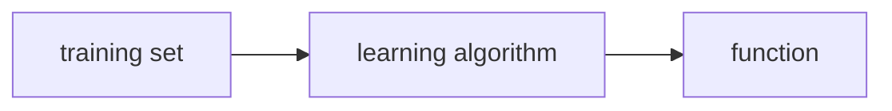

# MLS - C1 - Week 1
## Overview
Welcome to the Machine Learning Specialization! You're joining millions of others who have taken either this or the original course, which led to the founding of Coursera, and has helped millions of other learners, like you, take a look at the exciting world of machine learning!

---

### Learning Objectives
- Define machine learning
- Define supervised learning
- Define unsupervised learning
- Write and run Python code in Jupyter Notebooks
- Define a regression model
- Implement and visualize a cost function
- Implement gradient descent
- Optimize a regression model using gradient descent

---
---

## What is Machine Learning? 🤖
> "Machine learning is the field of study that gives computers the ability to learn without being explicitly programmed." - Arthur Samuel, 1950

#question If Arthur Samuel's checkers-playing program had been allowed to play only 10 games (instead of tens of thousands games) against itself, how would this have affected its performance?
- Would have made it worse ✅
- Would have made it better

> In general, the more opportunities you give a learning algorithm to learn, the better it will perform. 

There 2 main types of ML:
1. Supervised Learning
2. Unsupervised Learning

By far, the most used types of learning algorithms today are supervised learning, unsupervised learning, and recommender systems. In machine learning, making sure you have the tools is really important and so is making sure that you know how to apply the tools of machine learning effectively. 

---

## Supervised Learning Part 1
Supervised machine learning or more commonly, supervised learning, refers to algorithms that learn $x$ to $y$ or `input -> output` mappings. The key characteristic of supervised learning is that ==you give your learning algorithm examples to learn from==. That includes the *right answers*, whereby right answer, the correct label $y$ for a given input $x$, and is by seeing correct pairs of input $x$ and desired output label $y$ that the learning algorithm eventually learns to take just the input alone without the output label and gives a reasonably accurate prediction or guess of the output.

Some examples of such algorithms:

| Input             | Output            | Application             |
| ----------------- | ----------------- | ----------------------- |
| email             | spam (0/1)        | Spam Filter         |
| audio clip        | text transcript   | Speech Recognition  |
| English           | Spanish           | Machine Translation |
| ad, user info     | click (0/1)       | Online Advertising  |
| image, radar info | positions of cars | Autonomous Vehicle  |
| image of product  | defect (0/1)      | Visual Inspection   |

In all of these applications, you will first train your model with examples of inputs $x$ and the right answers, that is the labels $y$. After the model has learned from these input, output, or $x$ and $y$ pairs, they can then take a brand new input $x$, something it has never seen before, and try to produce the appropriate corresponding output $y$. 

---

### Predicting Housing Prices 🏘️
Say you want to predict housing prices based on the size of the house. You've collected some data and say you plot the data and it looks like this. 

<p align="center"></p>

One thing a learning algorithm might be able to do is fitting a straight line. But fitting a straight line isn't the only learning algorithm you can use. There are others that could work better for this application. For example, instead of fitting a straight line, you might decide that it's better to fit a curve, a function that's slightly more complicated or more complex than a straight line. ==The task of the learning algorithm is to produce more right answers.==

To define a little bit more terminology, this housing price prediction is the particular type of supervised learning called Regression (Statistics). By regression, I mean we're trying to predict a number from infinitely many possible numbers such as the house prices in our example, which could be 150,000 or 70,000 or 183,000 or any other number in between. 

But there's also a second major type of supervised learning problem called Classification (Statistics).

---

## Supervised Learning Part 2
There's a second major type of supervised learning algorithm called a classification algorithm. Take breast cancer detection as an example of a classification problem. Using a patient's medical records your machine learning system tries to figure out if a tumor that is a lump is:
- **malignant:** meaning cancerous or dangerous
- **benign:** meaning that it's just a lump that isn't cancerous and isn't that dangerous

So maybe your dataset has tumors of various sizes. And these tumors are labeled as either benign, which I will designate in this example with a 0 or malignant, which will designate in this example with a 1 (the online graph doesn't match description).

<p align="center"></p>

---

### Regression vs. Classification 🆚
One reason that this is different from regression is that ==we're trying to predict only a small number of possible outputs or categories==, unlike regression where you can have infinite number of possibilities. so the fact that there are only two possible outputs is what makes this classification. 

It turns out that in classification problems you can also have more than two possible output categories. Maybe you're learning algorithm can output multiple types of cancer diagnosis if it turns out to be malignant. 

> Classes or categories both refer to the outputs and are the same thing.

So to summarize: ==classification algorithms predict categories.== Categories don't have to be numbers. It could be non numeric for example, it can predict whether a picture is that of a cat or a dog. And it can predict if a tumor is benign or malignant. Categories can also be numbers like 0, 1 or 0, 1, 2. You can also use more than one input value to predict an output. So the learning algorithm has to decide how to fit a boundary line through this data. 

Supervised learning maps input x to output y, where the learning algorithm learns from the quote right answers. In a regression application like predicting prices of houses, the learning algorithm has to predict numbers from infinitely many possible output numbers. Whereas in classification the learning algorithm has to make a prediction of a category, all of a small set of possible outputs. 

#question Supervised learning is when we give our learning algorithm the right answer $y$ for each example to learn from.  Which is an example of supervised learning?
- Calculating the average age of a group of customers.
- Spam filtering ✅

> For instance, emails labeled as "spam" or "not spam" are examples used for training a supervised learning algorithm. The trained algorithm will then be able to predict with some degree of accuracy whether an unseen email is spam or not.


Next there's a second major type of machine learning called Unsupervised Learning.

---
---

## Unsupervised Learning Part 1
When the given data isn't associated with output labels such as $y$, our job would be ==to find some structure== or some pattern or just find something interesting in the data. This is unsupervised learning, we call it unsupervised because we're not trying to supervise the algorithm. 

An unsupervised learning algorithm, might decide that the data can be assigned to two different groups or two different clusters. And so it might decide, that there's one cluster what group over here, and there's another cluster or group over here. This is a particular type of unsupervised learning, called a Clustering (Analysis) algorithm. Because it places the unlabeled data, into different clusters and this turns out to be used in many applications. 

In unsupervised learning, we're not telling the algorithm in advance, that there is a type one person with certain characteristics. Or a type two person with certain characteristics, instead what we're saying is here's a bunch of data. I don't know what the different types of people are but can you automatically find structure into data.

To summarize a clustering algorithm: ==is a type of unsupervised learning algorithm, takes data without labels and tries to automatically group them into clusters.==

---

## Unsupervised Learning Part 2
Whereas in supervised learning, the data comes with both inputs $x$ and input labels $y$, in unsupervised learning, the data comes only with inputs $x$ but not output labels $y$, and the algorithm has to find some structure or some pattern or something interesting in the data. 

In this specialization, you'll learn about clustering as well as two other types of unsupervised learning:
1. Anomaly Detection: which is used to detect unusual events. This turns out to be really important for fraud detection in the financial system, where unusual events, unusual transactions could be signs of fraud and for many other applications.
2. Dimensionality Reduction: This lets you take a big data-set and almost magically compress it to a much smaller data-set while losing as little information as possible. 

#question Of the following examples, which would you address using an unsupervised learning algorithm?  (Check all that apply.)
- Given a set of news articles found on the web, group them into sets of articles about the same stories. ☑️ ✅
- Given email labeled as spam/not spam, learn a spam filter.
- Given a database of customer data, automatically discover market segments and group customers into different market segments. ☑️ ✅
- Given a dataset of patients diagnosed as either having diabetes or not, learn to classify new patients as having diabetes or not.

> Both answers are examples of clustering algorithms. However, the other 2 are supervised learning problems.

---
---

## Jupyter Notebooks 🐍
Just some explanations regarding how Jupyter Notebooks work.

---

### Optional Lab:  Brief Introduction to Python and Jupyter Notebooks
Welcome to the first optional lab! 
Optional labs are available to:
- provide information - like this notebook
- reinforce lecture material with hands-on examples
- provide working examples of routines used in the graded labs

#### Goals
In this lab, you will:
- Get a brief introduction to Jupyter notebooks
- Take a tour of Jupyter notebooks
- Learn the difference between markdown cells and code cells
- Practice some basic python

The easiest way to become familiar with Jupyter notebooks is to take the tour available above in the Help menu.

Jupyter notebooks have two types of cells that are used in this course. Cells such as this which contain documentation called `Markdown Cells`. The name is derived from the simple formatting language used in the cells. You will not be required to produce markdown cells. Its useful to understand the `cell pulldown` shown in graphic below. Occasionally, a cell will end up in the wrong mode and you may need to restore it to the right state.

The other type of cell is the `code cell` where you will write your code:

```python
#This is  a 'Code' Cell
print("This is  code cell")
```
`This is code cell`

#### Python
You can write your code in the code cells. 
To run the code, select the cell and either
- hold the shift-key down and hit 'enter' or 'return'
- click the 'run' arrow above

#### Print statement
Print statements will generally use the python f-string style.  
Try creating your own print in the following cell.  
Try both methods of running the cell.

```python
# print statements
variable = "right in the strings!"
print(f"f strings allow you to embed variables {variable}")
```
`f strings allow you to embed variables right in the strings!`

---
---

## Quiz: Supervised Learning vs. Unsupervised Learning 
1. Which are the two common types of supervised learning? (Choose two)
	1. Classification ☑️✅
	2. Regression ☑️✅
	3. Clustering
2. Which of these is a type of unsupervised learning?
	1. Clustering ✅
	2. Classification
	3. Regression

---
---

## Linear Regression Model Part 1
Linear regression means fitting a straight line to your data. It's probably the most widely used learning algorithm in the world today. Let's look at a house price and size graph:

<p align="center"></p>

---

### Create Models from Datasets
One thing you could do this, you can build a linear regression model from this dataset. Your model will fit a straight line to the data. We call this supervised learning because you are first training a model by giving a data that has right answers because you get the model examples of houses with both the size of the house, as well as the price that the model should predict for each house. 

This linear regression model is a particular type of supervised learning model. It's called regression model because it predicts numbers as the output like prices in dollars. Any supervised learning model that predicts a number such as 220,000 or 1.5 or negative 33.2 is addressing what's called a regression problem. Linear regression is one example of a regression model. 

#### Tip
Just to remind you, in contrast with the regression model, the other most common type of supervised learning model is called a classification model. Classification model predicts categories or discrete categories, such as predicting if a picture is of a cat, meow or a dog, woof, or if given medical record, it has to predict if a patient has a particular disease. As a reminder about the difference between classification and regression, in classification, there are only a small number of possible outputs; whereas in regression, there are infinitely many possible numbers that the model could output


Let's draw the data table for our graph:

| Item | $x$ Size ($\rm{feet}^{2})$ | $y$ Price ($1,000 \, \$$) |
| ---- | -------------------------- | ------------------------- |
| 1    | 2104                       | 400                       |
| 2    | 1416                       | 232                       |
| 3    | 852                        | 178                       |
| ...  | ...                        | ...                       |
| 47   | 3210                       | 870                       | 

Notice that the horizontal and vertical axis correspond to these two columns, the size and the price. 

The dataset that you just saw and that is used to train the model is called a Training Set (AI). Note that your client's house is not in this dataset because it's not yet sold, so no one knows what the price is. To predict the price of your client's house, you first train your model to learn from the training set and that model can then predict your client's houses price. 

The standards in ML are:
- $x$ = "input" variable, feature, input feature
- $y$ = "output" variable, "target" variable
- $m$ = total number of training examples
- $\left( x , y \right)$ = single training example
- $\left( x^{(i)} , y^{(i)} \right)$ = $i^{\rm{th}}$ training example

Therefore, in our example, we can write the second training example as:
$$\left( x^{(2)} , y^{(2)} \right) = \left( 1416, 232 \right)$$

> Don't mistake this notation with exponentiation!


Just to note, this superscript $i$ in parentheses (or  $x^{(i)}$) is not an Exponential Function. When I write this, this is not $x^2$ (or x to the power 2). It just refers to the second training example. This $i$, is just an index into the training set and refers to row $i$ in the table. 

---

### Linear Regression Model Part 2
Recall that a training set in supervised learning includes:
1. **input features:** such as the size of the house
2. **output targets:** such as the price of the house

The output targets are the right answers to the model we'll learn from. To train the model, you feed the training set, both the input features and the output targets to your learning algorithm. Then your supervised learning algorithm will produce some function. 



We denote our function as $f$. Historically, this function used to be called a hypothesis, but I'm just going to call it a function f in this class.

The job of $f$ is to take a new input $x$ and output an estimate or a prediction, known as $\hat{y}$ (y-hat), and it's written like the variable y with this little hat symbol on top. ==The convention in machine learning is that $\hat{y}$ is the **estimate/prediction** for $y$==. The function $f$ is called the *model*. $x$ is called the *input* or the *input feature*, and the output of the model is the *prediction*, $\hat{y}$.

$$x \longrightarrow f \longrightarrow \hat{y}$$

The model's prediction is the estimated value of $y$. When the symbol is just the letter $y$, then that refers to the target, which is the *actual true value* in the training set. In contrast, $\hat{y}$ is an *estimate*. It may or may not be the actual true value. Well, if you're helping your client to sell the house, well, the true price of the house is unknown until they sell it. 

Now what is the math formula for our function? For now, let's stick with $f$ being a straight line. The function can be written as: 
$$f_{w, b} (x) = wx + b$$

For now, $w$ and $b$ are numbers, and the values chosen for them will determine the prediction $\hat{y}$ based on the input feature $x$. This $f_{w , b}$ of $x$ means $f$ is a function that takes $x$ as input, and depending on the values of $w$ and $b$, will output some value of a prediction $\hat{y}$. For the sake of simplicity: 
$$f_{w, b} (x) = f(x) = wx + b$$

Here's what this function is doing, it's making predictions for the value of $y$ using a streamline function of $x$. Since this is a straight-line, it's called a Linear Regression. More specifically, this is linear regression with *one variable*, where the phrase one variable means that there's a **single input variable** or feature $x$, namely the size of the house. Another name for a linear model with one input variable is *univariate* linear regression, where *uni* means one in Latin, and where *variate* means variable. 

#question For linear regression, the model is represented by $f_{w,b} (x) = wx+b$.  Which of the following is the output or "target" variable?
- $x$
- $y$ ✅
- $\hat{y}$
- $m$

> $y$ is the true value for that training example, referred to as the output variable, or “target”.

---

### Optional Lab: Model Representation
#### Goals
In this lab you will:
- Learn to implement the model $f_{w,b}$ for linear regression with one variable

#### Notation
Here is a summary of some of the notation you will encounter.  

| General  <br />  Notation   | Description | Python (if applicable) |
| :---------------------------------------------------------: | ---------------------------: | -: |
| $a$ | scalar, non bold                                                      ||
| $\mathbf{a}$ | vector, bold                                                      ||
| **Regression** |         |    |     |
|  $\mathbf{x}$ | Training Example feature values (in this lab - Size (1000 sqft))  | `x_train` |   
|  $\mathbf{y}$  | Training Example  targets (in this lab Price (1000s of dollars)).  | `y_train` 
|  $x^{(i)}$, $y^{(i)}$ | $i_{th}$Training Example | `x_i`, `y_i`|
| m | Number of training examples | `m`|
|  $w$  |  parameter: weight,                                 | `w`    |
|  $b$           |  parameter: bias                                           | `b`    |     
| $f_{w,b}(x^{(i)})$ | The result of the model evaluation at $x^{(i)}$ parameterized by $w,b$: $f_{w,b}(x^{(i)}) = wx^{(i)}+b$  | `f_wb` | 

The python libraries needed:
```python
import numpy as np
import matplotlib.pyplot as plt
plt.style.use('./deeplearning.mplstyle')
```

Our initial 2 points:

| Size (1000 sqft)     | Price (1000s of dollars) |
| :-------------------:| :------------------------: |
| 1.0               | 300                      |
| 2.0               | 500                      |

Create your `x_train` and `y_train` variables. The data is stored in one-dimensional NumPy arrays.
```python
# x_train is the input variable (size in 1000 square feet)
# y_train is the target (price in 1000s of dollars)
x_train = np.array([1.0, 2.0])
y_train = np.array([300.0, 500.0])
print(f"x_train = {x_train}")
print(f"y_train = {y_train}")
```
`x_train = [1. 2.]`
`y_train = [300. 500.]`

> **Note**: The course will frequently utilize the python 'f-string' output formatting described [here](https://docs.python.org/3/tutorial/inputoutput.html) when printing. The content between the curly braces is evaluated when producing the output.

#### Number of training examples `m`
You will use `m` to denote the number of training examples. Numpy arrays have a `.shape` parameter. `x_train.shape` returns a python tuple with an entry for each dimension. `x_train.shape[0]` is the length of the array and number of examples as shown below.
```python
# m is the number of training examples
print(f"x_train.shape: {x_train.shape}")
m = x_train.shape[0]
print(f"Number of training examples is: {m}")
```
`x_train.shape: (2,)`
`Number of training examples is: 2`

Or use `len()`:
```python
# m is the number of training examples
m = len(x_train)
print(f"Number of training examples is: {m}")
```
`Number of training examples is: 2`

#### Training example `x_i, y_i`
You will use (x$^{(i)}$, y$^{(i)}$) to denote the $i^{th}$ training example. Since Python is zero indexed, (x$^{(0)}$, y$^{(0)}$) is (1.0, 300.0) and (x$^{(1)}$, y$^{(1)}$) is (2.0, 500.0). 

To access a value in a Numpy array, one indexes the array with the desired offset. For example the syntax to access location zero of `x_train` is `x_train[0]`.
Run the next code block below to get the $i^{th}$ training example.
```python
i = 0 # Change this to 1 to see (x^1, y^1)

x_i = x_train[i]
y_i = y_train[i]
print(f"(x^({i}), y^({i})) = ({x_i}, {y_i})")
```
`(x^(0), y^(0)) = (1.0, 300.0)`

If you change `i=1`, you'll get:
`(x^(1), y^(1)) = (2.0, 500.0)`

You can plot these two points using the `scatter()` function in the `matplotlib` library, as shown in the cell below. 
- The function arguments `marker` and `c` show the points as red crosses (the default is blue dots).

You can use other functions in the `matplotlib` library to set the title and labels to display
```python
# Plot the data points
plt.scatter(x_train, y_train, marker='x', c='r')
# Set the title
plt.title("Housing Prices")
# Set the y-axis label
plt.ylabel('Price (in 1000s of dollars)')
# Set the x-axis label
plt.xlabel('Size (1000 sqft)')
plt.show()
```

> Since it's time consuming to to represent each graph or result, I'll just paste the python code here, but not the outputs of it. All OpenLab files can be found and accessed easily.

As described in lecture, the model function for linear regression (which is a function that maps from `x` to `y`) is represented as 
$$f_{w,b}(x^{(i)}) = wx^{(i)} + b$$

```python
w = 100
b = 100
print(f"w: {w}")
print(f"b: {b}")
```

Now, let's compute the value of $f_{w,b}(x^{(i)})$ for your two data points. You can explicitly write this out for each data point as:
- for $x^{(0)}$, `f_wb = w * x[0] + b`
- for $x^{(1)}$, `f_wb = w * x[1] + b`

For a large number of data points, this can get unwieldy and repetitive. So instead, you can calculate the function output in a `for` loop as shown in the `compute_model_output` function below.
> **Note**: The argument description `(ndarray (m,))` describes a Numpy n-dimensional array of shape (m,). `(scalar)` describes an argument without dimensions, just a magnitude.  
> **Note**: `np.zero(n)` will return a one-dimensional numpy array with $n$ entries   

```python
def compute_model_output(x, w, b):
    """
    Computes the prediction of a linear model
    Args:
      x (ndarray (m,)): Data, m examples 
      w,b (scalar)    : model parameters  
    Returns
      y (ndarray (m,)): target values
    """
    m = x.shape[0]
    f_wb = np.zeros(m)
    for i in range(m):
        f_wb[i] = w * x[i] + b
        
    return f_wb
```

Call the function:
```python
tmp_f_wb = compute_model_output(x_train, w, b,)

# Plot our model prediction
plt.plot(x_train, tmp_f_wb, c='b',label='Our Prediction')

# Plot the data points
plt.scatter(x_train, y_train, marker='x', c='r',label='Actual Values')

# Set the title
plt.title("Housing Prices")
# Set the y-axis label
plt.ylabel('Price (in 1000s of dollars)')
# Set the x-axis label
plt.xlabel('Size (1000 sqft)')
plt.legend()
plt.show()
```

For `w=b=100` the line does *not* fit the data. We can try to manually change the numbers. After some tweaking, one can find the best fit line by having `w=200`, `b=100`

After finding the proper `w` and `b`:
```python
w = 200                         
b = 100    
x_i = 1.2
cost_1200sqft = w * x_i + b    

print(f"${cost_1200sqft:.0f} thousand dollars")
```

#### Congratulations! 🎉
In this lab you have learned:
 - Linear regression builds a model which establishes a relationship between features and targets
     - In the example above, the feature was house size and the target was house price
     - for simple linear regression, the model has two parameters $w$ and $b$ whose values are 'fit' using *training data*.
     - once a model's parameters have been determined, the model can be used to make predictions on novel data.

---
---

## Cost Function (Mathematics) Formula
In order to implement linear regression the first key step is first to define something called a Cost Function (Mathematics). The cost function will tell us how well the model is doing so that we can try to get it to do better. 

To introduce a little bit more terminology, $w$ and $b$ are called the *parameters* of the model. In machine learning, parameters of the model are the variables you can adjust during training in order to improve the model. Sometimes you also hear the parameters $w$ and $b$ referred to as *coefficients* or as *weights*. Depending on the values you've chosen for $w$ and $b$, you get a different function $f(x)$, which generates a different line on the graph.

<br>

---

### The Use of Linear Regression
With linear regression, what you want to do is to choose values for the parameters $w$ and $b$ so that the straight line you get from the function $f$ somehow fits the data well.

<br>

---

### How to Find $w$ & $b$?
As we defined earlier:
$$\hat{y}^{(i)} = f_{w,b} \left( x^{(i)} \right) = w x^{(i)} + b$$

Now the question is how do you find values for $w$ and $b$ so that the prediction $\hat{y}^{(i)}$ is close to the true target $y^{(i)}$ for many or maybe all training examples $\left( x^{(i)} , y^{(i)} \right)$? 

To answer that question, let's first take a look at how to measure how well a line fits the training data. To do that, we're going to construct a Cost Function (Mathematics). The cost function takes the prediction $\hat{y}$ and compares it to the target $y$ by:
$${\rm{error}} := \hat{y}^{(i)} - y^{(i)}$$

This difference is called the *error*. We're measuring how far off to prediction is from the target. Next, let's compute the square of this error. Also, we're going to want to compute this term for different training examples $i$ in the training set. Finally, we want to measure the error across the entire training set. In particular, the summation of squared errors. We'll sum from $i = 1$ all the way up to $m$ (and remember that $m$ is the number of training examples). Notice that if we have more training examples $m$ is larger and your cost function will calculate a bigger number. By convention, we will compute the *average squared error* instead of the total squared error and we do that by dividing by $m$, also, the cost function that machine learning people use actually divides by $2m$. The extra division by 2 is just meant to make some of our later calculations look neater, but the cost function still works whether you include this division by 2 or not. 
$$J(w,b) = \frac{1}{2m} \sum_{i=1}^{m} \left( \hat{y}^{(i)} - y^{(i)} \right)^2$$

> This is also called the squared error cost function, and it's called this because you're taking the square of these error terms. 

Just a quick note, we can rewrite the $J$ function as:
$$J(w,b) = \frac{1}{2m} \sum\limits_{i=1}^{m} (f_{w,b}(x^{(i)}) - y^{(i)})^2$$

#question Based on the cost function used for linear regression, which of these are the parameters of the model that can be adjusted?
$$J(w,b) = \frac{1}{2m} \sum\limits_{i=1}^{m} (f_{w,b}(x^{(i)}) - y^{(i)})^2$$
- $w$ and $b$ ✅
- $f_{w,b}(x^{(i)})$
- $w$ only, because we should choose $b=0$
- $\hat{y}$

> $w$ and $b$ are parameters of the model, adjusted as the model learns from the data. They’re also referred to as “coefficients” or “weights”

But what is $J(w,b)$ really computing?

---

## Cost Function (Mathematics) Intuition
Depending on the values chosen for the parameters $w$ and $b$, you get different straight lines. You want to find values for your parameters, so that the straight line fits the training data well. To measure how well a choice of the parameters fit the training data, you have a cost function $J$. What the cost function $J$ does is, it measures the difference between the model's predictions, and the actual true values for $y$. 
- Model: $$f_{w,b} (x) = wx + b$$
- Parameters: $$w \quad \textrm{and} \quad b$$
- Cost function: $$J(w,b) = \frac{1}{2m} \sum\limits_{i=1}^{m} (f_{w,b}(x^{(i)}) - y^{(i)})^2$$
- Goal: $$\underset{w,b}{\textrm{minimize}} \ J(w,b)$$

Now we try to simplify this procedure using only $w$ (i.e. $b=0$) and write:
- Model: $$f_w (x) = wx$$
- Parameters: $$w \quad (b=0)$$
- Cost function: $$J(w) = \frac{1}{2m} \sum\limits_{i=1}^{m} (f_{w}(x^{(i)}) - y^{(i)})^2$$

When the parameter $w$ is fixed, that is, is always a constant value, then $f_w$ is only a function of $x$, which means that the estimated value of y depends on the value of the input $x$. 

---

### Graphing Time! 📈
Let's say our real data points are: $(1,1) , (2,2) , (3,3)$, meaning that $m=$.
Now, if we let $w=1$, then we would have the 🔵 line. Since this would fit the line perfectly to our data (because of how we chose this example), the error would be zero, or:
$$J(0) = \frac{1}{2 \times 3} \sum\limits_{i=1}^{3} (f_{0}(x^{(i)}) - y^{(i)})^2 = \frac{1}{6} \times 0 = 0$$

You can choose $w$ as other values as well, such as $w=0.5$, which would give you $J(0.5) \approx 0.58$ like the 🟢 line

If you draw the graph both for $f(x)$ and $J$, you would get:
#### $f_w (x)$ as a Function of $x$
<p align="center"><iframe src="https://www.desmos.com/calculator/ps27fo9ipv?embed" width="500" height="500" style="border: 1px solid #ccc" frameborder=0></iframe></p>

[link to Desmos](https://www.desmos.com/calculator/ps27fo9ipv)

---

#### $J(w)$ as a Function of $w$
<p align="center"><iframe src="https://www.desmos.com/calculator/q4xpn6frpo?embed" width="500" height="500" style="border: 1px solid #ccc" frameborder=0></iframe></p>

[link to Desmos](https://www.desmos.com/calculator/q4xpn6frpo)

---

==The objective is to minimize the cost function as much as possible== (the closer it gets to zero, the better). As you vary $w$ and/or $b$, you end up with different straight lines and when that straight line passes across the data. The goal of linear regression is to find the parameters that results in the smallest possible value for the cost function $J$. 

#question When does the model fit the data relatively well, compared to other choices for parameter w?
- When $x$ is at or near a minimum.
- When $f_w(x)$ is at or near a minimum for all the values of $x$ in the training set.
- When $w$ is close to zero.
- When the cost $J$ is at or near a minimum ✅

> When the cost is relatively small, closer to zero, it means the model fits the data better compared to other choices for $w$ and $b$.

---
---

## Visualizing the Cost Function (Mathematics)
Let's go back to the original model without setting $b$ to zero.
- Model: $$f_{w,b} (x) = wx + b$$
- Parameters: $$w \quad \textrm{and} \quad b$$
- Cost function: $$J(w,b) = \frac{1}{2m} \sum\limits_{i=1}^{m} (f_{w,b}(x^{(i)}) - y^{(i)})^2$$
- Goal: $$\underset{w,b}{\textrm{minimize}} \ J(w,b)$$

Now let's check the housing price example once again. Let's say our original guess for the model is: $$f_{w,b} (x) = 0.06x + 50$$

!/img/MLS_C1_HousePrice_CostFunction1.jpg

---

### The Bowl Shape 🍜
Now if you plot the graph for $J$ with respect to $w$ and $b$, it would be a 3D graph that looks like a soup bowl.

!MLS_C1_HousePrice_CostFunction2.jpg

---

### Mount Fuji 🗻
Now, if you were to look at this shape from the top, you could use a Contour Map to find all the points on the line that have the same height. Just like how we can find the similar points on Mount Fuji, where the red lines represent the contour lines.

!MLS_C1_HousePrice_CostFunction3.jpg

!MLS_C1_HousePrice_CostFunction4.jpg

---

### Contours for the Houses
Now using the previous technique, let's see how different parameters behave.

!MLS_C1_HousePrice_CostFunction5.jpg

On the upper right is a contour plot of this exact same cost function as that shown at the bottom. The two axes on this contour plots are $b$, on the vertical axis, and $w$ on the horizontal axis. What each of these ovals, also called ellipses, shows, is the center points on the 3D surface which are at the exact same height. In other words, the set of points which have the same value for the cost function $J$. To get the contour plots, you take the 3D surface at the bottom and you use a knife to slice it horizontally. You take horizontal slices of that 3D surface and get all the points, they're at the same height. Therefore, each horizontal slice ends up being shown as one of these ellipses or one of these oval.

!MLS_C1_HousePrice_CostFunction6.jpg

> The bottom of the bowl, where the cost function $J$ is at a minimum, is this point right here (the blue "minimum" sign), at the center of this concentric ovals. 

---
---

## Visualization Examples
Now let's try out some different values for $w$ and $b$, and see how they behave and whether or not they're the best parameters that can minimize our cost function $j$, which would give us the best fitting line for the actual model $f_{w,b} (x)$.
1. `w=-0.15, b=800`: as you can see, it's not a very good prediction because its error is too big, and it's very distant from the center of the ovals.

!MLS_C1_HousePrice_CostFunction7.jpg

2. `w=0, b=360`: even though this is better than the previous one, it's still not that good.

!MLS_C1_HousePrice_CostFunction8.jpg

3. `w=0.13, b=71`: now these parameters are very good, since they're pretty close to the minimum, and the line fits the data very well (the summation of the errors is little).

!MLS_C1_HousePrice_CostFunction9.jpg

---

### Is there another way to find these parameters?
Now in linear regression, rather than having to manually try to read a contour plot for the best value for w and b, which isn't really a good procedure and also won't work once we get to more complex machine learning models. What you really want is *an efficient algorithm* that you can write in code for automatically finding the values of parameters $w$ and $b$ they give you the best fit line that minimizes the cost function $J$. There is an algorithm for doing this called Gradient Descent. This algorithm is one of the most important algorithms in machine learning. Gradient descent and variations on gradient descent are used to train, not just linear regression, but some of the biggest and most complex models in all of AI. 

---

> The rest are from the Jupyter notebook provided by Coursera.

### Optional Lab:  Cost Function
#### Introduction
- This optional lab will show you how the cost function is implemented in code. And given a small training set and different choices for the parameters you’ll be able to see how the cost varies depending on how well the model fits the data.
- In the optional lab, you'll also get to play with an interactive contour plot. You can use your mouse cursor to click anywhere on the contour plot, and you see the straight line defined by the values you chose, for parameters w and b. 
- Finally the optional lab also has a 3D surface plot that you can manually rotate and spin around, using your mouse cursor, to take a better look at what the cost function looks like.

```python
import numpy as np
%matplotlib widget
import matplotlib.pyplot as plt
from lab_utils_uni import plt_intuition, plt_stationary, plt_update_onclick, soup_bowl
plt.style.use('./deeplearning.mplstyle')


x_train = np.array([1.0, 2.0])           #(size in 1000 square feet)
y_train = np.array([300.0, 500.0])           #(price in 1000s of dollars)


def compute_cost(x, y, w, b): 
    """
    Computes the cost function for linear regression.
    
    Args:
      x (ndarray (m,)): Data, m examples 
      y (ndarray (m,)): target values
      w,b (scalar)    : model parameters  
    
    Returns
        total_cost (float): The cost of using w,b as the parameters for linear regression
               to fit the data points in x and y
    """
    # number of training examples
    m = x.shape[0] 
    
    cost_sum = 0 
    for i in range(m): 
        f_wb = w * x[i] + b   
        cost = (f_wb - y[i]) ** 2  
        cost_sum = cost_sum + cost  
    total_cost = (1 / (2 * m)) * cost_sum  

    return total_cost

plt_intuition(x_train,y_train)
```

!MLS_C1_lab3_fig1.jpg
<br>
```python
x_train = np.array([1.0, 1.7, 2.0, 2.5, 3.0, 3.2])
y_train = np.array([250, 300, 480,  430,   630, 730,])


plt.close('all') 
fig, ax, dyn_items = plt_stationary(x_train, y_train)
updater = plt_update_onclick(fig, ax, x_train, y_train, dyn_items)
```

!MLS_C1_lab3_fig2.jpg
<br>
```python
soup_bowl()
```

!MLS_C1_lab3_fig3.jpg

---

### Congratulations!  🎉
You have learned the following:
 - The cost equation provides a measure of how well your predictions match your training data.
 - Minimizing the cost can provide optimal values of $w$, $b$.

---
---

## Quiz: Regression (Statistics)
1. For linear regression, the model is $f_{w,b}(x) = wx + b$. Which of the following are the inputs, or features, that are fed into the model and with which the model is expected to make a prediction?
	1. $w$ and $b$
	2. $m$
	3. $x$ ✅
	4. $(x,y)$
2. For linear regression, if you find parameters $w$ and $b$ so that $J(w,b)$ is very close to zero, what can you conclude?
	1. The selected values of the parameters cause the algorithm to fit the training set really poorly.
	2. This is never possible -- there must be a bug in the code.
	3. The selected values of the parameters cause the algorithm to fit the training set really well. ✅

> - The $x$, the input features, are fed into the model to generate a prediction $f_{w,b}(x)$
> - When the cost is small, this means that the model fits the training set well.

---
---

## Gradient Descent
It would be nice if we had a more systematic way to find the values of $w$ and $b$, that results in the smallest possible cost, $J(w,b)$. It turns out there's an algorithm called "gradient descent" that you can use to do that. Gradient descent is used all over the place in machine learning, not just for linear regression, but for training for example some of the most advanced Artificial Neural Network models, also called Deep Learning models. 
- have some function: $$J(w,b)$$
- want to: $$\underset{w,b}{\textrm{min}} \ J(w,b)$$

It turns out that gradient descent applies to more general functions, including other cost functions that work with models that have more than two parameters. 
- have higher number of parameters: $$J(w_1 , w_2, \ldots,b)$$
- want to: $$\underset{w_1 , w_2, \ldots,b}{\textrm{min}} \ J(w_1 , w_2, \ldots,b)$$

What you're going to do is just to start off with some initial guesses for $w$ and $b$. In linear regression, it won't matter too much what the initial value are, so a common choice is to set them both to 0. Then, you'll keep on changing the parameters a bit every time to try to reduce the cost $J(w,b)$ until hopefully $J$ settles at or near a minimum. 

One thing I should note is that ==for some functions $J$ that may not be a bow shape or a hammock shape, it is possible for there to be more than one possible minimum==.

For linear regression with the squared error cost function, you always end up with a bow shape or a hammock shape. But this is a type of cost function you might get if you're training a neural network model. 

!MLS_C1_GradientDescent1.jpg

---

### What is our Goal? ⛳
Now, let's imagine that this surface plot is actually a view of a slightly hilly outdoor park or a golf course where the high points are hills and the low points are valleys like so. I'd like you to imagine that you are physically standing at this point on the hill. ==Your goal is to start up here and get to the bottom of one of these valleys as efficiently as possible.==

!MLS_C1_GradientDescent2.jpg

Remember that you can choose a starting point at the surface by choosing starting values for the parameters $w$ and $b$. When you perform gradient descent a moment ago, you had started at the left point. Now, imagine if you try gradient descent again, but this time you choose a different starting point by choosing parameters that place your starting point just a couple of steps to the right over there.

If you then repeat the gradient descent process, then you end up in a totally different valley. This different minimum over here on the right. The bottoms of both the first and the second valleys are called "local minima" (see Local Minimum). Because if you start going down the first valley, gradient descent won't lead you to the second valley, and the same is true if you started going down the second valley, you stay in that second minimum and not find your way into the first local minimum. 

---
---

## Implementing Gradient Descent
In this context, the `=` sign is the *assignment operator* from coding (where if `a=3` then `a=a+3` means assigning the number 5 to the variable `a`). This is **different** from *truth assertion* in mathematics (where $2=2$ is correct, but $a=a-1$ is incorrect because $0 \neq 1$).
- for $w$: $$w = w - \alpha \frac{d}{dw} J(w,b)$$
- for $b$: $$b = b - \alpha \frac{d}{db} J(w,b)$$

What this expression is saying is, update your parameter $w$ by taking the current value of $w$ and adjusting it a small amount, which is this expression on the right, minus $\alpha$ times this expression (the Derivative of $J$ based on $w$): $$\frac{d}{dw} J(w,b)$$

### Hint

|            | Coding | Math         |
| ---------- | ------ | ------------ |
| Assignment | `=`    | $\leftarrow$ |
| Assertion  | `==`   | $=$          | 


In this equation, $\alpha$ is also called the Learning Rate (Computer Science). The learning rate is usually: $$0 < \alpha < 1$$ What $\alpha$ does is, it basically controls how big of a step you take downhill. If it is very large, then that corresponds to a very aggressive gradient descent procedure where you're trying to take huge steps downhill. If it is very small, then you'd be taking small baby steps downhill. 

In combination with the learning rate $\alpha$, the derivation of $j$ also determines the size of the steps you want to take downhill. For this course, you don't need to know any Calculus.

---

### Gradient Descent Algorithm
Remember in the graph of the surface plot where you're taking baby steps until you get to the bottom of the value, well, for the gradient descent algorithm, you're going to repeat these two update steps until the algorithm converges. By "converges", I mean that you reach the point at a local minimum where the parameters $w$ and $b$ no longer change much with each additional step that you take. 

One important detail is that ==for gradient descent, you want to simultaneously update $w$ and $b$==, meaning you want to **update both parameters at the same time.** You can see the correct and incorrect implementations down below:

#### Correct Implementation ✅
$\displaystyle 1. \ w_{\rm temp} = w - \alpha \frac{d}{dw} J({\color{green} w,b})$
$\displaystyle 2. \ b_{\rm temp} = b - \alpha \frac{d}{db} J({\color{green} w,b})$
$\displaystyle 3. \ w = w_{\rm temp}$
$\displaystyle 4. \ b = b_{\rm temp}$

---

#### Incorrect Implementation ❌
$\displaystyle 1. \ w_{\rm temp} = w - \alpha \frac{d}{dw} J({\color{green} w,b})$
$\displaystyle 2. \ {\color{red} w} = w_{\rm temp}$
$\displaystyle 3. \ b_{\rm temp} = b - \alpha \frac{d}{db} J({\color{red} w},b)$
$\displaystyle 4. \ b = b_{\rm temp}$

Now, one thing you may notice is that this value of $w$ gets updated (shown in 🔴). This is actually **incorrect** because it affects $b$.

---

The difference between the right-hand side and the left-hand side implementations is that if you look over here, this $w$ has already been updated to this new value, and this is updated $w$ that actually goes into the cost function $J(w,b)$. It means that this term here on the right is not the same as this term over here that you see on the left. That also means this `tmp_b` term on the right is not quite the same as the `tmp_b` term on the left, and thus this updated value for $b$ on the right is not the same as this updated value for variable $b$ on the left. 

!MLS_C1_GradientDescent3.jpg

> Although some make the mistake and implement the incorrect one in the code (which sometimes might not affect the results that much), it's better to always stick to the correct method.

#question Gradient descent is an algorithm for finding values of parameters $w$ and $b$ that minimize the cost function $J$. What does this update statement do? (Assume $\alpha$ is small.) 
$$w = w - \alpha \frac{\partial J(w,b)}{\partial w}$$
- Checks whether $w$ is equal to $w - \alpha\frac{\partial J(w,b)}{\partial w}$
- Updates parameter $w$ by a small amount ✅

---
---

## Gradient Descent Intuition
As a reminder, the variable represented with the Greek symbol $\alpha$, is the learning rate. ==The learning rate controls how big of a step you take when updating the model's parameters==, $w$ and $b$. For the purposes of this course, the Partial Derivative will simply be called Derivative:
$$\frac{\partial}{\partial w} J(w,b)$$

Now let's try to visualize gradient descent with a 2D example of $J$ and $w$ axis.

!MLS_C1_GradientDescent4.jpg

For a quick recap:
1. when the derivative is **positive** (having an upward slope), $w$ becomes smaller, therefore, it moves to the **left** (closer to the actual minimum that we want), meaning your cost $J$ is **decreasing**
2. when the derivative is **negative** (having a downward slope), $w$ becomes bigger (`w - (-x) = w + x`), therefore, it moves to the **right**, meaning your cost $J$ is **decreasing** once again (due to the bowl-shape nature of the graph)

#question Gradient descent is an algorithm for finding values of parameters $w$ and $b$ that minimize the cost function $J$. Assume the learning rate $\alpha$ is a small positive number. When $\frac{\partial J(w,b)}{\partial w}$ is a positive number (greater than zero) -- as shown below -- what happens to $w$ after one update step?

$$\begin{align*} \text{repeat}&\text{ until convergence:} \; \lbrace \newline
\;  w &= w -  \alpha \frac{\partial J(w,b)}{\partial w}  \; \newline 
 b &= b -  \alpha \frac{\partial J(w,b)}{\partial b}  \newline \rbrace
\end{align*}$$

- $w$ decreases ✅
- It is not possible to tell if $w$ will increase or decrease
- $w$ stays the same
- $w$ increases

> The learning rate α\alphaα is always a positive number, so if you take W minus a positive number, you end up with a new value for W that is smaller

One other key quantity in the gradient descent algorithm is the learning rate $\alpha$. How do you choose it? What happens if it's too small or what happens when it's too big? 

---
---

## Learning Rate (Computer Science)
The choice of the learning rate, $\alpha$ will have a huge impact on the efficiency of your implementation of gradient descent. And if the learning rate is chosen poorly, gradient descent may not even work at all. 

Let's see what could happen if the learning rate alpha is either too small or if it is too large. 

!MLS_C1_GradientDescent5.jpg

Therefore:
1. if $\alpha$ is **too small**: gradient descent may be slow
2. if $\alpha$ is **too large**: gradient descent may overshoot, never reach minimum, and even fail to converge (i.e. diverge)

---

### What if we're already at the local minima? 🔚
So, here's another question, you may be wondering one of your parameter $w$ is already at the desired point, so that your cost $J$ is already at a local minimum. What do you think one step of gradient descent will do if you've already reached a minimum? 

!MLS_C1_GradientDescent6.jpg

This means that you're at this point on the cost function $J$, and that happens to be a local minimum. Turns out if you draw attention to the function at this point, the slope of this line is zero and thus the derivative term here is equal to zero for the current value of $w$. And so you're gradient descent gets updated as:
$$w = w - \alpha \cdot 0$$
And this is the same as saying let's set $w$ to be equal to $w$. So this means that if you're already at a local minimum, gradient descent leaves $w$ unchanged. Because it just updates the new value to be the same as the old one.

So ==if your parameters have already brought you to a local minimum, then further gradient descent steps to absolutely nothing==. It doesn't change the parameters, which is what you want because it keeps the solution at that local minimum. This also explains why gradient descent can reach a local minimum, even with a fixed learning rate $\alpha$. 

!MLS_C1_GradientDescent7.jpg

---

### Gradient Descent can reach Local Minimum with a Fixed Learning Rate 📉
As we get closer to a local minimum, gradient descent will automatically take smaller steps. And that's because as we approach the local minimum, the derivative automatically gets smaller. 
$$\textrm{the closer to local minimum} \Rightarrow \frac{\partial}{\partial w} J(w,b) \downarrow$$
And that means the update steps also automatically gets smaller. Even if the learning rate $\alpha$ is kept at some fixed value ($\alpha \ \rm const.$)

!MLS_C1_GradientDescent8.jpg

---
---

## Gradient Descent for Linear Regression
A quick recap:
- linear regression model: $$f_{w, b} (x) = wx + b$$
- cost function: $$J(w,b) = \frac{1}{2m} \sum\limits_{i=1}^{m} (f_{w,b}(x^{(i)}) - y^{(i)})^2$$
- gradient descent algorithm: $$\begin{align*} \text{repeat}&\text{ until convergence:} \; \lbrace \newline \;  w &= w -  \alpha \frac{\partial J(w,b)}{\partial w} \; \newline b &= b -  \alpha \frac{\partial J(w,b)}{\partial b}  \newline \rbrace \end{align*}$$

!MLS_C1_GradientDescent_LinearRegression1.jpg

---

### Taking Derivation
Now let's take the derivations for the parameters:
- for $w$: $$\frac{\partial}{\partial w} J(w,b) = \frac{1}{m} \sum_{i=1}^{m} \left( f_{w,b} \left( x^{(i)} \right) - y^{(i)} \right) x^{(i)}$$
- for $b$: $$\frac{\partial}{\partial b} J(w,b) = \frac{1}{m} \sum_{i=1}^{m} \left( f_{w,b} \left( x^{(i)} \right) - y^{(i)} \right)$$

!MLS_C1_GradientDescent_LinearRegression2.jpg

---

#### Mathematical Proof (Optional)
The proof is not that important, but for those who are interested, since we know: $$\frac{d}{dx} U^{n} = n \cdot U^{'} \cdot U^{n-1}$$ We can find the derivative of the parameters as below:

!MLS_C1_GradientDescent_LinearRegression3.jpg

> The reason we used $2m$ in the cost function formula is that to get rid of with the power 2 here.

---

### Gradient Descent Algorithm
You repeatedly carry out these updates to w and b until convergence. Remember that this $f(x)$ is a linear regression model, so as equal to $wx + b$. Just as a reminder, you want to update $w$ and $b$ simultaneously on each step. 

$$\begin{align*} \text{repeat}&\text{ until convergence:} \; \lbrace \newline
\;  w &= w -  \alpha \frac{\partial J(w,b)}{\partial w}  \; \newline 
 b &= b -  \alpha \frac{\partial J(w,b)}{\partial b}  \newline \rbrace
\end{align*}$$

---

### More than One Local Minimum
As you can remember, based on where you start, you can end up at different places (if the model has more than one local min). With gradient descent is that it can lead to a local minimum instead of a global minimum. 

!MLS_C1_GradientDescent_LinearRegression4.jpg

---

### Squared Error Cost Function
When you're using a squared error cost function with linear regression, the cost function does not and will never have multiple local minima. ==It has a single global minimum because of this bowl-shape.== The technical term for this is that this cost function is a Convex Function.

Informally, a convex function is of bowl-shaped function and it cannot have any local minima other than the single global minimum. When you implement gradient descent on a convex function, one nice property is that so long as you're learning rate is chosen appropriately, it will always converge to the global minimum. 

!MLS_C1_GradientDescent_LinearRegression5.jpg

---
---

## Running Gradient Descent
Now we will see gradient descent in action. At first, we select random values for the parameters, but then we can see how the line changes to best fit the data, starting with the blue line and going all the way to the chartreuse (yellow-green) line.

!MLS_C1_RunningGradientDescent1.jpg

---

### Batch Gradient Descent
To be more precise, this gradient descent process we're using is called "batch gradient descent". The term *batch* refers to the fact that on every step of gradient descent. Here,we're looking at all of the training examples, instead of just a subset of the training data. 

!MLS_C1_RunningGradientDescent2.jpg

> [The Batch](https://read.deeplearning.ai/the-batch/) by [DeepLearning.AI](https://www.deeplearning.ai/) is actually a newsletter that got its name from "batch gradient descent".

---

### Optional Lab:  Gradient Descent
#### Introduction
- In the optional lab, you’ll see a review of the gradient descent algorithm, as well as how to implement it in code.
- You will also see a plot that shows how the cost decreases as you continue training more iterations.  And you’ll also see a contour plot, seeing how the cost gets closer to the global minimum as gradient descent finds better and better values for the parameters w and b.

```python
import math, copy
import numpy as np
import matplotlib.pyplot as plt
plt.style.use('./deeplearning.mplstyle')
from lab_utils_uni import plt_house_x, plt_contour_wgrad, plt_divergence, plt_gradients


# Load our data set
x_train = np.array([1.0, 2.0])   #features
y_train = np.array([300.0, 500.0])   #target value


#Function to calculate the cost
def compute_cost(x, y, w, b):
   
    m = x.shape[0] 
    cost = 0
    
    for i in range(m):
        f_wb = w * x[i] + b
        cost = cost + (f_wb - y[i])**2
    total_cost = 1 / (2 * m) * cost

    return total_cost


def compute_gradient(x, y, w, b): 
    """
    Computes the gradient for linear regression 
    Args:
      x (ndarray (m,)): Data, m examples 
      y (ndarray (m,)): target values
      w,b (scalar)    : model parameters  
    Returns
      dj_dw (scalar): The gradient of the cost w.r.t. the parameters w
      dj_db (scalar): The gradient of the cost w.r.t. the parameter b     
     """
    
    # Number of training examples
    m = x.shape[0]    
    dj_dw = 0
    dj_db = 0
    
    for i in range(m):  
        f_wb = w * x[i] + b 
        dj_dw_i = (f_wb - y[i]) * x[i] 
        dj_db_i = f_wb - y[i] 
        dj_db += dj_db_i
        dj_dw += dj_dw_i 
    dj_dw = dj_dw / m 
    dj_db = dj_db / m 
        
    return dj_dw, dj_db


plt_gradients(x_train,y_train, compute_cost, compute_gradient)
plt.show()
```

!MLS_C1_lab5_fig1.jpg
<br>
```python
def gradient_descent(x, y, w_in, b_in, alpha, num_iters, cost_function, gradient_function): 
    """
    Performs gradient descent to fit w,b. Updates w,b by taking 
    num_iters gradient steps with learning rate alpha
    
    Args:
      x (ndarray (m,))  : Data, m examples 
      y (ndarray (m,))  : target values
      w_in,b_in (scalar): initial values of model parameters  
      alpha (float):     Learning rate
      num_iters (int):   number of iterations to run gradient descent
      cost_function:     function to call to produce cost
      gradient_function: function to call to produce gradient
      
    Returns:
      w (scalar): Updated value of parameter after running gradient descent
      b (scalar): Updated value of parameter after running gradient descent
      J_history (List): History of cost values
      p_history (list): History of parameters [w,b] 
      """
    
    w = copy.deepcopy(w_in) # avoid modifying global w_in
    # An array to store cost J and w's at each iteration primarily for graphing later
    J_history = []
    p_history = []
    b = b_in
    w = w_in
    
    for i in range(num_iters):
        # Calculate the gradient and update the parameters using gradient_function
        dj_dw, dj_db = gradient_function(x, y, w , b)     

        # Update Parameters using equation (3) above
        b = b - alpha * dj_db                            
        w = w - alpha * dj_dw                            

        # Save cost J at each iteration
        if i<100000:      # prevent resource exhaustion 
            J_history.append( cost_function(x, y, w , b))
            p_history.append([w,b])
        # Print cost every at intervals 10 times or as many iterations if < 10
        if i% math.ceil(num_iters/10) == 0:
            print(f"Iteration {i:4}: Cost {J_history[-1]:0.2e} ",
                  f"dj_dw: {dj_dw: 0.3e}, dj_db: {dj_db: 0.3e}  ",
                  f"w: {w: 0.3e}, b:{b: 0.5e}")
 
    return w, b, J_history, p_history #return w and J,w history for graphing


# initialize parameters
w_init = 0
b_init = 0
# some gradient descent settings
iterations = 10000
tmp_alpha = 1.0e-2
# run gradient descent
w_final, b_final, J_hist, p_hist = gradient_descent(x_train ,y_train, w_init, b_init, tmp_alpha, 
                                                    iterations, compute_cost, compute_gradient)
print(f"(w,b) found by gradient descent: ({w_final:8.4f},{b_final:8.4f})")
```

!MLS_C1_lab5_fig2.jpg
<br>
```python
# plot cost versus iteration  
fig, (ax1, ax2) = plt.subplots(1, 2, constrained_layout=True, figsize=(12,4))
ax1.plot(J_hist[:100])
ax2.plot(1000 + np.arange(len(J_hist[1000:])), J_hist[1000:])
ax1.set_title("Cost vs. iteration(start)");  ax2.set_title("Cost vs. iteration (end)")
ax1.set_ylabel('Cost')            ;  ax2.set_ylabel('Cost') 
ax1.set_xlabel('iteration step')  ;  ax2.set_xlabel('iteration step') 
plt.show()
```

!MLS_C1_lab5_fig3.jpg
<br>
```python
print(f"1000 sqft house prediction {w_final*1.0 + b_final:0.1f} Thousand dollars")
print(f"1200 sqft house prediction {w_final*1.2 + b_final:0.1f} Thousand dollars")
print(f"2000 sqft house prediction {w_final*2.0 + b_final:0.1f} Thousand dollars")
```
`1000 sqft house prediction 300.0 Thousand dollars`
`1200 sqft house prediction 340.0 Thousand dollars`
`2000 sqft house prediction 500.0 Thousand dollars`
<br>
```python
fig, ax = plt.subplots(1,1, figsize=(12, 6))
plt_contour_wgrad(x_train, y_train, p_hist, ax)
```
!MLS_C1_lab5_fig4.jpg
<br>
```python
fig, ax = plt.subplots(1,1, figsize=(12, 4))
plt_contour_wgrad(x_train, y_train, p_hist, ax, w_range=[180, 220, 0.5], b_range=[80, 120, 0.5],
            contours=[1,5,10,20],resolution=0.5)
```

!MLS_C1_lab5_fig5.jpg
<br>
```python
# initialize parameters
w_init = 0
b_init = 0
# set alpha to a large value
iterations = 10
tmp_alpha = 8.0e-1
# run gradient descent
w_final, b_final, J_hist, p_hist = gradient_descent(x_train ,y_train, w_init, b_init, tmp_alpha, 
                                                    iterations, compute_cost, compute_gradient)
```

!MLS_C1_lab5_fig6.jpg
<br>
```python
plt_divergence(p_hist, J_hist,x_train, y_train)
plt.show()
```

!MLS_C1_lab5_fig7.jpg	

---
---

## Quiz: Train the Model with Gradient Descent
1. Gradient descent is an algorithm for finding values of parameters w and b that minimize the cost function $J$. When $\frac{\partial J(w,b)}{\partial w}$ is a negative number (less than zero), what happens to $w$ after one update step? $$\begin{align*} \text{repeat}&\text{ until convergence:} \; \lbrace \newline \; w &= w - \alpha \frac{\partial J(w,b)}{\partial w}  \; \newline b &= b -  \alpha \frac{\partial J(w,b)}{\partial b}  \newline \rbrace \end{align*}$$
	1. $w$ decreases
	2. It is not possible to tell if $w$ will increase or decrease
	3. $w$ increases ✅
	4. $w$ stays the same
2. For linear regression, what is the update step for parameter b?
	1. $\displaystyle b = b - \alpha \frac{1}{m} \sum\limits_{i=1}^{m} (f_{w,b}(x^{(i)}) - y^{(i)})$ ✅
	2. $\displaystyle b = b - \alpha \frac{1}{m} \sum\limits_{i=1}^{m} (f_{w,b}(x^{(i)}) - y^{(i)})x^{(i)}$

> - The learning rate is always a positive number, so if you take $w$ minus a negative number, you end up with a new value for $w$ that is larger (more positive).
> - The update step is $\displaystyle b = b - \alpha \frac{\partial J(w,b)}{\partial w}$ where $\displaystyle \frac{\partial J(w,b)}{\partial b}$ can be computed with this expression: $$\displaystyle \sum_{i=1}^{m} (f_{w,b}(x^{(i)}) - y^{(i)})$$

---
---

# MLS - C1 - Week 2
## Overview
This week, you'll extend linear regression to handle multiple input features. You'll also learn some methods for improving your model's training and performance, such as vectorization, feature scaling, feature engineering and polynomial regression. At the end of the week, you'll get to practice implementing linear regression in code.

---

### Learning Objectives
- Use vectorization to implement multiple linear regression
- Use feature scaling, feature engineering, and polynomial regression to improve model training
- Implement linear regression in code

---
---

## Multiple Features
Now we have a version of Linear Regression that looks at not just one feature, but a lot of different features. In the original version of linear regression, you had a single feature $x$, the size of the house, and you were able to predict $y$, the price of the house (see MLS - C1 - Week 01#Predicting Housing Prices 🏘️. The model was: $$f_{w,b} = wx + b$$

| $x$ Size ($\rm{feet}^{2})$ | $y$ Price ($1,000 \, \$$) |
| -------------------------- | ------------------------- |
| 2104                       | 400                       |
| 1416                       | 232                       |
| 852                        | 178                       |
| ...                        | ...                       |
| 3210                       | 870                       |

But now, what if you did not only have the size of the house as a feature with which to try to predict the price, but if you also knew the number of bedrooms, the number of floors and the age of the home in years. It seems like this would give you a lot more information with which to predict the price. 

| size in $\text{ft}^2$ | # bedrooms | # floors | age (years) | price ($1000s) |
| --------------------- | ---------- | -------- | ----------- | -------------- |
| 2104                  | 5          | 1        | 45          | 460            |
| 1416                  | 3          | 2        | 40          | 232            |
| 1534                  | 3          | 2        | 30          | 315            |
| 852                   | 2          | 1        | 36          | 178            |
| ...                   | ...        | ...      | ...         | ...            | 

---

### Some New Notation 🔢
To denote the 4 features, we're going to use $j$ as $x_j$ (`x` sub `j`) for each feature. Since there are 4 features in total, we would have $n=4$. To show the number of the Training Set (AI), we're going to use $i$ once again as $x^{(i)}$ (`x` superscript `i`).

Here, $x^{(i)}$ is actually going to be a list of four numbers, or sometimes we'll call this a Vector that includes all the features of the $i$th training example. Therefore, we can represent $x$ as: $$\vec x^{(i)}$$

So basically:
1. $i$: row number
2. $j$: column number

!MLS_C1_MultipleFeatures1.jpg

To recap:
- $x_j$ = $j$th feature
- $n$ = number of features
- $\vec x^{(i)}$ = features of $i$th training example
- $x_{j}^{(i)}$ = value of feature $j$ in $i$th training example

---

### Model Representation
Previously, we would write our model as:
$$f_{w,b}(x) = wx + b$$

But now, since we have more than one feature, we should write our model as:
$$f_{w,b}(x) = w_1 x_1 + w_2 x_2 + \ldots w_n x_n + b$$

Each of the parameters $w_k$ (where $k \in [1, n]$) can represent a different number that determines the importance of the feature that is assigned to.

!MLS_C1_MultipleFeatures2.jpg

Now since we have 2 lists of numbers for $x$ and $w$, we can represent them as vectors, where our new model would be:
$$f_{{\color{GoldenRod} \vec w}, b} ({\color{BlueGreen} \vec x}) = {\color{GoldenRod}\vec w} {\color{OrangeRed} \cdot} {\color{BlueGreen} \vec x} + b$$
- $\color{GoldenRod} \vec w = [w_1 , w_2 , \ldots , w_n]$
- $\color{OrangeRed} {\large \cdot} = \text{Dot Product}$ (see Dot Product)
- $\color{BlueGreen} \vec x = [x_1, x_2, \ldots , x_n]$

!MLS_C1_MultipleFeatures3.jpg

> This is called a Multiple Linear Regression, in contrast to *univariate* linear regression that had a single feature.

```ad-danger
This is **NOT** a Multivariate Regression!
```

#question In the training set below, what is $x_{1}^{(4)}$? Please type in the number below (this is an integer such as 123, no decimal points).

| size in $\text{ft}^2$ | # bedrooms | # floors | age (years) | price ($1000s) |
| --------------------- | ---------- | -------- | ----------- | -------------- |
| 2104                  | 5          | 1        | 45          | 460            |
| 1416                  | 3          | 2        | 40          | 232            |
| 1534                  | 3          | 2        | 30          | 315            |
| 852                   | 2          | 1        | 36          | 178            |
| ...                   | ...        | ...      | ...         | ...            | 

- 2 ❌
- 852 ✅

> $x_{1}^{(4)}$ is the first feature (first column in the table) of the fourth training example (fourth row in the table).

---
---

## Vectorization Part 1
When you're implementing a learning algorithm, using vectorization will both make your code shorter and also make it run much more efficiently. Learning how to write vectorized code will allow you to also take advantage of modern Numerical Linear Algebra libraries such as [NumPy](https://numpy.org/), as well as maybe even GPU hardware (see Graphics Processing Unit). 

Now let's take a look at the different implementations of the operation:

!MLS_C1_Vectorization1.jpg

As you can tell, the last option (with the 😃 face) is the most efficient, since it takes advantage of Hardware Acceleration and is the shortest.
```python
# import the numpy library
import numpy as np

# assign the desired values to your parameters and features
w = np.array([1.0, 2.5, -3.3])
b = 4
x = np.array([10, 20, 30])

# calculate the output
f = np.dot(w, x) + b
print(f"The model results in {f}")
```
`The model results in -35`

#question Which of the following is a vectorized implementation for computing a linear regression model’s prediction?
- A ✅
```python
f = np.dot(w, x) + b
```
- B
```python
f = 0
for j in range(n):
	f = f + w[j] * x[j]
f = f + b
```

<br>

> This numpy function uses parallel hardware to efficiently calculate the dot product.

```ad-seealso
<p align="center"><iframe width="560" height="315" src="https://www.youtube.com/embed/xECXZ3tyONo" title="YouTube video player" frameborder="0" allow="accelerometer; autoplay; clipboard-write; encrypted-media; gyroscope; picture-in-picture" allowfullscreen></iframe></p>

[Learn NUMPY in 5 minutes - BEST Python Library!](https://youtu.be/xECXZ3tyONo) by [Python Programmer](https://www.youtube.com/c/FlickThrough)
```

---
---

## Vectorization Part 2
Let's take a deeper look at how a vectorized implementation may work on your computer behind the scenes. Let's look at this `for` loop. The `for` loop like runs without vectorization:
```python
for i in range(0, 16):
	f = f + (w[i] * x[i])
```

This will take you from `i = 0` all the way to `i = 16 - 1 = 15`. Meaning that there will be 16 steps in total. In contrast, if you were to use the vectorization method, with thanks to the special techniques that computer hardware can use, the whole Dot Product process would take you 2 steps. This is made possible because of Parallel Processing:
```python
f = np.dot(w, x) + b
```
<br>

!MLS_C1_Vectorization2.jpg

---

### Vectorization in Gradient Descent
Now let's see how this helps with implementing multiple linear regression with multiple input features. Let's say you have 16 parameters and 16 features. In contrast, with factorization, you can imagine the computer's parallel processing hardware as:
1. take all 16 values in the $\vec w$
2. subtract in parallel
3. multiply $0.1$ times all 16 values in $\vec d$
4. assign all 16 calculations back to $\vec w$ (all at the same time and all in one step)

This is much more efficient than going through a loop 16 times, especially with real-world problems where the size of your parameters and features could go beyond hundred of thousands.

!MLS_C1_Vectorization3.jpg

#question which of the following is a vectorized implementation for computing a linear regression model’s prediction?
- A
```python
f = w[0] * x[0] + w[1] * x[1] + w[2] * x[2] + b
```
- B
```python
f = f + b
```
- C ✅
```python
f = np.dot(w,x) + b
```

---

```ad-note
title:Optional Lab
```
### Optional Lab: Python, NumPy and vectorization
#### Introduction
- This optional lab will show you how to use NumPy to implement the math operations of creating vectors and matrices, and performing dot products and matrix multiplications in code. These NumPy operations use vectorization behind the scenes to make the code run faster!
- This optional lab introduces a fair amount of new numpy syntax, so don't worry about understanding all of it right away. But you can save this notebook and use it as a reference to look at when you’re working with data stored in numpy arrays.

```python
import numpy as np    # it is an unofficial standard to use np for numpy
import time
```

<br>

!MLS_C1_lab7_fig1.jpg

```python
# NumPy routines which allocate memory and fill arrays with value
a = np.zeros(4);                print(f"np.zeros(4) :   a = {a}, a shape = {a.shape}, a data type = {a.dtype}")
a = np.zeros((4,));             print(f"np.zeros(4,) :  a = {a}, a shape = {a.shape}, a data type = {a.dtype}")
a = np.random.random_sample(4); print(f"np.random.random_sample(4): a = {a}, a shape = {a.shape}, a data type = {a.dtype}")
```
!MLS_C1_lab6_fig1.jpg
<br>
```python
# NumPy routines which allocate memory and fill arrays with value but do not accept shape as input argument
a = np.arange(4.);              print(f"np.arange(4.):     a = {a}, a shape = {a.shape}, a data type = {a.dtype}")
a = np.random.rand(4);          print(f"np.random.rand(4): a = {a}, a shape = {a.shape}, a data type = {a.dtype}")
```
!MLS_C1_lab6_fig2.jpg
<br>
```python
# NumPy routines which allocate memory and fill with user specified values
a = np.array([5,4,3,2]);  print(f"np.array([5,4,3,2]):  a = {a},     a shape = {a.shape}, a data type = {a.dtype}")
a = np.array([5.,4,3,2]); print(f"np.array([5.,4,3,2]): a = {a}, a shape = {a.shape}, a data type = {a.dtype}")
```
!MLS_C1_lab6_fig3.jpg

!MLS_C1_lab7_fig2.jpg

> The reference for slicing and indexing: [link](https://numpy.org/doc/stable/reference/arrays.indexing.html)
<br>
```python
#vector indexing operations on 1-D vectors
a = np.arange(10)
print(a)

#access an element
print(f"a[2].shape: {a[2].shape} a[2]  = {a[2]}, Accessing an element returns a scalar")

# access the last element, negative indexes count from the end
print(f"a[-1] = {a[-1]}")

#indexs must be within the range of the vector or they will produce and error
try:
    c = a[10]
except Exception as e:
    print("The error message you'll see is:")
    print(e)
```

```
[0 1 2 3 4 5 6 7 8 9]
a[2].shape: () a[2]  = 2, Accessing an element returns a scalar
a[-1] = 9
The error message you'll see is:
index 10 is out of bounds for axis 0 with size 10
```

<br>

```python
#vector slicing operations
a = np.arange(10)
print(f"a         = {a}")

#access 5 consecutive elements (start:stop:step)
c = a[2:7:1];     print("a[2:7:1] = ", c)

# access 3 elements separated by two 
c = a[2:7:2];     print("a[2:7:2] = ", c)

# access all elements index 3 and above
c = a[3:];        print("a[3:]    = ", c)

# access all elements below index 3
c = a[:3];        print("a[:3]    = ", c)

# access all elements
c = a[:];         print("a[:]     = ", c)
```

```
a         = [0 1 2 3 4 5 6 7 8 9]
a[2:7:1] =  [2 3 4 5 6]
a[2:7:2] =  [2 4 6]
a[3:]    =  [3 4 5 6 7 8 9]
a[:3]    =  [0 1 2]
a[:]     =  [0 1 2 3 4 5 6 7 8 9]
```

<br>

```python
a = np.array([1,2,3,4])
print(f"a             : {a}")
# negate elements of a
b = -a 
print(f"b = -a        : {b}")

# sum all elements of a, returns a scalar
b = np.sum(a) 
print(f"b = np.sum(a) : {b}")

b = np.mean(a)
print(f"b = np.mean(a): {b}")

b = a**2
print(f"b = a**2      : {b}")
```

```
a             : [1 2 3 4]
b = -a        : [-1 -2 -3 -4]
b = np.sum(a) : 10
b = np.mean(a): 2.5
b = a**2      : [ 1  4  9 16]
```

<br>

```python
a = np.array([ 1, 2, 3, 4])
b = np.array([-1,-2, 3, 4])
print(f"Binary operators work element wise: {a + b}")
```

`Binary operators work element wise: [0 0 6 8]`

<br>

```python
#try a mismatched vector operation
c = np.array([1, 2])
try:
    d = a + c
except Exception as e:
    print("The error message you'll see is:")
    print(e)
```

```
The error message you'll see is:
operands could not be broadcast together with shapes (4,) (2,)
```

<br>

```python
a = np.array([1, 2, 3, 4])

# multiply a by a scalar
b = 5 * a 
print(f"b = 5 * a : {b}")
```

`b = 5 * a : [ 5 10 15 20]`


<br>

!MLS_C1_lab7_fig3.jpg
!MLS_C1_lab7_fig4.jpg

<br>

```python
def my_dot(a, b): 
    """
   Compute the dot product of two vectors
 
    Args:
      a (ndarray (n,)):  input vector 
      b (ndarray (n,)):  input vector with same dimension as a
    
    Returns:
      x (scalar): 
    """
    x=0
    for i in range(a.shape[0]):
        x = x + a[i] * b[i]
    return x


# test 1-D
a = np.array([1, 2, 3, 4])
b = np.array([-1, 4, 3, 2])
print(f"my_dot(a, b) = {my_dot(a, b)}")
```

`my_dot(a, b) = 24`

<br>

```python
# test 1-D
a = np.array([1, 2, 3, 4])
b = np.array([-1, 4, 3, 2])
c = np.dot(a, b)
print(f"NumPy 1-D np.dot(a, b) = {c}, np.dot(a, b).shape = {c.shape} ") 
c = np.dot(b, a)
print(f"NumPy 1-D np.dot(b, a) = {c}, np.dot(a, b).shape = {c.shape} ")
```

```
NumPy 1-D np.dot(a, b) = 24, np.dot(a, b).shape = () 
NumPy 1-D np.dot(b, a) = 24, np.dot(a, b).shape = ()
```

<br>

```python
np.random.seed(1)
a = np.random.rand(10000000)  # very large arrays
b = np.random.rand(10000000)

tic = time.time()  # capture start time
c = np.dot(a, b)
toc = time.time()  # capture end time

print(f"np.dot(a, b) =  {c:.4f}")
print(f"Vectorized version duration: {1000*(toc-tic):.4f} ms ")

tic = time.time()  # capture start time
c = my_dot(a,b)
toc = time.time()  # capture end time

print(f"my_dot(a, b) =  {c:.4f}")
print(f"loop version duration: {1000*(toc-tic):.4f} ms ")

del(a);del(b)  #remove these big arrays from memory
```

```
np.dot(a, b) =  2501072.5817
Vectorized version duration: 161.8240 ms 
my_dot(a, b) =  2501072.5817
loop version duration: 10138.8087 ms
```

<br>

> So, Vectorization provides a large speed up in this example. This is because NumPy makes better use of available Data Parallelism in the underlying hardware. GPU's (see Graphics Processing Unit) and modern CPU's (see Central Processing Unit) implement Single Instruction, Multiple Data (SIMD) pipelines allowing multiple operations to be issued in parallel. This is critical in Machine Learning where the data sets are often very large.

<br>

```python
# show common Course 1 example
X = np.array(1],[2],[3],[4)
w = np.array([2])
c = np.dot(X[1], w)

print(f"X[1] has shape {X[1].shape}")
print(f"w has shape {w.shape}")
print(f"c has shape {c.shape}")
```

```
X[1] has shape (1,)
w has shape (1,)
c has shape ()
```

<br>

!MLS_C1_lab7_fig5.jpg

```python
a = np.zeros((1, 5))                                       
print(f"a shape = {a.shape}, a = {a}")                     

a = np.zeros((2, 1))                                                                   
print(f"a shape = {a.shape}, a = {a}") 

a = np.random.random_sample((1, 1))  
print(f"a shape = {a.shape}, a = {a}") 
```

```
a shape = (1, 5), a = 0. 0. 0. 0. 0.
a shape = (2, 1), a = 0.]
 [0.
a shape = (1, 1), a = 0.44236513
```

<br>

```python
# NumPy routines which allocate memory and fill with user specified values
a = np.array(5], [4], [3);   print(f" a shape = {a.shape}, np.array: a = {a}")
a = np.array(5],   # One can also
              [4],   # separate values
              [3); #into separate rows
print(f" a shape = {a.shape}, np.array: a = {a}")
```

```
a shape = (3, 1), np.array: a = 5]
[4]
[3
a shape = (3, 1), np.array: a = 5]
[4]
[3
```

<br>

```python
#vector indexing operations on matrices
a = np.arange(6).reshape(-1, 2)   #reshape is a convenient way to create matrices
print(f"a.shape: {a.shape}, \na= {a}")

#access an element
print(f"\na[2,0].shape:   {a[2, 0].shape}, a[2,0] = {a[2, 0]},     type(a[2,0]) = {type(a[2, 0])} Accessing an element returns a scalar\n")

#access a row
print(f"a[2].shape:   {a[2].shape}, a[2]   = {a[2]}, type(a[2])   = {type(a[2])}")
```

```
a.shape: (3, 2), 
a= 0 1]
 [2 3]
 [4 5

a[2,0].shape:   (), a[2,0] = 4,     type(a[2,0]) = <class 'numpy.int64'> Accessing an element returns a scalar

a[2].shape:   (2,), a[2]   = [4 5], type(a[2])   = <class 'numpy.ndarray'>
```

```ad-note
**Reshape**  
The previous example used [reshape](https://numpy.org/doc/stable/reference/generated/numpy.reshape.html) to shape the array.  
`a = np.arange(6).reshape(-1, 2)`   
This line of code first created a *1-D Vector* of six elements. It then reshaped that vector into a *2-D* array using the reshape command. This could have been written:  
`a = np.arange(6).reshape(3, 2)`  
To arrive at the same 3 row, 2 column array.
The -1 argument tells the routine to compute the number of rows given the size of the array and the number of columns.
```

```python
#vector 2-D slicing operations
a = np.arange(20).reshape(-1, 10)
print(f"a = \n{a}")

#access 5 consecutive elements (start:stop:step)
print("a[0, 2:7:1] = ", a[0, 2:7:1], ",  a[0, 2:7:1].shape =", a[0, 2:7:1].shape, "a 1-D array")

#access 5 consecutive elements (start:stop:step) in two rows
print("a[:, 2:7:1] = \n", a[:, 2:7:1], ",  a[:, 2:7:1].shape =", a[:, 2:7:1].shape, "a 2-D array")

# access all elements
print("a[:,:] = \n", a[:,:], ",  a[:,:].shape =", a[:,:].shape)

# access all elements in one row (very common usage)
print("a[1,:] = ", a[1,:], ",  a[1,:].shape =", a[1,:].shape, "a 1-D array")
# same as
print("a[1]   = ", a[1],   ",  a[1].shape   =", a[1].shape, "a 1-D array")
```

```
a = 
 0  1  2  3  4  5  6  7  8  9]
 [10 11 12 13 14 15 16 17 18 19
a[0, 2:7:1] =  [2 3 4 5 6] ,  a[0, 2:7:1].shape = (5,) a 1-D array
a[:, 2:7:1] = 
  2  3  4  5  6]
 [12 13 14 15 16 ,  a[:, 2:7:1].shape = (2, 5) a 2-D array
a[:,:] = 
  0  1  2  3  4  5  6  7  8  9]
 [10 11 12 13 14 15 16 17 18 19 ,  a[:,:].shape = (2, 10)
a[1,:] =  [10 11 12 13 14 15 16 17 18 19] ,  a[1,:].shape = (10,) a 1-D array
a[1]   =  [10 11 12 13 14 15 16 17 18 19] ,  a[1].shape   = (10,) a 1-D array
```

### Congratulations!  🎉
In this lab you mastered the features of Python and NumPy that are needed for Course 1.

---
---

## Gradient Descent for Multiple Linear Regression
Let's have a quick review:

|                                 | Previous Notation                                                                                                                                                                                                                                    | Vector Notation                                                                                                                                                                                                                  |
|:-------------------------------:| ---------------------------------------------------------------------------------------------------------------------------------------------------------------------------------------------------------------------------------------------------- | ------------------------------------------------------------------------------------------------------------------------------------------------------------------------------------------------------------------------------------ |
|           Parameters            | $\small w_1,\ldots,w_n$ and $\small b$                                                                                                                                                                                                               | $\small \vec w = [w_1,\ldots,w_n]$ and $\small b$                                                                                                                                                                                    |
|              Model              | $\small f_{\vec w,b}(\vec x) = w_1 x_1 + w_2 x_2 + \ldots w_n x_n + b$                                                                                                                                                                               | $\small f_{\vec w, b} (\vec x) = \vec w \cdot \vec x + b$                                                                                                                                                                            |
| Cost Function (Mathematics) | $\small J(w_1,\ldots,w_n,b)$                                                                                                                                                                                                                         | $\small J(\vec w, b)$                                                                                                                                                                                                                |
|      Gradient Descent       | $$\small \begin{align*} \text{repeat}& \; \lbrace \newline \;  w_j &= w_j -  \alpha \frac{\partial}{\partial w_j}  J(w_1,\ldots,w_n,b) \; \newline b &= b -  \alpha \frac{\partial}{\partial b} J(w_1,\ldots,w_n,b)  \newline \rbrace \end{align*}$$ | $$\small \begin{align*} \text{repeat}& \; \lbrace \newline \;  w_j &= w_j -  \alpha \frac{\partial}{\partial w_j}  J(\vec w,b) \; \newline b &= b -  \alpha \frac{\partial}{\partial b} J(\vec w,b)  \newline \rbrace \end{align*}$$ |

Now let's take a look at the derivative term (see Derivative and Partial Derivative):
- with one feature: $$\begin{align*} \text{repeat}& \; \lbrace \newline \;  w &= w -  \alpha \frac{1}{m} \sum_{i=1}^{m} \left( f_{w,b} \left( x^{(i)} \right) - y^{(i)} \right) x^{(i)} \; \newline b &= b -  \alpha \frac{1}{m} \sum_{i=1}^{m} \left( f_{w,b} \left( x^{(i)} \right) - y^{(i)} \right)  \newline \rbrace \end{align*}$$
- with $n$ features ($n \geq 2$): $$\begin{align*} \text{repeat}& \; \lbrace \newline \;  w_n &= w_n -  \alpha \frac{1}{m} \sum_{i=1}^{m} \left( f_{\vec w,b} \left( \vec x^{(i)} \right) - y^{(i)} \right) x_{n}^{(i)} \; \newline b &= b -  \alpha \frac{1}{m} \sum_{i=1}^{m} \left( f_{\vec w,b} \left( \vec x^{(i)} \right) - y^{(i)} \right)  \newline \rbrace \end{align*}$$

This is basically gradient descent for multiple regression.

---

### An Alternative
There's another method called the [Normal Equation Method](http://mlwiki.org/index.php/Normal_Equation) (see Normal Equation), where it **only** works for Linear Regression and can solve for $w$ and $b$ without iterations.

Given a Matrix Equation $$A \mathbf{x} = b$$ the normal equation is that which minimizes the square difference between the left and right sides: $$A^{T} A \mathbf{x} = A^{T} b$$ It is called a normal equation because $b - A \mathbf{x}$ is normal to the range of $A$. Here, $A^{T} A$ is a Normal Matrix. 

Unfortunately, it has some disadvantages:
- can't generalize to other learning algorithms 
- slow for large number of features ($\geq 10,000$)

---

```ad-note
title:Optional Lab
```
### Optional Lab: Multiple Linear Regression
#### Introduction
- In this optional lab, you’ll see how to define a multiple regression model, in code, and also how to calculate the prediction, f of x. You’ll also see how to calculate the cost, and implement gradient descent for a multiple linear regression model.
- This will be using Python’s numpy library, so if any of the code looks very new, please take a look at the previous optional lab that introduces Numpy and Vectorization, for a refresher of Numpy functions and how to implement those in code.

```python
import copy, math
import numpy as np
import matplotlib.pyplot as plt
plt.style.use('./deeplearning.mplstyle')
np.set_printoptions(precision=2)  # reduced display precision on numpy arrays
```

<br>

| General  <br />  Notation   |                                                                                                                                          Description | Python (if applicable) |
|:---------------------------------------------------------:| --------------------------------------------------------------------------------------------------------------------------------------------------------------------:| ---------------------- |
|                            $a$                            |                                                                                                                                                     scalar, non bold |                        |
|                       $\mathbf{a}$                        |                                                                                                                                                         vector, bold |                        |
|                       $\mathbf{A}$                        |                                                                                                                                                 matrix, bold capital |                        |
|                      **Regression**                       |                                                                                                                                                                      |                        |
|                       $\mathbf{X}$                        |                                                                                                                                             training example maxtrix | `X_train`              |
|                       $\mathbf{y}$                        |                                                                                                                                            training example  targets | `y_train`              |
|               $\mathbf{x}^{(i)}$, $y^{(i)}$               |                                                                                                                                             $i_{th}$Training Example | `X[i]`, `y[i]`         |
|                             m                             |                                                                                                                                          number of training examples | `m`                    |
|                             n                             |                                                                                                                                   number of features in each example | `n`                    |
|                       $\mathbf{w}$                        |                                                                                                                                                   parameter: weight, | `w`                    |
|                            $b$                            |                                                                                                                                                      parameter: bias | `b`                    |
|           $f_{\mathbf{w},b}(\mathbf{x}^{(i)})$            | The result of the model evaluation at $\mathbf{x^{(i)}}$ parameterized by $\mathbf{w},b$: $f_{\mathbf{w},b}(\mathbf{x}^{(i)}) = \mathbf{w} \cdot \mathbf{x}^{(i)}+b$ | `f_wb`                 |

Now this is our new dataset:

| Size (sqft) | Number of Bedrooms  | Number of floors | Age of  Home | Price (1000s dollars)  |   
| ----------------| ------------------- |----------------- |--------------|-------------- |  
| 2104            | 5                   | 1                | 45           | 460           |  
| 1416            | 3                   | 2                | 40           | 232           |  
| 852             | 2                   | 1                | 35           | 178           | 

<br>

```python
X_train = np.array(2104, 5, 1, 45], [1416, 3, 2, 40], [852, 2, 1, 35)
y_train = np.array([460, 232, 178])

# data is stored in numpy array/matrix
print(f"X Shape: {X_train.shape}, X Type:{type(X_train)})")
print(X_train)
print(f"y Shape: {y_train.shape}, y Type:{type(y_train)})")
print(y_train)
```

```
X Shape: (3, 4), X Type:<class 'numpy.ndarray'>)
2104    5    1   45]
 [1416    3    2   40]
 [ 852    2    1   35
y Shape: (3,), y Type:<class 'numpy.ndarray'>)
[460 232 178]
```

<br>

```python
b_init = 785.1811367994083
w_init = np.array([ 0.39133535, 18.75376741, -53.36032453, -26.42131618])
print(f"w_init shape: {w_init.shape}, b_init type: {type(b_init)}")
```

`w_init shape: (4,), b_init type: <class 'float'>`

<br>

```python
def predict_single_loop(x, w, b): 
    """
    single predict using linear regression
    
    Args:
      x (ndarray): Shape (n,) example with multiple features
      w (ndarray): Shape (n,) model parameters    
      b (scalar):  model parameter     
      
    Returns:
      p (scalar):  prediction
    """
    n = x.shape[0]
    p = 0
    for i in range(n):
        p_i = x[i] * w[i]  
        p = p + p_i         
    p = p + b                
    return p


# get a row from our training data
x_vec = X_train[0,:]
print(f"x_vec shape {x_vec.shape}, x_vec value: {x_vec}")

# make a prediction
f_wb = predict_single_loop(x_vec, w_init, b_init)
print(f"f_wb shape {f_wb.shape}, prediction: {f_wb}")
```

```
x_vec shape (4,), x_vec value: [2104    5    1   45]
f_wb shape (), prediction: 459.9999976194083
```

<br> 

Now implementing with the `dot` command:
```python
def predict(x, w, b): 
    """
    single predict using linear regression
    Args:
      x (ndarray): Shape (n,) example with multiple features
      w (ndarray): Shape (n,) model parameters   
      b (scalar):             model parameter 
      
    Returns:
      p (scalar):  prediction
    """
    p = np.dot(x, w) + b     
    return p    


# get a row from our training data
x_vec = X_train[0,:]
print(f"x_vec shape {x_vec.shape}, x_vec value: {x_vec}")

# make a prediction
f_wb = predict(x_vec,w_init, b_init)
print(f"f_wb shape {f_wb.shape}, prediction: {f_wb}")
```

```
x_vec shape (4,), x_vec value: [2104    5    1   45]
f_wb shape (), prediction: 459.99999761940825
```

<br>

```python
def compute_cost(X, y, w, b): 
    """
    compute cost
    Args:
      X (ndarray (m,n)): Data, m examples with n features
      y (ndarray (m,)) : target values
      w (ndarray (n,)) : model parameters  
      b (scalar)       : model parameter
      
    Returns:
      cost (scalar): cost
    """
    m = X.shape[0]
    cost = 0.0
    for i in range(m):                                
        f_wb_i = np.dot(X[i], w) + b           #(n,)(n,) = scalar (see np.dot)
        cost = cost + (f_wb_i - y[i])**2       #scalar
    cost = cost / (2 * m)                      #scalar    
    return cost


# Compute and display cost using our pre-chosen optimal parameters. 
cost = compute_cost(X_train, y_train, w_init, b_init)
print(f'Cost at optimal w : {cost}')
```

`Cost at optimal w : 1.5578904880036537e-12`

<br>

```python
def compute_gradient(X, y, w, b): 
    """
    Computes the gradient for linear regression 
    Args:
      X (ndarray (m,n)): Data, m examples with n features
      y (ndarray (m,)) : target values
      w (ndarray (n,)) : model parameters  
      b (scalar)       : model parameter
      
    Returns:
      dj_dw (ndarray (n,)): The gradient of the cost w.r.t. the parameters w. 
      dj_db (scalar):       The gradient of the cost w.r.t. the parameter b. 
    """
    m,n = X.shape           #(number of examples, number of features)
    dj_dw = np.zeros((n,))
    dj_db = 0.

    for i in range(m):                             
        err = (np.dot(X[i], w) + b) - y[i]   
        for j in range(n):                         
            dj_dw[j] = dj_dw[j] + err * X[i, j]    
        dj_db = dj_db + err                        
    dj_dw = dj_dw / m                                
    dj_db = dj_db / m                                
        
    return dj_db, dj_dw


#Compute and display gradient 
tmp_dj_db, tmp_dj_dw = compute_gradient(X_train, y_train, w_init, b_init)
print(f'dj_db at initial w,b: {tmp_dj_db}')
print(f'dj_dw at initial w,b: \n {tmp_dj_dw}')
```

```
dj_db at initial w,b: -1.673925169143331e-06
dj_dw at initial w,b: [-2.73e-03 -6.27e-06 -2.22e-06 -6.92e-05]
```

<br>

```python
def gradient_descent(X, y, w_in, b_in, cost_function, gradient_function, alpha, num_iters): 
    """
    Performs batch gradient descent to learn theta. Updates theta by taking 
    num_iters gradient steps with learning rate alpha
    
    Args:
      X (ndarray (m,n))   : Data, m examples with n features
      y (ndarray (m,))    : target values
      w_in (ndarray (n,)) : initial model parameters  
      b_in (scalar)       : initial model parameter
      cost_function       : function to compute cost
      gradient_function   : function to compute the gradient
      alpha (float)       : Learning rate
      num_iters (int)     : number of iterations to run gradient descent
      
    Returns:
      w (ndarray (n,)) : Updated values of parameters 
      b (scalar)       : Updated value of parameter 
      """
    
    # An array to store cost J and w's at each iteration primarily for graphing later
    J_history = []
    w = copy.deepcopy(w_in)  #avoid modifying global w within function
    b = b_in
    
    for i in range(num_iters):

        # Calculate the gradient and update 'the parameters
        dj_db,dj_dw = gradient_function(X, y, w, b)   ##None

        # Update Parameters using w, b, alpha and gradient
        w = w - alpha * dj_dw               ##None
        b = b - alpha * dj_db               ##None
      
        # Save cost J at each iteration
        if i<100000:      # prevent resource exhaustion 
            J_history.append( cost_function(X, y, w, b))

        # Print cost every at intervals 10 times or as many iterations if < 10
        if i% math.ceil(num_iters / 10) == 0:
            print(f"Iteration {i:4d}: Cost {J_history[-1]:8.2f}   ")
        
    return w, b, J_history #return final w,b and J history for graphing


# initialize parameters
initial_w = np.zeros_like(w_init)
initial_b = 0.
# some gradient descent settings
iterations = 1000
alpha = 5.0e-7
# run gradient descent 
w_final, b_final, J_hist = gradient_descent(X_train, y_train, initial_w, initial_b, compute_cost, compute_gradient, alpha, iterations)
print(f"b,w found by gradient descent: {b_final:0.2f},{w_final} ")
m,_ = X_train.shape
for i in range(m):
    print(f"prediction: {np.dot(X_train[i], w_final) + b_final:0.2f}, target value: {y_train[i]}")
```

```
Iteration    0: Cost  2529.46   
Iteration  100: Cost   695.99   
Iteration  200: Cost   694.92   
Iteration  300: Cost   693.86   
Iteration  400: Cost   692.81   
Iteration  500: Cost   691.77   
Iteration  600: Cost   690.73   
Iteration  700: Cost   689.71   
Iteration  800: Cost   688.70   
Iteration  900: Cost   687.69   
b,w found by gradient descent: -0.00,[ 0.2   0.   -0.01 -0.07] 
prediction: 426.19, target value: 460
prediction: 286.17, target value: 232
prediction: 171.47, target value: 178
```

<br>

```python
# plot cost versus iteration  
fig, (ax1, ax2) = plt.subplots(1, 2, constrained_layout=True, figsize=(12, 4))
ax1.plot(J_hist)
ax2.plot(100 + np.arange(len(J_hist[100:])), J_hist[100:])
ax1.set_title("Cost vs. iteration");  ax2.set_title("Cost vs. iteration (tail)")
ax1.set_ylabel('Cost')             ;  ax2.set_ylabel('Cost') 
ax1.set_xlabel('iteration step')   ;  ax2.set_xlabel('iteration step') 
plt.show()
```

!MLS_C1_lab7_fig6.jpg

### Congratulations!  🎉
In this lab you:
- Redeveloped the routines for linear regression, now with multiple variables.
- Utilized NumPy `np.dot` to vectorize the implementations

---
---

## Quiz: Multiple Linear Regression
1. In the training set below, what is $x_4^{(3)}$? Please type in the number below (this is an integer such as 123, no decimal points).

| size in $\text{ft}^2$ | # bedrooms | # floors | age (years) | price ($1000s) |
| --------------------- | ---------- | -------- | ----------- | -------------- |
| 2104                  | 5          | 1        | 45          | 460            |
| 1416                  | 3          | 2        | 40          | 232            |
| 1534                  | 3          | 2        | 30          | 315            |
| 852                   | 2          | 1        | 36          | 178            |

30 ✅

2. Which of the following are potential benefits of Vectorization? Please choose the best option.
	1. It makes your code run faster
	2. It can make your code shorter
	3. It allows your code to run more easily on parallel compute hardware
	4. All of the above ✅
3. True/False? To make gradient descent converge about twice as fast, a technique that almost always works is to double the Learning Rate (Computer Science) $\alpha$.
	1. true
	2. false ✅

> 1. Yes! $x_4^{(3)}$ is the 4th feature (4th column in the table) of the 3rd training example (3rd row in the table).
> 2. Correct! All of these are benefits of vectorization!
> 3. Doubling the learning rate may result in a learning rate that is too large, and cause gradient descent to fail to find the optimal values for the parameters $w$ and $b$.

---
---

## Feature Scaling Part 1
There are some techniques that make gradient descent work better. Let's start by taking a look at the relationship between the size of a feature, that is how big are the numbers for that feature, and the size of its associated parameter. 

As a concrete example, let's predict the price of a house using two features:
1. $x_1$ as the size of the house: $300 \leq x_1 \leq 2000 \; \text{feet}^2$
2. $x_2$ as the number of bedrooms: $0 \leq x_2 \leq 5$

So for this example, $x_1$ takes on a relatively large range of values and $x_2$ takes on a relatively small range of values. Our house is: `size = 2000 square feet, bedrooms = 5, price = $500k` What would be some reasonable values for parameters $w_1$ and $w_2$? Let's make 2 guesses:
1. $w_1 = 50 , w_2 = 0.1, b = 50 \Longrightarrow \widehat{price} = $100,050.5 \rm k$ which is a very unreasonable price!
2. $w_1 = 0.1 , w_2 = 50, b = 50 \Longrightarrow \widehat{price} = $500 \rm k$ which is a reasonable price and it happens to be the true price as well

So when a possible range of values of a feature is large (like the size and square feet which goes all the way up to 2000), It's more likely that a good model will learn to choose a relatively small parameter value, like 0.1. Likewise, when the possible values of the feature are small (like the number of bedrooms), then a reasonable value for its parameters will be relatively large, like 50. 

Now let's plot the data to see the relation between gradient descent and the behavior of large/small ranges of data:

!MLS_C1_FeatureScaling1.jpg

Because the contours (see Contour Map) are so tall and skinny, gradient descent may end up bouncing back and forth for a long time before it can finally find its way to the Global Minimum. In situations like this, a useful thing to do is to scale the features, a.k.a Feature Scaling. This means performing some transformation of your training data so that:
1. $0 \leq x_1 \leq 1$
2. $0 \leq x_2 \leq 1$

!MLS_C1_FeatureScaling2.jpg

The key point is that the rescaled $x_1$ and $x_2$ are both now taking comparable ranges of values to each other. And if you run gradient descent on a Cost Function (Mathematics) to find on this, then the contours will look more like circles and less tall and skinny. Therefore, gradient descent can find a much more direct path to the global minimum. 

So to recap, when you have different features that take on very different ranges of values, it can cause gradient descent to run slowly. However, ==rescaling the different features so they all take on comparable range of values can speed up gradient descent significantly.== 

---
---

## Feature Scaling Part 2
How can we scale the features? There are 3 ways:
1. Dividing by the maximum: where you divide the number by the maximum number in the range of your data, and then store the new number in the original value, giving you a possible range of $(0,1]$ $$x_i := \frac{x_i}{max(x_i)}$$ !MLS_C1_FeatureScaling3.jpg
2. Mean Normalization: where you find the average value of the given range (called $\mu$), then you store the division of *the original value subtracted by the average* over *the interval of your range* (`max - min`), giving you a possible range of $(-1,1)$ $$x_i := \frac{x_i - \mu}{max(x_i) - min(x_i)}$$ !MLS_C1_FeatureScaling4.jpg
3. Z-Score Normalization: where you first calculate the Standard Deviation ($\sigma$) of each feature (see Normal Distribution), then you find the Mean (Statistics) ($mu$), and then you store the division of *the original value subtracted by the mean* over *the standard deviation*, giving you a possible range of $(-3 \sigma, +3 \sigma)$ $$x_i := \frac{x_i - \mu}{\sigma}$$ !MLS_C1_FeatureScaling5.jpg
<br>
As a rule of thumb, when performing feature scaling, you might want to aim for getting the features to range from $(-1,1)$ for each feature $x_i$. But these values, negative one and plus one can be a little bit loose. 

!MLS_C1_FeatureScaling6.jpg

```ad-tip
There's no harm in carrying out feature rescaling. When in doubt, just carry it out!
```

#question Which of the following is a valid step used during feature scaling? 
- Divide each value by the maximum value for that feature ✅
- Multiply each value by the maximum value for that feature

> By dividing all values by the maximum, the new maximum range of the rescaled features is now 1 (and all other rescaled values are less than 1).

---
---

## Checking Gradient Descent for Convergence (Mathematics)
When running gradient descent, how can you tell if it is converging? That is, whether it's helping you to find parameters close to the Global Minimum of the Cost Function (Mathematics). By learning to recognize what a well-running implementation of gradient descent looks like, we will be better able to choose a good Learning Rate (Computer Science) $\alpha$. 

Since our objective is to minimize the cost function, we can try to plot the value of $J$ in each iteration of the gradient descent to see how it changes. ==Remember that each iteration means after each simultaneous update of the parameters $w$ and $b$.== The curved line is called a Learning Curve (Machine Learning). 

!MLS_C1_GradDescConvg1.jpg

---

### Problems ⚠️
If gradient descent is working properly, then the cost $J$ should decrease after every single iteration. If $J$ ever increases after one iteration, that means either:
- $\alpha$ is chosen poorly (usually means it's too large)
- or there could be a bug in the code 

---

### Is it Converging?
If you look at your plot, the curve might start leveling off. This means that gradient descent has more or less converged because the curve is no longer decreasing. Looking at this learning curve, you can try to spot whether or not gradient descent is converging. By the way, the number of iterations that gradient descent takes a conversion can vary a lot between different applications. In this example, the number is 300 iterations, but it could differ in another problem.

It turns out to be very difficult to tell in advance how many iterations gradient descent needs to converge, which is why you can create a learning curve graph. Another way to decide when your model is done training is with an Automatic Convergence Test. 

---

#### Automatic Convergence Test 
You first give a value to $\epsilon$ (such as $10^{-3}$). Then you check whether your cost function is decreasing less than that value in each iteration. If so, you can state that it's converging. Doing so, you can find the parameters $\vec w$ and $b$ that get you closer to the Global Minimum.
$$J (\vec w, b) \leq \epsilon$$

!MLS_C1_GradDescConvg2.jpg

Usually, choosing the right threshold $\epsilon$ is pretty difficult. Graphs like the one on the left are easier to analyze, rather than using an automatic convergence test. 

---
---

## Choosing the Learning Rate (Computer Science)
Your learning algorithm will run much better with an appropriate choice of learning rate. If it's too small, it will run very slowly and if it is too large, it may not even converge. Now let's see how to choose a good learning rate $\alpha$. 

If you plot the cost for a number of iterations and notice that the costs sometimes goes up and sometimes goes down, you should take that as a clear sign that gradient descent is not working properly. There are 2 possible explanations:
1. there's a bug in the code
2. or your learning rate is too large

!MLS_C1_GradDescConvg3.jpg

---

### How to fix it?
To fix the issue, you can use a smaller learning rate. Then your updates may start here and go down a little bit and down a bit, and hopefully consistently decrease until it reaches the global minimum. Sometimes you may see that the cost consistently increases after each iteration, like the curve on the right. This is also likely due to a learning rate that is too large, and it could be addressed by choosing a smaller learning rate. But learning rates like this could also be a sign of a possible broken code. 

!MLS_C1_GradDescConvg4.jpg

---

#### Possible Code Mistakes 🔣
For example, if I wrote my code so that: $$w_1 = w_1 + \alpha (\text{derivative term})$$ this could result in the cost consistently increasing at each iteration. This is because having the derivative term moves your cost $J$ further from the global minimum instead of closer. So remember, ==you have to use the **minus sign**==, so the code should be updated as: $$w_1 = w_1 - \alpha (\text{derivative term})$$

!MLS_C1_GradDescConvg5.jpg

```ad-tip
One debugging tip for a correct implementation of gradient descent is that with a small enough learning rate, the cost function should decrease on every single iteration. So if gradient descent isn't working, one thing to do is to just set $\alpha$ to be a very small number and see if that causes the cost to decrease on every iteration. 
```

Note that setting $\alpha$ to be really small is meant here as a debugging step and a very small value of $\alpha$ is not going to be the most efficient choice for actually training your learning algorithm. One important trade-off is that ==if your learning rate is too small, then gradient descents can take a lot of iterations to converge.==

---

#### A Range of Values
Try a range of values for the learning rate $\alpha$. I may start by trying a learning rate of 0.001 and I may also try learning rate as 10 times as large, say 0.01 and 0.1 and so on. In the example below, multiplying by 3 has been chosen:
$$\ldots \; 0.001 \overset{\times 3}{\longrightarrow} 0.003 \overset{\times 3}{\longrightarrow} 0.01 \overset{\times 3}{\longrightarrow} 0.03 \overset{\times 3}{\longrightarrow} 0.1 \; \ldots$$
For each choice of $\alpha$, you might run gradient descent just for a handful of iterations and plot the cost function $J$ as a function of the number of iterations and after trying a few different values, you might then ==pick the value that seems to decrease the learning rate rapidly, but also consistently.== 

!MLS_C1_GradDescConvg6.jpg

What I'll do is try a range of values until I found the value of that's too small and then also make sure I've found a value that's too large. I'll slowly try to pick the largest possible learning rate, or just something slightly smaller than the largest reasonable value that I found. When I do that, it usually gives me a good learning rate for my model. 

#question You run gradient descent for 15 iterations with $\alpha = 0.3$ and compute $J(w)$ after each iteration. You find that the value of $J(w)$ increases over time.  How do you think you should adjust the learning rate $\alpha$?
- Try a smaller value (say $\alpha = 0.1$) ✅
- Try a larger value (say $\alpha = 1.0$)
- Keep running it for additional iterations
- Try running it for only 10 iterations so $J(w)$ doesn’t increase as much

> Since the cost function is increasing, we know that gradient descent is diverging, so we need a lower learning rate.

---

```ad-note
title:Optional Lab
```
### Optional Lab: Features Scaling & Learning Rate
#### Introduction
- In this optional lab you can also take a look at how feature scaling is done in code and also see how different choices of the learning rate alpha can lead to better or worse training of your model.
- This will help you to gain a deeper intuition about feature scaling as well as the learning rate alpha.

```python
import numpy as np
import matplotlib.pyplot as plt
from lab_utils_multi import  load_house_data, run_gradient_descent 
from lab_utils_multi import  norm_plot, plt_equal_scale, plot_cost_i_w
from lab_utils_common import dlc
np.set_printoptions(precision=2)
plt.style.use('./deeplearning.mplstyle')
```

<br>

| General <br />  Notation                        | Description                                                                                                                                                           | Python (if applicable) |
|:----------------------------------------------- |:--------------------------------------------------------------------------------------------------------------------------------------------------------------------- | ---------------------- |
| $a$                                             | scalar, non bold                                                                                                                                                      |                        |
| $\mathbf{a}$                                    | vector, bold                                                                                                                                                          |                        |
| $\mathbf{A}$                                    | matrix, bold capital                                                                                                                                                  |                        |
| **Regression**                                  |                                                                                                                                                                       |                        |
| $\mathbf{X}$                                    | training example maxtrix                                                                                                                                              | `X_train`              |
| $\mathbf{y}$                                    | training example  targets                                                                                                                                             | `y_train`              |
| $\mathbf{x}^{(i)}$, $y^{(i)}$                   | $i_{th}$Training Example                                                                                                                                              | `X[i]`, `y[i]`         |
| m                                               | number of training examples                                                                                                                                           | `m`                    |
| n                                               | number of features in each example                                                                                                                                    | `n`                    |
| $\mathbf{w}$                                    | parameter: weight,                                                                                                                                                    | `w`                    |
| $b$                                             | parameter: bias                                                                                                                                                       | `b`                    |
| $f_{\mathbf{w},b}(\mathbf{x}^{(i)})$            | The result of the model evaluation at  $\mathbf{x}^{(i)}$ parameterized by $\mathbf{w},b$: $f_{\mathbf{w},b}(\mathbf{x}^{(i)}) = \mathbf{w} \cdot \mathbf{x}^{(i)}+b$ | `f_wb`                 |
| $\frac{\partial J(\mathbf{w},b)}{\partial w_j}$ | the gradient or partial derivative of cost with respect to a parameter $w_j$                                                                                          | `dj_dw[j]`             |
| $\frac{\partial J(\mathbf{w},b)}{\partial b}$   | the gradient or partial derivative of cost with respect to a parameter $b$                                                                                            | `dj_db`                |

```python
# load the dataset
X_train, y_train = load_house_data()
X_features = ['size(sqft)','bedrooms','floors','age']

fig,ax=plt.subplots(1, 4, figsize=(12, 3), sharey=True)
for i in range(len(ax)):
    ax[i].scatter(X_train[:,i],y_train)
    ax[i].set_xlabel(X_features[i])
ax[0].set_ylabel("Price (1000's)")
plt.show()
```

!MLS_C1_lab8_fig1.jpg

```python
#set alpha to 9.9e-7
_, _, hist = run_gradient_descent(X_train, y_train, 10, alpha = 9.9e-7)
```

!MLS_C1_lab8_fig2.jpg

<br>

```python
plot_cost_i_w(X_train, y_train, hist)
```

!MLS_C1_lab8_fig3.jpg

> Choosing different values for $\alpha$ will result in different behaviors. The other 2 values for the learning rate are not shown here. Check the notebook.

```python
def zscore_normalize_features(X):
    """
    computes  X, zcore normalized by column
    
    Args:
      X (ndarray (m,n))     : input data, m examples, n features
      
    Returns:
      X_norm (ndarray (m,n)): input normalized by column
      mu (ndarray (n,))     : mean of each feature
      sigma (ndarray (n,))  : standard deviation of each feature
    """
    # find the mean of each column/feature
    mu     = np.mean(X, axis=0)                 # mu will have shape (n,)
    # find the standard deviation of each column/feature
    sigma  = np.std(X, axis=0)                  # sigma will have shape (n,)
    # element-wise, subtract mu for that column from each example, divide by std for that column
    X_norm = (X - mu) / sigma      

    return (X_norm, mu, sigma)
 
#check our work
#from sklearn.preprocessing import scale
#scale(X_orig, axis=0, with_mean=True, with_std=True, copy=True)

mu     = np.mean(X_train,axis=0)   
sigma  = np.std(X_train,axis=0) 
X_mean = (X_train - mu)
X_norm = (X_train - mu)/sigma      

fig,ax=plt.subplots(1, 3, figsize=(12, 3))
ax[0].scatter(X_train[:,0], X_train[:,3])
ax[0].set_xlabel(X_features[0]); ax[0].set_ylabel(X_features[3]);
ax[0].set_title("unnormalized")
ax[0].axis('equal')

ax[1].scatter(X_mean[:,0], X_mean[:,3])
ax[1].set_xlabel(X_features[0]); ax[0].set_ylabel(X_features[3]);
ax[1].set_title(r"X - $\mu$")
ax[1].axis('equal')

ax[2].scatter(X_norm[:,0], X_norm[:,3])
ax[2].set_xlabel(X_features[0]); ax[0].set_ylabel(X_features[3]);
ax[2].set_title(r"Z-score normalized")
ax[2].axis('equal')
plt.tight_layout(rect=[0, 0.03, 1, 0.95])
fig.suptitle("distribution of features before, during, after normalization")
plt.show()
```

!MLS_C1_lab8_fig4.jpg

<br>

```python
# normalize the original features
X_norm, X_mu, X_sigma = zscore_normalize_features(X_train)
print(f"X_mu = {X_mu}, \nX_sigma = {X_sigma}")
print(f"Peak to Peak range by column in Raw        X:{np.ptp(X_train,axis=0)}")   
print(f"Peak to Peak range by column in Normalized X:{np.ptp(X_norm,axis=0)}")
```

```
X_mu = [1.42e+03 2.72e+00 1.38e+00 3.84e+01], 
X_sigma = [411.62   0.65   0.49  25.78]
Peak to Peak range by column in Raw        X:[2.41e+03 4.00e+00 1.00e+00 9.50e+01]
Peak to Peak range by column in Normalized X:[5.85 6.14 2.06 3.69]
```

<br>

```python
fig,ax=plt.subplots(1, 4, figsize=(12, 3))
for i in range(len(ax)):
    norm_plot(ax[i],X_train[:,i],)
    ax[i].set_xlabel(X_features[i])
ax[0].set_ylabel("count");
fig.suptitle("distribution of features before normalization")
plt.show()
fig,ax=plt.subplots(1,4,figsize=(12,3))
for i in range(len(ax)):
    norm_plot(ax[i],X_norm[:,i],)
    ax[i].set_xlabel(X_features[i])
ax[0].set_ylabel("count"); 
fig.suptitle("distribution of features after normalization")

plt.show()
```

!MLS_C1_lab8_fig5.jpg

<br>

```python
w_norm, b_norm, hist = run_gradient_descent(X_norm, y_train, 1000, 1.0e-1, )
```

!MLS_C1_lab8_fig6.jpg

```python
#predict target using normalized features
m = X_norm.shape[0]
yp = np.zeros(m)
for i in range(m):
    yp[i] = np.dot(X_norm[i], w_norm) + b_norm

    # plot predictions and targets versus original features    
fig,ax=plt.subplots(1,4,figsize=(12, 3),sharey=True)
for i in range(len(ax)):
    ax[i].scatter(X_train[:,i],y_train, label = 'target')
    ax[i].set_xlabel(X_features[i])
    ax[i].scatter(X_train[:,i],yp,color=dlc["dlorange"], label = 'predict')
ax[0].set_ylabel("Price"); ax[0].legend();
fig.suptitle("target versus prediction using z-score normalized model")
plt.show()
```

!MLS_C1_lab8_fig7.jpg

<br>

```python
# First, normalize out example.
x_house = np.array([1200, 3, 1, 40])
x_house_norm = (x_house - X_mu) / X_sigma
print(x_house_norm)
x_house_predict = np.dot(x_house_norm, w_norm) + b_norm
print(f" predicted price of a house with 1200 sqft, 3 bedrooms, 1 floor, 40 years old = ${x_house_predict*1000:0.0f}")
```

```
[-0.53  0.43 -0.79  0.06]
 predicted price of a house with 1200 sqft, 3 bedrooms, 1 floor, 40 years old = $318709
```

<br>

```python
plt_equal_scale(X_train, X_norm, y_train)
```

!MLS_C1_lab8_fig8.jpg

### Congratulations!  🎉
In this lab you:
- utilized the routines for linear regression with multiple features you developed in previous labs
- explored the impact of the learning rate $\alpha$ on convergence
- discovered the value of feature scaling using z-score normalization in speeding convergence

> The housing data was derived from the [Ames Housing dataset](http://jse.amstat.org/v19n3/decock.pdf) compiled by Dean De Cock for use in data science education.

---
---

## Feature Engineering
The choice of features can have a huge impact on your learning algorithm's performance. In fact, for many practical applications, ==choosing the right features is a critical step to making the algorithm work well==. Now, how can choose the right one(s)?

For instance, in the MLS - C1 - Week 01#Predicting Housing Prices 🏘️ example, our initial model was: $$f_{\vec w, b} (\vec x) = w_1 x_1 + w_2 x_2 + b$$ However, you might notice that the area of the land can be calculated as: $$\text{Area} = \text{Width} \times \text{Depth}$$ You may have an intuition that the area of the land is more predictive of the price, than the frontage and depth as separate features. You might define a new feature, $x_3$, as: $$x_3 = x_1 x_2$$ This new feature $x_3$ is equal to the area of the plot of land. As a result, our new model will be: $$f_{\vec w, b} (\vec x) = w_1 x_1 + w_2 x_2 + w_3 x_3 + b$$

!MLS_C1_FeatureEngineering1.jpg

What we just did, creating a new feature is an example of what's called "feature engineering", in which you might use your knowledge or intuition about the problem to design new features usually by transforming or combining the original features of the problem in order to make it easier for the learning algorithm to make accurate predictions. Depending on what insights you may have into the application, rather than just taking the features that you happen to have started off with sometimes by defining new features, you might be able to get a much better model. 

#question If you have measurements for the dimensions of a swimming pool (length, width, height), which of the following two would be a more useful engineered feature?
- `l*w*h` ✅
- `l+w+h`

> The volume of the swimming pool could be a useful feature to use.  This is the more useful engineered feature of the two.

It turns out that this one flavor of feature engineering allows you to fit not just straight lines, but curves to non-linear functions as well. 

---
---

## Polynomial Regression
So far we've just been fitting straight lines to our data. Let's take the ideas of multiple linear regression and feature engineering to come up with a new algorithm called "polynomial regression", which will let you fit curves, non-linear functions, to your data. 

Let's say you have the data below. Since you can't really fit a straight line to it, you might try to fit a curved one. Note that if you were to choose a 2nd degree model, due to the nature of $y=x^2$, the line would then taper off (pink line), which is not acceptable because the price of a house wouldn't decrease the larger it gets. Therefore, you can introduce a third variable such as $x_3$ to fix this issue (purple line).

!MLS_C1_PolyReg1.jpg

I just want to point out one more thing, which is that ==if you create features that are powers of the original features, then feature scaling becomes increasingly important.== If the size of the house ranges from say, $1-10^3 \; \text{ft}^2$, then the second feature, which is a size squared, will range from $1-10^6 \; \text{ft}^2$, and the third feature, which is size cubed, ranges from $1-10^9 \; \text{ft}^2$. These two features, $x^2$ and $x^3$, take on very different ranges of values compared to the original feature $x$. If you're using Gradient Descent, it's important to apply feature scaling to get your features into comparable ranges of values. 

---

### The Wide Range of Features
Don't forget that you have a wide range of features to use. For example, instead of choosing higher powers for your features that would increase your predictions exponentially (see Exponential Growth), you could choose another approach, such as $\sqrt{x}$. In this case, if you were to write: $$f_{\vec w, b} (\vec x) = w_1 x + w_2 \sqrt{x} + b$$ you would actually get an even better fitting line (blue line).

!MLS_C1_PolyReg2.jpg

You might ask yourself "how can I choose a good feature?" You'll find the answer to this question in the 2nd course.

---

## Optional Lab: Feature engineering and Polynomial regression
### Introduction
In this optional lab, you'll see some code that implements polynomial regression including features like $x, x^2, x^3$.

```python
import numpy as np
import matplotlib.pyplot as plt
from lab_utils_multi import zscore_normalize_features, run_gradient_descent_feng
np.set_printoptions(precision=2)  # reduced display precision on numpy arrays


# create target data
x = np.arange(0, 20, 1)
y = 1 + x**2
X = x.reshape(-1, 1)

model_w,model_b = run_gradient_descent_feng(X,y,iterations=1000, alpha = 1e-2)

plt.scatter(x, y, marker='x', c='r', label="Actual Value"); plt.title("no feature engineering")
plt.plot(x,X@model_w + model_b, label="Predicted Value");  plt.xlabel("X"); plt.ylabel("y"); plt.legend(); plt.show()
```

!MLS_C1_lab9_fig1.jpg

<br>

```python
# create target data
x = np.arange(0, 20, 1)
y = 1 + x**2

# Engineer features 
X = x**2      #<-- added engineered feature

X = X.reshape(-1, 1)  #X should be a 2-D Matrix
model_w,model_b = run_gradient_descent_feng(X, y, iterations=10000, alpha = 1e-5)

plt.scatter(x, y, marker='x', c='r', label="Actual Value"); plt.title("Added x**2 feature")
plt.plot(x, np.dot(X,model_w) + model_b, label="Predicted Value"); plt.xlabel("x"); plt.ylabel("y"); plt.legend(); plt.show()
```

!MLS_C1_lab9_fig2.jpg

> Fits the data pretty well. If you were to do this for $x^3$, it wouldn't be as good as this.
<br>

```python
# create target data
x = np.arange(0, 20, 1)
y = x**2

# engineer features .
X = np.c_[x, x**2, x**3]   #<-- added engineered feature
X_features = ['x','x^2','x^3']

fig,ax=plt.subplots(1, 3, figsize=(12, 3), sharey=True)
for i in range(len(ax)):
    ax[i].scatter(X[:,i],y)
    ax[i].set_xlabel(X_features[i])
ax[0].set_ylabel("y")
plt.show()
```

!MLS_C1_lab9_fig3.jpg

<br>

```python
# create target data
x = np.arange(0,20,1)
X = np.c_[x, x**2, x**3]
print(f"Peak to Peak range by column in Raw        X:{np.ptp(X,axis=0)}")

# add mean_normalization 
X = zscore_normalize_features(X)     
print(f"Peak to Peak range by column in Normalized X:{np.ptp(X,axis=0)}")
```

```
Peak to Peak range by column in Raw        X:[  19  361 6859]
Peak to Peak range by column in Normalized X:[3.3  3.18 3.28]
```

```python
x = np.arange(0,20,1)
y = x**2

X = np.c_[x, x**2, x**3]
X = zscore_normalize_features(X) 

model_w, model_b = run_gradient_descent_feng(X, y, iterations=100000, alpha=1e-1)

plt.scatter(x, y, marker='x', c='r', label="Actual Value"); plt.title("Normalized x x**2, x**3 feature")
plt.plot(x,X@model_w + model_b, label="Predicted Value"); plt.xlabel("x"); plt.ylabel("y"); plt.legend(); plt.show()
```

!MLS_C1_lab9_fig4.jpg

### Congratulations!  🎉
In this lab you:
- learned how linear regression can model complex, even highly non-linear functions using feature engineering
- recognized that it is important to apply feature scaling when doing feature engineering

---

## Optional Lab: Linear Regression with Scikit-Learn
### Introduction
- This optional lab shows how to use a popular open source toolkit that implements linear regression. [Scikit learn](https://scikit-learn.org/stable/index.html) is a very widely used open source machine learning library that is used by many practitioners in many of the top Artificial Intelligence, internet, Machine Learning companies in the world.
- So if either now or in the future you are using machine learning in in your job there’s a very good chance you use tools like Scikit learn to train your models.

```python
import numpy as np
import matplotlib.pyplot as plt
from sklearn.linear_model import SGDRegressor
from sklearn.preprocessing import StandardScaler
from lab_utils_multi import  load_house_data
from lab_utils_common import dlc
np.set_printoptions(precision=2)
plt.style.use('./deeplearning.mplstyle')


X_train, y_train = load_house_data()
X_features = ['size(sqft)','bedrooms','floors','age']

scaler = StandardScaler()
X_norm = scaler.fit_transform(X_train)
print(f"Peak to Peak range by column in Raw        X:{np.ptp(X_train,axis=0)}")   
print(f"Peak to Peak range by column in Normalized X:{np.ptp(X_norm,axis=0)}")
```

```
Peak to Peak range by column in Raw        X:[2.41e+03 4.00e+00 1.00e+00 9.50e+01]
Peak to Peak range by column in Normalized X:[5.85 6.14 2.06 3.69]
```

```python
sgdr = SGDRegressor(max_iter=1000)
sgdr.fit(X_norm, y_train)
print(sgdr)
print(f"number of iterations completed: {sgdr.n_iter_}, number of weight updates: {sgdr.t_}")
```

```
SGDRegressor(alpha=0.0001, average=False, early_stopping=False, epsilon=0.1,
             eta0=0.01, fit_intercept=True, l1_ratio=0.15,
             learning_rate='invscaling', loss='squared_loss', max_iter=1000,
             n_iter_no_change=5, penalty='l2', power_t=0.25, random_state=None,
             shuffle=True, tol=0.001, validation_fraction=0.1, verbose=0,
             warm_start=False)
number of iterations completed: 136, number of weight updates: 13465.0
```

```python
b_norm = sgdr.intercept_
w_norm = sgdr.coef_
print(f"model parameters:                   w: {w_norm}, b:{b_norm}")
print( "model parameters from previous lab: w: [110.56 -21.27 -32.71 -37.97], b: 363.16")
```

```
model parameters:                   w: [110.28 -21.12 -32.54 -38.01], b:[363.15]
model parameters from previous lab: w: [110.56 -21.27 -32.71 -37.97], b: 363.16
```

```python
# make a prediction using sgdr.predict()
y_pred_sgd = sgdr.predict(X_norm)
# make a prediction using w,b. 
y_pred = np.dot(X_norm, w_norm) + b_norm  
print(f"prediction using np.dot() and sgdr.predict match: {(y_pred == y_pred_sgd).all()}")

print(f"Prediction on training set:\n{y_pred[:4]}" )
print(f"Target values \n{y_train[:4]}")
```

```
prediction using np.dot() and sgdr.predict match: True
Prediction on training set:
[295.18 485.92 389.57 492.08]
Target values 
[300.  509.8 394.  540. ]
```

```python
# plot predictions and targets vs original features    
fig,ax=plt.subplots(1,4,figsize=(12,3),sharey=True)
for i in range(len(ax)):
    ax[i].scatter(X_train[:,i],y_train, label = 'target')
    ax[i].set_xlabel(X_features[i])
    ax[i].scatter(X_train[:,i],y_pred,color=dlc["dlorange"], label = 'predict')
ax[0].set_ylabel("Price"); ax[0].legend();
fig.suptitle("target versus prediction using z-score normalized model")
plt.show()
```

!MLS_C1_lab9_fig5.jpg

### Congratulations! 🎉
In this lab you:
- utilized an open-source machine learning toolkit, scikit-learn
- implemented linear regression using gradient descent and feature normalization from that toolkit

---
---

## Quiz: Gradient Descent in Practice
1. Which of the following is a valid step used during feature scaling? !MLS_C1_quiz_q1.jpg
	1. Add the mean (average) from each value and and then divide by the (max - min).
	2. Subtract the mean (average) from each value and then divide by the (max - min). ✅
2. Suppose a friend ran gradient descent three separate times with three choices of the learning rate $\alpha$ and plotted the learning curves for each (cost $J$ for each iteration). For which case, A or B, was the learning rate likely too large? !MLS_C1_quiz_q2.jpg
	1. A only
	2. B only ✅
	3. A and B
	4. neither
3. Of the circumstances below, for which one is feature scaling particularly helpful?
	1. Feature scaling is helpful when one feature is much larger (or smaller) than another feature. ✅
	2. Feature scaling is helpful when all the features in the original data (before scaling is applied) range from 0 to 1.
4. You are helping a grocery store predict its revenue, and have data on its items sold per week, and price per item. What could be a useful engineered feature?
	1. For each product, calculate the number of items sold times price per item. ✅
	2. For each product, calculate the number of items sold divided by the price per item.
5. True/False? With polynomial regression, the predicted values $f_{\vec w,b} (\vec x)$ does not necessarily have to be a straight line (or linear) function of the input feature $x$.
	1. True ✅
	2. False

> 1. This is called Mean Normalization.
> 2. The Cost Function (Mathematics) is increasing as training continues, which likely indicates that the Learning Rate (Computer Science) $\alpha$ is too large.
> 3. For example, the “house size” in square feet may be as high as 2,000, which is much larger than the feature “number of bedrooms” having a value between 1 and 5 for most houses in the modern era.
> 4. This feature can be interpreted as the revenue generated for each product. $$\text{Revenue} = \text{No. Sold} \times \text{Price per Item}$$
> 5. A Polynomial Function can be non-linear.  This can potentially help the model to fit the training data better.

---
---

## Programming Assignment: Week 2 practice lab: Linear regression
Most of the notebook was already written, and it can be found in the folders. These are the lines that I personally wrote:
```python
# UNQ_C1
# GRADED FUNCTION: compute_cost

def compute_cost(x, y, w, b): 
    """
    Computes the cost function for linear regression.
    
    Args:
        x (ndarray): Shape (m,) Input to the model (Population of cities) 
        y (ndarray): Shape (m,) Label (Actual profits for the cities)
        w, b (scalar): Parameters of the model
    
    Returns
        total_cost (float): The cost of using w,b as the parameters for linear regression
               to fit the data points in x and y
    """
    # number of training examples
    m = x.shape[0] 
    
    # You need to return this variable correctly
    total_cost = 0
    
    ### START CODE HERE ###  
    
    for i in range(0, m):
        cost_i = ((w * x[i]) + b - y[i])**2
        total_cost += cost_i
        
    total_cost = total_cost / (2*m)
    
    ### END CODE HERE ### 

    return total_cost
```

<br>

```python
# UNQ_C2
# GRADED FUNCTION: compute_gradient
def compute_gradient(x, y, w, b): 
    """
    Computes the gradient for linear regression 
    Args:
      x (ndarray): Shape (m,) Input to the model (Population of cities) 
      y (ndarray): Shape (m,) Label (Actual profits for the cities)
      w, b (scalar): Parameters of the model  
    Returns
      dj_dw (scalar): The gradient of the cost w.r.t. the parameters w
      dj_db (scalar): The gradient of the cost w.r.t. the parameter b     
     """
    
    # Number of training examples
    m = x.shape[0]
    
    # You need to return the following variables correctly
    dj_dw = 0
    dj_db = 0
    
    ### START CODE HERE ### 
    
    for i in range(0, m):
        dj_dw += ((w * x[i]) + b - y[i]) * x[i]
        dj_db += ((w * x[i]) + b - y[i])
        
    dj_dw = dj_dw / m
    dj_db = dj_db / m
    
    ### END CODE HERE ### 
        
    return dj_dw, dj_db
```

> Passed · 100/100 points ✅

---
---

# MLS - C1 - Week 3
## Overview
This week, you'll learn the other type of supervised learning, classification. You'll learn how to predict categories using the logistic regression model. You'll learn about the problem of overfitting, and how to handle this problem with a method called regularization. You'll get to practice implementing logistic regression with regularization at the end of this week!

---

### Learning Objectives
- Use logistic regression for binary classification
- Implement logistic regression for binary classification
- Address overfitting using regularization, to improve model performance

---
---

## [[Classification (Statistics)]] with [[Logistic Regression]]
It turns out that [[Linear Regression]] is not a good algorithm for classification problems. Let's see why, and then realize why logistic regression is a better learning algorithm for [[Machine Learning]]. For example, in [[Spam Filter]] systems, the answer is either:
- `yes`
- `no`

This type of classification problem where there are only two possible outputs is called [[Binary Classification]]. Where the word binary refers to there being only two possible classes or two possible categories. In these problems I will use the terms *class* and *category* relatively interchangeably. They mean basically the same thing. 

By convention, we say:
- $0$ = `false`
- $1$ = `true`

An email that has spam might be referred to as a positive training example because the answer to "Is it spam?" is *yes* or `true` or $1$ to be clear. ==Negative and positive **don't** mean bad versus good or evil versus good!== It's just that negative and positive examples are used to convey the concepts of absence or zero or false vs the presence or true or one of something you might be looking for. 

![[MLS_C1_Motivations1.jpg]]

So how do you build a classification algorithm? Here's the example of a training set for classifying if the tumor is malignant. The classes are:
1. malignant, $1$, positive class, *yes*
2. benign, $0$, negative class, *no*

![[MLS_C1_Motivations2.jpg]]

If you try to draw a straight line, it wouldn't fit well. Therefore, linear regression is not the best option in this case.

![[MLS_C1_Motivations3.jpg]]

> Linear regression can predict a range of numbers, but here, we want to classify our data.

One thing you could try is to pick a threshold of say 0.5. So that if the model outputs a value below 0.5, then you predict $\hat{y} = 0$ or not malignant. And if the model outputs a number equal to or greater than 0.5, then $\hat{y} = 1$ or malignant. Notice that this threshold value of 0.5 intersects the best fit straight line at this point. So if you draw this vertical line here, everything to the left ends up with a prediction of y equals zero. And everything on the right ends up with the prediction of y equals one. Now, for this particular data set it looks like linear regression could do something reasonable. 

![[MLS_C1_Motivations4.jpg]]

Now if you were to introduce to another point, it could ruin the whole thing, and your predictions could become worse. Hence, using logistic regression is a better option.

![[MLS_C1_Motivations5.jpg]]

```ad-note
One thing confusing about the name logistic regression is that even though it has the word "regression" in it, it's actually used for classification. Don't be confused by the name which was given for historical reasons. It's actually used to solve binary classification problems with output label $y$ as either zero or one. 
```

#question Which of the following is an example of a classification task?
- Estimate the weight of a cat based on its height.
- Decide if an animal is a cat or not a cat. ✅

> This is an example of _binary classification_ where there are two possible classes (True/False or Yes/No or 1/0).

---

```ad-note
title:Optional Lab
```
### Optional Lab: Classification
#### Introduction
- In this optional lab, you’ll get to take a look at what happens when you try to use linear regression for classification on categorical data.
- You can see an interactive plot that attempts to classify between two categories. And you may notice that this doesn’t work very well, which is okay, because that motivates the need for a different model to do classification tasks.

```ad-check
From now on, I'll provide code from the optional labs if necessary, and in between the notes (not seperated).
```

---
---

## [[Logistic Regression]]
Let's continue with the tumor example. In contrast to linear, what logistic regression we end up doing is fit a curve that looks like an S-shaped curve to this dataset. Even though we have a 0.7 threshold here, the output $y$ will always be either 1 or 0.

![[MLS_C1_LogReg1.jpg]]

To build out to the logistic regression algorithm, there's an important mathematical function called the [[Sigmoid Function]], sometimes also referred to as the [[Logistic Function]]. 
$$g(x) = \frac{1}{1 + e^{-x}}$$

> Where:
> - $e$ is [[Euler's Number]]
> - the function will always be: $$0 < g(x) < 1$$
> - based on the value of $x$: $$\begin{align*} &1. \; x \to +\infty : g(x) \to 1 \\ &2. \; x \to -\infty : g(x) \to 0 \\ &3. \; x = 0 : g(x) = 0.5 \end{align*}$$

---

### How to Make it?
Using [[Function Composition]], we can write the Sigmoid function. Since we know:
$$f_{\vec w, b} (\vec x) = \vec w \cdot \vec x + b$$
Then let:
$$z = \vec w \cdot \vec x + b$$
Then using $z$, we can write:
$$g(z) = \frac{1}{1 + e^{-z}}$$
So in the end:
$$f_{\vec w, b} (\vec x) = g(\vec w \cdot \vec x + b) = \frac{1}{1 + e^{-(\vec w \cdot \vec x + b)}}$$

And what it does is it inputs feature or set of features $x$, and outputs a number between 0 and 1. 

![[MLS_C1_LogReg2.jpg]]

---

### Sigmoid Function for Tumor
Going back to the tumor example, let's use the sigmoid function for finding the probability of the patient having a malignant tumor. Given:
$$f_{\vec w, b} (\vec x) = \frac{1}{1 + e^{-(\vec w \cdot \vec x + b)}}$$
if the "probability" of the class is considered to be 1, there would be a 70% chance in a patient's case for $y=1$. We can define this using:
$$f_{\vec w, b} = ( \vec x ) = P \left( y=1 \vert \vec x ; \vec w, b \right)$$

![[MLS_C1_LogReg3.jpg]]

==Note that the summation of the probabilities should be 1.==
$$P(y=0) + P(y=1) = 1$$

#question Recall the sigmoid function. If z is a large negative number then: $$g(z) = \frac{1}{1+e^{-z}}$$
- $g(z) \to 0$ ✅
- $g(z) \to -1$

---

```python
def sigmoid(z):
    """
    Compute the sigmoid of z

    Args:
        z (ndarray): A scalar, numpy array of any size.

    Returns:
        g (ndarray): sigmoid(z), with the same shape as z
         
    """

    g = 1/(1+np.exp(-z))
   
    return g
```

---
---

## [[Decision Boundary]]
The way you let your learning algorithm to predict is that you give it a certain threshold, above which you predict $y = 1$, or you set $\hat y = 1$, and below which you might say $\hat y= 0$. A common choice would be to pick a threshold of 0.5 so that:
- if $f_{\vec w, b} (\vec x) \geq 0.5$, then predict $\hat y = 1$ 
- if $f_{\vec w, b} (\vec x) < 0.5$, then predict $\hat y = 0$ 

![[MLS_C1_DecBound1.jpg]]

If you were to have more than 1 parameter, it would like the graph below. Now, if you were to draw the line differentiating the 2 classes, it would be the "decision boundary", where to the left and right sides of it would be the 2 classes.

$$f_{\vec w, b} = ( \vec x ) = g(z) = g(w_1 x_1 + w_2 x_2 + b)$$

![[MLS_C1_DecBound2.jpg]]

---

### Non-Linear Decision Boundaries
$$f_{\vec w, b} = ( \vec x ) = g(z) = g(w_1 x_{1}^{2} + w_2 x_{2}^{2} + b)$$

![[MLS_C1_DecBound3.jpg]]

#question Let’s say you are creating a tumor detection algorithm. Your algorithm will be used to flag potential tumors for future inspection by a specialist. What value should you use for a threshold?
- High, say a threshold of 0.9?
- Low, say a threshold of 0.2? ✅

> You would not want to miss a potential tumor, so you will want a low threshold. A specialist will review the output of the algorithm which reduces the possibility of a ‘false positive’. The key point of this question is to note that the threshold value does not need to be 0.5.

---
---

## [[Cost Function (Mathematics)]] for [[Logistic Regression]]
Remember that the cost function gives you a way to measure how well a specific set of parameters fits the training data. Thereby gives you a way to try to choose better parameters. In this video, we'll look at how the [[Squared Error Cost Function]] function is not an ideal cost function for logistic regression. We'll take a look at a different cost function that can help us choose better parameters for logistic regression. 

As for the function:
$$J \left( \vec w , b \right) = \frac{1}{m} \sum_{i=1}^{m} \frac{1}{2} \left( f_{\vec w , b} \left( \vec x ^{(i)} \right) - y^{(i)} \right) ^{2}$$

And for the [[Loss Function]] we can say:
$$L \left( f_{\vec w , b} \left( \vec x ^{(i)} \right) , y^{(i)} \right)$$

![[MLS_C1_SqCostFunc1.jpg]]

---

### [[Loss Function]]
And we can define the loss function as:
$$
L \left( f_{\vec w , b} \left( \vec x ^{(i)} \right) , y^{(i)} \right)\ = \left \{
\begin{array}{ll}
	- \log \left( f_{\vec w , b} \left( \vec x ^{(i)} \right) \right) & \text{if} \ y^{(i)} = 1 \\
	- \log \left( 1 - f_{\vec w , b} \left( \vec x ^{(i)} \right) \right) & \text{if} \ y^{(i)} = 0 \\
\end{array}
\right.
$$

There are 2 scenarios, where depending on $y$, your loss could be maximized or minimized.

---

#### 1) $y=1$
This means that when the prediction is close to the true label $y^{(i)}$, your loss would be minimized.

![[MLS_C1_SqCostFunc2.jpg]]
#### 2. $y=0$
This means that when the prediction is far from the true label $y^{(i)}$, your loss would be maximized.

![[MLS_C1_SqCostFunc3.jpg]] 

---

The loss for each case, whilst the cost is for the whole set. If it's convex, then you can reach a global minimum. Our aim is to find the parameters $w,b$ such that the cost $J$ would be minimized.

![[MLS_C1_SqCostFunc4.jpg]]

#question Why is the squared error cost not used in logistic regression?
- The non-linear nature of the model results in a “wiggly”, non-convex cost function (see [[Convex Function]]) with many potential local minima (see [[Local Minimum]]). ✅
- The mean squared error is used for logistic regression.

> If using the mean squared error for logistic regression, the cost function is "non-convex", so it's more difficult for gradient descent to find an optimal value for the parameters w and b.

---
---

## Simplified Cost Function for Logistic Regression
So if we were to write the [[Cost Function (Mathematics)]] and the [[Loss Function]] in a simpler way, we could rewrite them as below.

----

### Simplified Loss Function
$$\small
L \left( f_{\vec w, b} \left( \vec x^{(i)}\right) , y^{(i)}  \right) = -y^{(i)} \log \left( f_{\vec w, b} \left( \vec x^{(i)} \right) \right) - \left( 1 - y^{(i)} \right) \log \left( 1 - f_{\vec w, b} \left( \vec x^{(i)} \right) \right)
$$

![[MLS_C2_SimplifiedCostFunc1.jpg]]

---

### Simplified Cost Function
$$\small
\begin{align}
J \left( \vec w, b \right) &= \frac{1}{m} \sum_{i=1}^{m} \left[ L \left( f_{\vec w, b} \left( \vec x^{(i)} \right) , y^{(i)} \right)  \right] \\
&= \frac{-1}{m} \sum_{i=1}^{m} \left[ y^{(i)} \log \left( f_{\vec w, b} \left( \vec x^{(i)} \right) \right) + \left( 1 - y^{(i)} \right) \log \left( 1 - f_{\vec w, b} \left( \vec x^{(i)} \right) \right) \right]
\end{align}
$$

![[MLS_C2_SimplifiedCostFunc2.jpg]]

---
---

## [[Gradient Descent]] Implementation


---
---

## The Problem of [[Ovrerfitting]]

---
---

## Addressing [[Ovrerfitting]]

---
---

## [[Cost Function (Mathematics)]] with [[Regularization (Machine Learning)]]

---
---

## Regularized [[Linear Regression]]

---
---

## Regularized [[Logistic Regression]]

---
---

## Programming Assignment: Week 3 practice lab: logistic regression
Most of the notebook was already written, and it can be found in the folders. These are the lines that I personally wrote:
```python
# UNQ_C1
# GRADED FUNCTION: sigmoid

def sigmoid(z):
    """
    Compute the sigmoid of z

    Args:
        z (ndarray): A scalar, numpy array of any size.

    Returns:
        g (ndarray): sigmoid(z), with the same shape as z
         
    """
          
    ### START CODE HERE ### 
    
    g = []
    
    g = 1 / (1 + np.exp(-z))
    
    ### END SOLUTION ###  
    
    return g
```

<br>

```python
# UNQ_C2
# GRADED FUNCTION: compute_cost
def compute_cost(X, y, w, b, lambda_= 1):
    """
    Computes the cost over all examples
    Args:
      X : (ndarray Shape (m,n)) data, m examples by n features
      y : (array_like Shape (m,)) target value 
      w : (array_like Shape (n,)) Values of parameters of the model      
      b : scalar Values of bias parameter of the model
      lambda_: unused placeholder
    Returns:
      total_cost: (scalar)         cost 
    """

    m, n = X.shape
    
    ### START CODE HERE ###
    
    total_cost = 0.0
    
    for i in range(m):
        z_i = np.dot(w, X[i]) + b
        f_i = sigmoid(z_i)
        loss = (-1 * y[i])*(np.log(f_i)) - (1 - y[i])*(np.log(1 - f_i))
        total_cost += loss
    
    total_cost = total_cost / m
    
    ### END CODE HERE ### 

    return total_cost
```

<br>

```python
# UNQ_C3
# GRADED FUNCTION: compute_gradient
def compute_gradient(X, y, w, b, lambda_=None): 
    """
    Computes the gradient for logistic regression 
 
    Args:
      X : (ndarray Shape (m,n)) variable such as house size 
      y : (array_like Shape (m,1)) actual value 
      w : (array_like Shape (n,1)) values of parameters of the model      
      b : (scalar)                 value of parameter of the model 
      lambda_: unused placeholder.
    Returns
      dj_dw: (array_like Shape (n,1)) The gradient of the cost w.r.t. the parameters w. 
      dj_db: (scalar)                The gradient of the cost w.r.t. the parameter b. 
    """
    m, n = X.shape
    dj_dw = np.zeros(w.shape)
    dj_db = 0.

    ### START CODE HERE ### 
    for i in range(m):
        z_wb = np.dot(w, X[i]) + b
#         for j in range(n): 
#             z_wb += None
#         z_wb += None
#       they wanted to calculate z_wb with too many steps

        f_wb = sigmoid(z_wb)
        
        dj_db_i = f_wb - y[i]
        dj_db += dj_db_i
        
        for j in range(n):
            dj_dw[j] += (f_wb - y[i]) * X[i][j]
            
    dj_dw = dj_dw / m
    dj_db = dj_db / m
    ### END CODE HERE ###

        
    return dj_db, dj_dw
```

```ad-note
title:Regarding `z_wb`
This is how the instructors wrote the code for the part that I skipped with my one-liner (which I had to later use in the other questions):

````python
for i in range(m):   
	# Calculate f_wb
	z_wb = 0
	# Loop over each feature
	for j in range(n): 
		# Add the corresponding term to z_wb
		z_wb_ij = X[i, j] * w[j]
		z_wb += z_wb_ij
	
	# Add bias term 
	z_wb += b
	
	# Calculate the prediction from the model
	f_wb = sigmoid(z_wb)	
```

<br>

```python
# UNQ_C4
# GRADED FUNCTION: predict

def predict(X, w, b): 
    """
    Predict whether the label is 0 or 1 using learned logistic
    regression parameters w
    
    Args:
    X : (ndarray Shape (m, n))
    w : (array_like Shape (n,))      Parameters of the model
    b : (scalar, float)              Parameter of the model

    Returns:
    p: (ndarray (m,1))
        The predictions for X using a threshold at 0.5
    """
    # number of training examples
    m, n = X.shape   
    p = np.zeros(m)
   
    ### START CODE HERE ### 
    # Loop over each example
    for i in range(m):   
        z_wb = 0
        # Loop over each feature
        for j in range(n): 
            # Add the corresponding term to z_wb
            z_wb += X[i, j] * w[j]
        
        # Add bias term 
        z_wb += b
        
        # Calculate the prediction for this example
        f_wb = sigmoid(z_wb)

        # Apply the threshold
        p[i] = f_wb >= 0.5
        
        
    ### END CODE HERE ### 
    return p
```

<br>

```python
# UNQ_C5
def compute_cost_reg(X, y, w, b, lambda_ = 1):
    """
    Computes the cost over all examples
    Args:
      X : (array_like Shape (m,n)) data, m examples by n features
      y : (array_like Shape (m,)) target value 
      w : (array_like Shape (n,)) Values of parameters of the model      
      b : (array_like Shape (n,)) Values of bias parameter of the model
      lambda_ : (scalar, float)    Controls amount of regularization
    Returns:
      total_cost: (scalar)         cost 
    """

    m, n = X.shape
    
    # Calls the compute_cost function that you implemented above
    cost_without_reg = compute_cost(X, y, w, b) 
    
    # You need to calculate this value
    reg_cost = 0.
    
    ### START CODE HERE ###
    
    for j in range(n):
        reg_cost += (w[j])**2
        
    ### END CODE HERE ### 
    
    # Add the regularization cost to get the total cost
    total_cost = cost_without_reg + (lambda_/(2 * m)) * reg_cost

    return total_cost
```

<br>

```python
# UNQ_C6
def compute_gradient_reg(X, y, w, b, lambda_ = 1): 
    """
    Computes the gradient for linear regression 
 
    Args:
      X : (ndarray Shape (m,n))   variable such as house size 
      y : (ndarray Shape (m,))    actual value 
      w : (ndarray Shape (n,))    values of parameters of the model      
      b : (scalar)                value of parameter of the model  
      lambda_ : (scalar,float)    regularization constant
    Returns
      dj_db: (scalar)             The gradient of the cost w.r.t. the parameter b. 
      dj_dw: (ndarray Shape (n,)) The gradient of the cost w.r.t. the parameters w. 

    """
    m, n = X.shape
    
    dj_db, dj_dw = compute_gradient(X, y, w, b)

    ### START CODE HERE ###     
    
#     for i in range(m):
#         dj_db_i = np.dot(w, X[i]) + b - y[i]
        
#         for j in range(n):
            
    for j in range(n):
        dj_dw[j] = dj_dw[j] + (lambda_/m) * w[j]
        
    ### END CODE HERE ###         
        
    return dj_db, dj_dw
```

> Passed · 100/100 points ✅