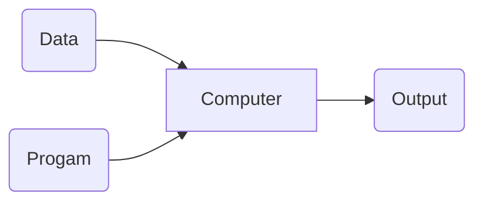
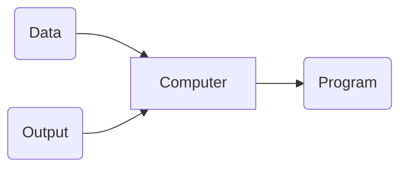
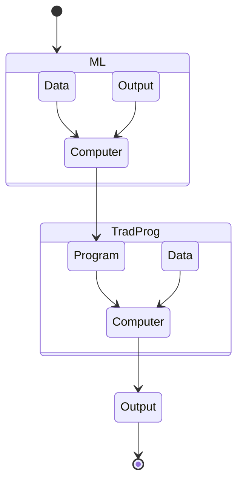
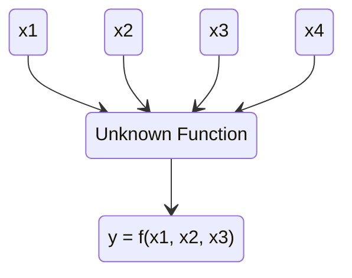

<h1> What Is Machine Learning?</h1>

- Automating automation
- Getting computers to program themselves
- Writing software is the bottleneck
- Let the data do the work instead

The current software developers, are **the new bottlenecks** in modern industries. The way computer engineers put traditional workers out of work, will happen between machine learning scientists and traditional software engineers.

<h1> Differences Between Traditional Programming And Machine Learning</h1>

**Traditional Programming:** 

**Machine Learning:**

The output program in machine learning can be used as the input program for the traditional method.

<h1> Is It Magic?</h1>

Machine Learning is more like **gardening** than magic, because:

- Seeds = Algorithms
- Nutrients = Data
- Gardener = You
- Plants = Programs

<h1> Sample Applications</h1>

:globe_with_meridians: Web search 

🧬 Computational biology

:currency_exchange: Finance  

:shopping_cart: E-commerce 

:rocket: Space exploration 

:artificial_satellite:  Robotics  

:outbox_tray:  Information extraction   

:busts_in_silhouette: ​Social networks 

:bug: ​Debugging  

<h1>Machine Learning In A Nutshell</h1>

- Tens of thousand of machine learning algorithms are out there.
- Hundreds of them come out every year.
- Every machine learning algorithm has three components:
  1. Representation
  2. Evaluation
  3. Optimization

<h2>1) Representation</h2>

- Decision trees
- Sets of rules
- Logic programs
- Instances
- Graphical models _(e.g. Bayes/Markov nets)_
- Neural networks
- Support vector machines
- Model ensembles

<h2>2) Evaluation</h2>

- Accuracy
- Precision and recall
- Squared error
- Likelihood
- Posterior probability
- Cost or utility
- Margin
- Entropy
- K-L divergence

<h2>3) Optimization</h2>

- Combinatorial optimization _(e.g. Greedy search)_
- Convex optimization _(e.g. Gradient descent)_
- Constrained optimization _(e.g. Linear programming)_

<h1>Types Of Learning</h1>

1. Supervised _(inductive)_ learning
   - Training data includes desired outputs.
2. Unsupervised learning
   - Training data **does not** include desired outputs.
3. Semi-supervised learning
   - Training data includes a few desired outputs.
4. Reinforcement learning
   - Rewards from sequence of actions.

<h1>Inductive Learning</h1>

**Given:** examples of a function $(x, F(x))$

**Predict:** function $F(x)$  for new examples of $x$ 

Depending on what we are predicting:

- Discrete $F(x)$ : Classification
- Continuous $F(x)$ : Regression
- $F(x) = \textrm{Probability}(x)$ : Probability estimation

<h1>What Will Be Covered</h1>

1. Supervised Learning:
   - Decision tree induction
   - Rule induction
   - Instance-based learning
   - Bayesian learning
   - Neural networks
   - Support vector machines
   - Model ensembles
   - Learning theory
2. Unsupervised learning:
   - Clustering
   - Dimensionality reduction

<h1>Machine Learning In Practice</h1>

1. Understanding domain, prior knowledge and goals
   - The first step is to understand the problem.
   - The data on its own, doesn't let you generalize.
   - There is no replacement for talking with experts.
   - The goals of the process must be precise and set beforehand.

2. Data integration, selection, cleaning, preprocessing & etc.
   - Most of the time, data is crap.
   - Some people enter random numbers for their birth date and skew the data.
   - Even data reach IT companies _(e.g. E-commerce sites)_ have data spikes.

3. Learning models
   - This is the fun part that most people enjoy.
   - Different variations will be tested in this section.

4. Interpreting results
   - Is the result correct?
   - Is the result accurate?
   - Were the experts wrong?

5. Consolidating and deploying discovered knowledge
   - This might be the single biggest point of failure in such ML projects.
   - Some times, the model won't even be deployed by the company.
   - Maybe the customers don't comply with the recommended results and deny the assistance.

6. Loop :repeat: 

<h1>Inductive Learning</h1>

<h2>Supervised Learning</h2>

**Given:** Training Example $(x, f(x))$ for some unknown function $f$

**Find:** A good approximation of $f$

<h3>Example Applications</h3>

1. Credit risk assessment
	- $x$ : Properties of customer and proposed purchase
	- $f(x)$ : Approve purchase or not

2. Disease diagrams
	- $x$ : Properties of patient _(symptoms, lab tests & etc.)_
	- $f(x)$ : Disease _(or recommended therapy)_

3. Face recognition
	- $x$ : Bitmap picture of person's face
	- $f(x)$ : Name of the person

4. Automatic steering
	- $x$ : Bitmap picture of road surface in front of car
	- $f(x)$ : Degrees to turn the steering wheel

<h3>Appropriate Applications</h3>

1. Situations where there is no human export
	- $x$ : Bond graphs for a new molecule
	- $f(x)$ : Predicted binding strength to AIDS protease molecule
	
2. Situations where humans can perform the task but can't describe how they do it
	- $x$ : Bitmap picture of hand-written character
	- $f(x)$ : ASCII code of the character

3. Situations where the desired function is changing frequently
	- $x$ : Description of stock prices and trades for last 10 days
	- $f(x)$ : Recommended stock transactions

4. Situations where each user needs a customized function
	- $x$ : Incoming email message
	- $f(x)$ : Importance score for presenting to user (or deleting without presenting)

<h2>A Learning Problem</h2>

| Example | $\large x_1$ | $\large x_2$ | $\large x_3$ | $\large x_4$ | $\large y$ |
| :-----: | :------------: | :------------: | :------------: | :------------: | :----------: |
|    1    |       0        |       0        |       1        |       0        |      0       |
|    2    |       0        |       1        |       0        |       0        |      0       |
|    3    |       0        |       0        |       1        |       1        |      1       |
|    4    |       1        |       0        |       0        |       1        |      1       |
|    5    |       0        |       1        |       1        |       0        |      0       |
|    6    |       1        |       1        |       0        |       0        |      0       |
|    7    |       0        |       1        |       0        |       1        |      0       |

<h3>Hypothesis Spaces</h3>

**Complete Ignorance:** There are $2^{16} = 65536$ possible boolean functions over four input features. We can't figure out which one is correct until we've seen every possible input-output pair.

**Simple Rules:** There are only $16$ simple conjunctive rules.

|                 Rule                  | Counterexample  |
| :-----------------------------------: | :-------------: |
|       $\large \Rightarrow y$        |        1        |
|     $\large x_1 \Rightarrow y$      |        3        |
| $\large x_1 \\and x_2 \Rightarrow y$ |        3        |
|            $\large \ldots$             | $\ \large ... $ |

No simple rule can explain the data. The same is true for simple clauses.

**The $\large \textbf{m - of - n}$ Rules:** There are 32 possible rules _(including simple conjunctions and clauses)_.

|            variables            | $\ \large \textbf{1 - of}$ | $\ \large \textbf{2 - of}$ | $\ \large \textbf{3 - of}$ | $\ \large \textbf{4 - of}$ |
| :-----------------------------: | :------------------------: | :------------------------: | :------------------------: | :------------------------: |
|      $\ \large \{{x_1}\} $      |             3              |             -              |             -              |             -              |
|      $\ \large \{{x_2}\} $      |             2              |             -              |             -              |             -              |
|      $\ \large \{{x_3}\} $      |             1              |             -              |             -              |             -              |
|      $\ \large \{{x_4}\} $      |             7              |             -              |             -              |             -              |
|         $\ \large ... $         |            ...             |            ...             |            ...             |            ...             |
| $\ \large \{{x_1, x_3, x_4}\} $ |             1              |         **! ! !**          |             3              |             -              |
|         $\ \large \ldots $         |            ...             |            ...             |            ...             |            ...             |

Finally, there is a situation that actually works _(the **! ! !** example)_. It fits all training data perfectly. So now, we have a candidate. The goal of machine learning algorithms is to come up with the right candidate.

<h1>Two Views Of Learning</h1>

1. **Learning is the removal of our remaining uncertainty.** Suppose we knew that the unknown function was an $m- \ of- n$ boolean function, then we could use the training examples to infer which function it is.
2. **Learning requires guessing a good, small hypothesis class.** We can start with a very small class and enlarge it until it contains an hypothesis that fits the data.

:anger: ***But We Could Be Wrong.***

- Our prior knowledge might be wrong.
- Our guess of the hypothesis class could be wrong.

The smaller the hypothesis class, the more likely we are wrong.

