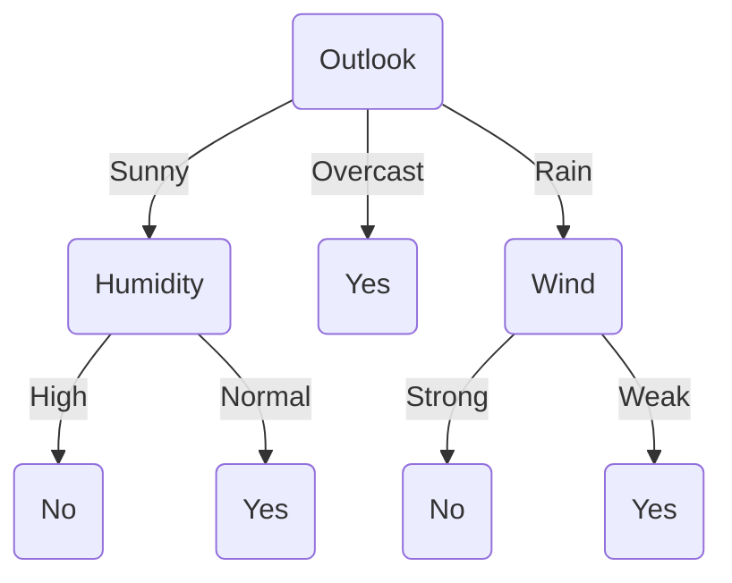
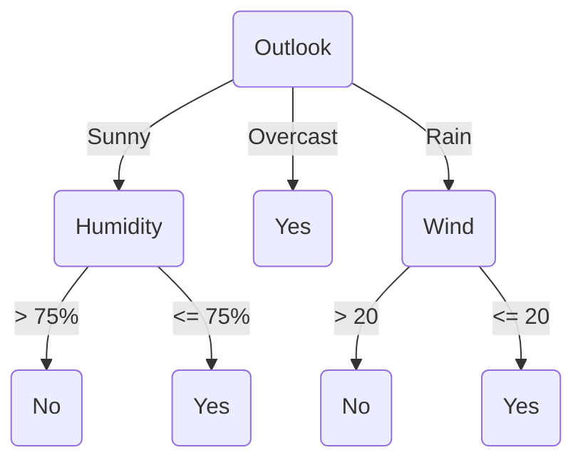

<h1>Two Strategies For Machine Learning</h1>

1. **Develop languages for expressing prior knowledge:** Rule grammars and stochastic models.
2. **Develop flexible hypothesis spaces:** Nested collections of hypotheses, decision trees, rules, neural networks, cases.

In either case:

:anger: ***Develop Algorithms for Finding an Hypothesis that Fits the Data.***

<h1>Terminology</h1>

- **Training example:** An example of the form $\langle x, f(x) \rangle$ .

- **Target function (target concept):** The true function $f$ .

- **Hypothesis:** A proposed function $h$  believed to be similar to $f$ .

- **Concept:** A boolean function. Examples for which $f(x) = 1$ are **positive examples** or **positive instances** of the concept. Examples for which $f(x) = 0$ are called **negative examples** or **negative instances**.

- **Classifier:** A discrete-valued function. The possible values $f(x) \in \{ 1, \ldots , K \}$ are called the **classes** or **class labels**.

- **Hypothesis space:** The space of all hypothesis that can, in practice, be output by a learning algorithm.

- **Version space:** The space of all hypothesis in the hypothesis space that have not yet been ruled out by a training example.

$$\text{Version Space} \subseteq \text{Hypothesis  Space}$$

If your version space winds up empty, you have probably done something wrong. 

:grey_question:

>   **Q:** Is the version space narrowing, when the algorithm is learning?

> **A:** Yes, the more examples you see, the narrower the version space becomes. Ideally, the version space should contain only one hypothesis, which should be the true one. You can also end up with no hypotheses, which means you should move to a larger hypothesis space to repeat the process. However, if you end up with multiple hypotheses in your version space, what you can do, is to average them.

<h1>Key Issues In Machine Learning</h1>

- **What are good hypothesis spaces?**

  Which spaces have been useful in practical applications and why?

- **What algorithms can work with these spaces?**

  Are these general design principles for machine learning algorithms?

- **How can we optimize accuracy on future data points?**

  This is sometimes called _"the problem of over-fitting"_.

- **How can we have confidence in the results?**

  How much training data is required to find accurate hypothesis? _(the statistical question)_

- **Are some learning problems computationally intractable?**

  If it's intractable, it's basically useless. _(the computational question)_

- **How can we formulate application problems are machine problems?**

  Even if you answer the statistical and computational questions, you still have to find a way to apply the algorithm to a real world problem. _(the engineering question)_

<h1>A Framework For Hypothesis Spaces</h1>

1. **Space:** Does the hypothesis space have a **fixed size** or **variable size**?

   Fixed-size spaces are easier to understand, but variable-size spaces are generally more useful, since they can grow _(like decision trees)_. Variable-size spaces introduce the problem of over-fitting.

2. **Randomness:** Is your hypothesis **deterministic** or **stochastic**?

   This affects how we evaluate hypotheses. If it's deterministic, a training example is either **consistent** _(correctly predicted)_ or **inconsistent** _(incorrectly predicted)_. With a stochastic hypothesis, a training example is **more likely** or **less likely**.

3. **Parameterization:** Is each hypothesis described by a set of **symbolic** _(discrete)_ choices or **continuous** parameters? If both are required, we say the hypothesis space has a **mixed** parameterization. 

   Discrete parameters must be found by combinatorial search methods; continuous parameters can be found numerical search methods.

<h1>A Framework For Learning Algorithms</h1>

1. **Search procedure:** How can you find the best hypothesis?

   - **Direction computation:** solve for the hypothesis directly.
   - **Local search:** start with an initial hypothesis, make small improvements until a local optimum.
   - **Constructive search:** start with an empty hypothesis, gradually add structures to it until local optimum.

2. **Timing:** It has to do with how hardworking the algorithm is.

   - **Eager:** Analyze the training data and construct an explicit hypothesis, like an eager student who studies everything beforehand.
   - **Lazy:** Store the training data and wait until a test data point is presented, then construct an ad hoc hypothesis to classify that one data point, like a lazy student who procrastinates until the exam and studies the night before. Paradoxically, the lazy learning method is the more powerful one compared to the eager learning method, since in machine learning, laziness can actually pay off.

3. **Online vs. Batch:** Depending on the training example, we can use two different approaches for dealing with eager algorithms.

   - **Batch:** Collect training examples, analyze them, output an hypothesis. It's traditionally how most learning has been done.

   - **Online:** Analyze each training example as it's presented. It's actually what children do when they grow up, dealing with new information on a daily basis non-stop. Nowadays, more people are turning to online learning in the industry.

     There are obviously, pros and cons for each of them, For instance, in online learning, search is harder because you can't see most of your data yet _(when in batch learning, you already have all of the examples)_. Online learning doesn't really work with lazy algorithms, however, you can combine the two together. 

<h1>Decision Trees</h1>

Anthony Goldbloom, Co-founder and CEO of **[Kaggle](https://www.kaggle.com)** once said:

> The number one thing that works, is the ensembles of decision trees.

Decision trees, are a symbolic type of learning and the leading symbolic approach.

<h2>Learning Decision Trees</h2>

Decision trees provide a very popular and efficient hypothesis space.

- **Variable Size:** Any boolean function can be represented.
- **Deterministic**
- **Discrete and continuous parameters**

Learning algorithms for decision trees can be described as:

- **Constructive search:** The tree is built by adding nodes.
- **Eager**
- **Batch** (although, online algorithms do exist)

<h2>Decision Tree Hypothesis Space</h2>

-   **Internal nodes:**: They test the value of particular features $x_j$ and branch according to the results of the test.
-   **Leaf nodes:** They specify the class $h(x)$.

Suppose the features are **Outlook** $(x_1)$, **Temperature** $(x_2)$, **Humidity** $(x_3)$ and **Wind** $(x_4)$. Then the feature vector $\chi = \text{(Sunny,\ Hot,\ High,\ Strong)}$ will be classified as a **No**. The **Temperature** feature is irrelevant.

If the features are continuous, internal nodes may test the value of a feature against a threshold.

<h2>Decision Tree Decision Boundaries</h2>

Decision trees divide the feature space into axis-parallel rectangles, and label each rectangle with one of the $K$ classes. You can always represent a boolean function with a decision tree, since truth tables are very inefficient decision trees. The tree will in the worst case require exponentially many nodes.

<h3>Decision Trees Provide Variable-Size Hypothesis Space</h3>

As the number of nodes _(or depth)_ of a tree increases, the hypothesis space grows.
-   **Depth 1 :** Can represent any boolean function of one feature _("decision stump")_.
-   **Depth 2 :** Any boolean function of two features, some boolean functions involving three features, such as $(x_1 \land x_2) \lor (\neg x_1 \land \neg x_3)$.
-   **etc.**

<h2>Learning Algorithms For Decision Trees</h2>
The same basic learning algorithm has been discovered by many people independently:

$$\large
\begin{aligned}
	&\large \textbf{GrowTree} (S) \\
	&\textbf{if}\ (y=0\ \textrm{for all}\ \langle x,y \rangle \in S)\ \textbf{return}\ \textrm{new leaf(0)} \\
	&\textbf{else if}\ (y = 1\ \textrm{for all}\ \langle x, y \rangle \in S)\ \textbf{return}\ \textrm{new leaf(1)} \\
	&\textbf{else:} \\
	&\qquad\textrm{choose best attribute}\ x_j \\
	&\qquad S_0 = \textrm{all}\ \langle x, y \rangle \in S\ \textrm{with}\ x_j = 0 \\
	&\qquad \textbf{return}\ \textrm{new node}(x_j,\ \textrm{GrowTree}(S_0), \ \textrm{GrowTree}(S_1))
\end{aligned}
$$

<h2>Choosing The Best Attribute</h2>

One way to choose the best attribute is to perform a 1-step lookahead search and choose the attribute that gives the lowest error rate on the training data.

$$\large
\begin{aligned}
	&\large \textbf{ChooseBestAttribute}(S) \\
	&\textrm{choose}\ j\ \textrm{to mininmize}\ J_j \textrm{, computed as follows:} \\
	&\qquad S_0 = \textrm{all}\ \langle x, y \rangle \in S\ \textrm{with}\ x_j = 0 \\
	&\qquad S_1 = \textrm{all}\ \langle x, y \rangle \in S\ \textrm{with}\ x_j = 1 \\
	&\qquad y_0 = \textrm{the most common value of}\ y\ \textrm{in}\ S_0 \\
	&\qquad y_1 = \textrm{the most common value of}\ y\ \textrm{in}\ S_1 \\
	&\qquad J_0 = \textrm{number of examples}\ \langle x, y \rangle \in\ S_0\ \textrm{with}\ y \neq y_0 \\
	&\qquad J_1 = \textrm{number of examples}\ \langle x, y \rangle \in\ S_1\ \textrm{with}\ y \neq y_1 \\
	&\qquad J_j = J_0 + J_1\ \textrm{(total errors if we split on this feature)} \\
	&\textbf{return}\ j
\end{aligned}
$$

Greedy search often works pretty well, and it prevents us from over-fitting. Therefore, most people don't implement a decision tree and jump straight to using greedy search. With ensembles trees, you can learn different things at different times _(which is always better)_.

| $\large x_1$ | $\large x_2$ | $\large x_3$ | $\large y$ |
| :------------: | :------------: | :------------: | :----------: |
|       0        |       0        |       0        |      1       |
|       0        |       0        |       1        |      0       |
|       0        |       1        |       0        |      1       |
|       0        |       1        |       1        |      1       |
|       1        |       0        |       0        |      0       |
|       1        |       0        |       1        |      1       |
|       1        |       1        |       0        |      0       |
|       1        |       1        |       1        |      0       |

Just using the number of errors or the accuracy as your criteria is not a good idea, and they actually don't work quite well. Unfortunately, these measures don't always work well, because they don't detect causes when we are making "progress" towards a good tree.

<h2>A Better Heuristic From Information Theory</h2>

Let $V$ be a random variable with the following probability distribution:

| $\large P(V=0)$ | $\large P(V=1)$ |
| :---------------: | :---------------: |
|        0.2        |        0.8        |

The $\textrm{surprise}$ , $S(V = v)$ of each value of $V$ is defined to be:

$$S(V=v) = -\log P(V=v)$$

-   An even with probability 1 gives us zero surprise. 
-   An event with probability 0 gives us infinite surprise!

It turns out that the surprise is equal to the number of bits of information that need to be transmitted to a recipient who knows the probabilities of the results. This is also called the $\textrm{description length of } V = v$ . Fractional bits only make sense if they are part of a longer message _(e.g. describe a whole sequence of coin tosses)_.

<h2>Entropy</h2>

The $\textrm{entropy of }V$, denoted $H(V)$ is defined as follows:

$$H(V) = \sum_{v=0}^1 - P(H=v) \log P(H=v)$$
	
This is the average surprise of describing the result of one "trial" of $V$ _(one coin toss)_. 

Entropy can be viewed as a measure of uncertainty.

<h2>Mutual Information</h2>

Now consider two random variables $A$ and $B$ that are not necessarily independent. The $\textrm{mutual information}$ between $A$ and $B$ is the amount of information we learn about $\ B$ by knowing the value of $A$ _(and vice versa)_. It is computed as follows:

$$I(A;B) = H(A) - \sum_{b} P(B=b) \cdot H(A|B=b)$$

>   $H(A)$ is the entropy of $A$ before seeing $B$ 
>
>   $H(A | B=b)$ is the entropy of $A$ conditioned on $B$

In particular, consider the class $Y$ of each training example and the value of feature $x_1$ to be random variables. Then the mutual information quantifies how much $x_1$ tells us about the value of the class $Y$.

<h2>Visualizing Heuristics</h2>

Mutual information works, because it's a convex measure.

<h2>Non-Boolean Features</h2>

Before having an industrial level decision tree, we have to deal with some issues. The first one is, when features are not boolean. The obvious way is to use features with multiple values.

1.  **Features with multiple discrete values**
    -   Construct a multi-way split?
    -   Test for one value versus all of the others?
    -   Group the values into two disjoint subsets?

2.  **Real-valued features**
Consider a threshold split using each observed value of the feature.

Whichever method is used, the mutual information can be computer to choose the best split. The simplest way to deal with real-valued attributes is to consider different thresholds _(e.g. temperature being higher or lower than $x^\circ C$)_. In essence, what setting a threshold does, is it reduces continuous levels to boolean ones.

<h2>Learning Parity With Noise</h2>

All of the things shown thus far are heuristics, which means that they fail sometimes. Now how can we detect if it is failing or not? When learning $\oplus$ _("exclusive-or", the 2-bit parity)_, all splits look equally good. Hence, decision tree algorithms cannot distinguish random noisy features from parity features. 

| $\large x_1$ | $\large x_2$ | $\large x_3$ | $\large y$ |
| :------------: | :------------: | :------------: | :----------: |
|       0        |       0        |       0        |      0       |
|       0        |       0        |       1        |      0       |
|       0        |       1        |       0        |      1       |
|       0        |       1        |       1        |      1       |
|       1        |       0        |       0        |      1       |
|       1        |       0        |       1        |      1       |
|       1        |       1        |       0        |      0       |
|       1        |       1        |       1        |      0       |

This problem isn't only for decision trees, but in machine learning in general. In practice, what happens is that you have pretty complex frontiers. Therefore, there are subproblems that aren't parities. In that case, you either have to give up on, or have a lot of data and split by luck.

<h2>Attributes With Many Values</h2>

What happens when we have an attribute with many values? For a problem like credit scoring, we have the social security numbers of the applicants. Now what happens if we split on the social security number? What will be the resulting entropy? It's going to be zero. But this has problem: **Massive Over-fitting**

If someone comes with a new social security number, we will have no idea on what to do. With the algorithms we have seen so far, attributes with more values have unfair advantage compared to attributes with less values, because we can split the data on them more finely. Consequentially, the resulting entropy on the former will be less.

Problem:

-   If attribute has many values, $\textrm{Gain}$ will select it.
-   Imagine using $\textrm{Date}=June\ 3rd\ 1996$ as an attribute.

One approach would be to use $\textrm{GainRatio}$ instead:

$$\Large
\begin{align}
	\textrm{GainRatio}(S, A) = &\frac{\textrm{Gain}(S, A)}{\textrm{SplitInformation}(S, A)} \\
	\textrm{SplitInformation}(S, A) = & - \sum_{i=1}^c \frac{|S_i|}{|S|} \log_2 \frac{|S_i|}{|S|}
\end{align}
$$

>   $S_i$ is a subset of $S$  for which $A$ has the value of $v_i$

<h2>Unknown Attribute Values</h2>

The bigger the dataset, the worse it is. We have big data, but they're most likely filled with noise or unknown values. For instance, when you have a medical diagnose dataset of a patient, but not all of the test results. So there are missing information. 

What if some examples are missing values of $A$ ? Use training examples anyway, sort through trees, and then perform one of these methods:

1.  If node $n$ tests $A$ , assign most common value of $A$ among other examples sorted to node $n$ .
2.  Assign the most common value of $\ A$ among other examples with the same target value.
3.  Assign probability $p_i$ to each possible value $v_i$ of $A$ and then assign fraction $p_i$ of example to each descendant in the tree.

Classify the new examples in the same fashion.

:grey_question:

>   **Q:** How do you come up with the values for $p_i$ ?
>
>   **A:** You count. So you have your training set at that node, and then look at the examples of the same class, and you count the fraction of those examples with the same attributes. That will be your probability.
>
>   **Q:** So what about the test data?
>
>   **A:** In test data, you actually have to have the probabilities to be able to apply them.

<h2>Overfitting In Decision Trees</h2>

Overfitting is the biggest problem as of today in machine learning. More papers have been written about combating overfitting than anything else. 

Now let's go back to the previous example of you trying to take your friend to play tennis. Let's suppose a random unexpected event happens _(e.g. your friend being hangover from the night before)_ and suddenly you get a **No** as an answer, even when everything else was perfectly set. Now what do you do? Your decision tree now is broken. After this incident, the future examples will be misclassified _(since your friend won't be hungover next time most likely)_, and a sub region of similar instances will be incorrectly generalized _(which damages the tree)_ and also your decision tree will become bigger.

Consider adding a noisy training example:

$$\textrm{Sunny, Hot, Normal, Strong, PlayTennis = No}$$

What effect does this have on our tree?

<h1>Overfitting</h1>

Consider error of hypothesis $h$ over:

-   Training data: $\textrm{error}_{\textrm{train}} (h)$
-   Entire distribution $D$ of data:  $\textrm{error}_{D} (h)$

Hypothesis $h \in H$ **overfitts** the training data if there is an alternative hypothesis $h^{\prime} \in H$ such that:

$$\textrm{error}_{\textrm{train}} (h) < \textrm{error}_{\textrm{train}} (h^{\prime})$$
 and:
 
$$\textrm{error}_{D} (h) < \textrm{error}_{D} (h^{\prime})$$

<h2>Overfitting In Decision Tree Learning</h2>

What happens in practice when you overfit?

People who compete in [Kaggle](https://www.kaggle.com/) usually learn this painful lesson that they're at the top of the leader board at first, since the leader board is based on the training data _(and not the test data)_, but then finally the winners are chosen from the test data that only Kaggle sees. So some models are at the top because they have overfit and increased their accuracy, but then after the submission is over, they aren't even in the top 10.

So when you give a machine learning project to someone, make sure that you hold on some of the data to later check whether the model actually works or not. Now if you are going to make a model, make sure to split the data into 2 groups:

1.  Training data
2.  Test data

That way, you can have a dataset that you're going to use only in the very last part of the project to test your model. That last dataset is also called the **Validation dataset**, which can be used by either parties in a project. 

Initially the accuracy rises up rapidly, on both of the datasets, but then things tend to flatten out. The real disaster comes when you decide to grow the tree. You're still bettering your predictions, but the accuracy on the test dataset will go down until it becomes somewhat worse than random guessing.  This is the biggest pitfall in machine learning.

In the example, size 10 is presumably the best size for our tree before it gets worse. As you can see, after that point, the accuracy on the test data drops continuously.

<h2>Avoiding Overfitting</h2>

How can we avoid overfitting?

1.  Stop growing when data split isn't statistically significant.
2.  Grow a full tree, then post-prune.

How to select the **best** tree?

1.  Measure performance over training data.
2.  Measure performance over separate validation datasets.
3.  Add complexity penalty to performance measure.

You can find more info about the topic of **Pruning** on [Wikipedia](https://en.wikipedia.org/wiki/Decision_tree_pruning) or from this document by [Carnegie Mellon University](https://www.cs.cmu.edu/~bhiksha/courses/10-601/decisiontrees/).

>   This image is from the Carnegie Mellon documentation.

<h3>Cross-Validation</h3>

Cross-validation is a very clever way to make maximum use of our data. The snippet below is from [Wikipedia](https://en.wikipedia.org/wiki/Cross-validation_(statistics)):

>   **Cross-validation**, sometimes called **rotation estimation** or **out-of-sample testing**, is any of various similar [model validation](https://en.wikipedia.org/wiki/Model_validation) techniques for assessing how the results of a [statistical](https://en.wikipedia.org/wiki/Statistics) analysis will [generalize](https://en.wikipedia.org/wiki/Generalization_error) to an independent data set. It is mainly used in settings where the goal is prediction, and one wants to estimate how [accurately](https://en.wikipedia.org/wiki/Accuracy) a [predictive model](https://en.wikipedia.org/wiki/Predictive_modelling) will perform in practice. 

>   This image is from DataRobot Artificial Intelligence Wiki | Cross-Validation.

<h2>Rule Post-Pruning</h2>
The idea is that to post-prune the decision tree into something that is no longer a decision tree, but a set of rules.
1.  Convert tree to equivalent set of rules.
2.  Prune each rule independently of others.
3.  Sort final rules into desired sequences for use.

<h3>Converting A Tree To Rules</h3>
When you turn each path to leaf into a rule, you have converted that tree to a set of rules. For instance:

$$\large
\begin{align*}
	&\textbf{if}\ (Outlook = Sunny) \land (Humidity = High): \\
	&\qquad \textbf{then}\ PlayTennis := \textrm{No} \\
	&\textbf{if}\ (Outlook = Sunny) \land (Humidity = Normal): \\
	&\qquad \textbf{then}\ PlayTennis := \textrm{Yes}
\end{align*}
$$

The number of rules will be equal to the number of leafs of the tree. A set of rules is more flexible than a decision tree. With a rule set, you can avoid a lot of useless tests, which usually lead to overfitting if not taken care of. 

How can someone **sort the rules**? The rule of thumb is to put the **more accurate ones first**.

---

<h1>Scaling Up</h1>
Scaling won't be taught heavily in this course, however, it is preferable to know the 3 main algorithms that have been developed to work with data.
- **ID3, C4.5:** assume data first in main memory, which is suitable for up to hundred of thousands of examples.
- **SPRINT, SLIQ:** multiple sequential scans of data, which is suitable for up to millions of examples.
- **VFDT:** at most one sequential scan, which is suitable for up to billions of examples.
