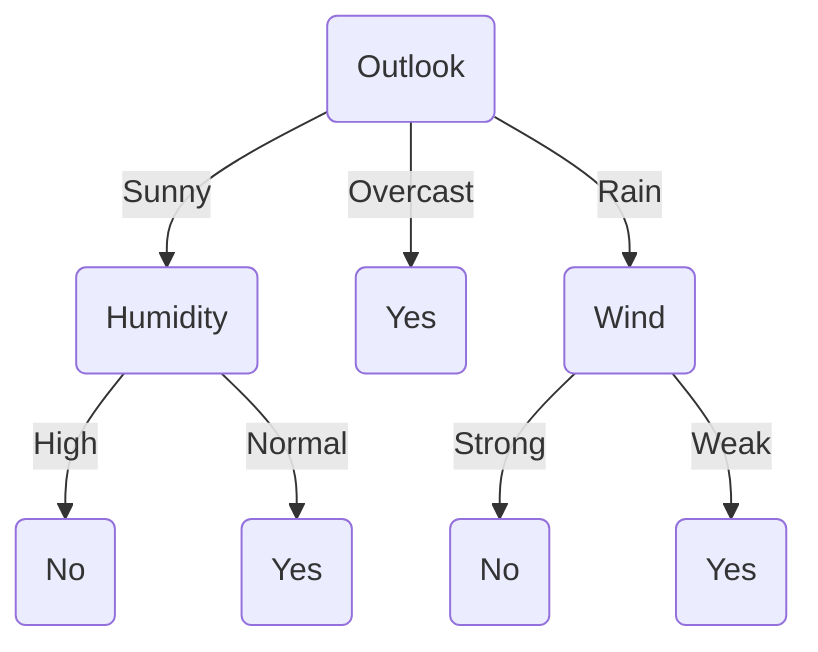
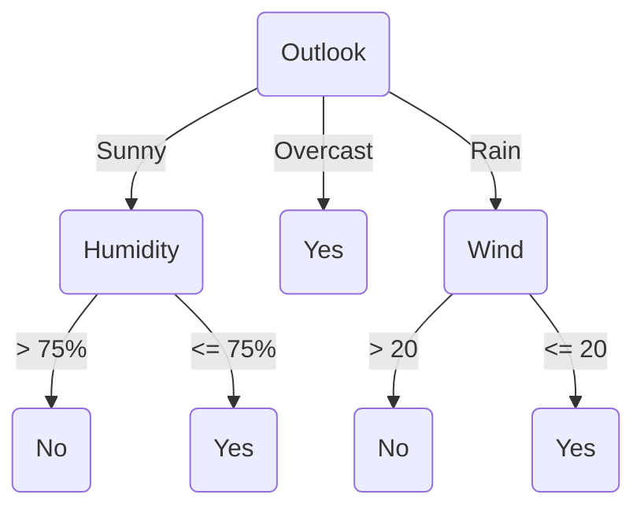

<h1>Two Strategies For Machine Learning</h1>

1. **Develop languages for expressing prior knowledge:** Rule grammars and stochastic models.
2. **Develop flexible hypothesis spaces:** Nested collections of hypotheses, decision trees, rules, neural networks, cases.

In either case:

:anger: ***Develop Algorithms for Finding an Hypothesis that Fits the Data.***

<h1>Terminology</h1>

- **Training example:** An example of the form $\  \langle x, f(x) \rangle$ .

- **Target function (target concept):** The true function $\  f $ .

- **Hypothesis:** A proposed function $\  h$  believed to be similar to $\  f$ .

- **Concept:** A boolean function. Examples for which $\  f(x) = 1 $ are **positive examples** or **positive instances** of the concept. Examples for which $\  f(x) = 0 $ are called **negative examples** or **negative instances**.

- **Classifier:** A discrete-valued function. The possible values $\  f(x) \in \{1, ..., K\} $ are called the **classes** or **class labels**.

- **Hypothesis space:** The space of all hypothesis that can, in practice, be output by a learning algorithm.

- **Version space:** The space of all hypothesis in the hypothesis space that have not yet been ruled out by a training example.

  $\  Version \ Space \subseteq Hypothesis \ Space$

If your version space winds up empty, you have probably done something wrong. 

:grey_question:

>   **Q:** Is the version space narrowing, when the algorithm is learning?

> **A:** Yes, the more examples you see, the narrower the version space becomes. Ideally, the version space should contain only one hypothesis, which should be the true one. You can also end up with no hypotheses, which means you should move to a larger hypothesis space to repeat the process. However, if you end up with multiple hypotheses in your version space, what you can do, is to average them.

<h1>Key Issues In Machine Learning</h1>

- **What are good hypothesis spaces?**

  Which spaces have been useful in practical applications and why?

- **What algorithms can work with these spaces?**

  Are these general design principles for machine learning algorithms?

- **How can we optimize accuracy on future data points?**

  This is sometimes called _"the problem of over-fitting"_.

- **How can we have confidence in the results?**

  How much training data is required to find accurate hypothesis? _(the statistical question)_

- **Are some learning problems computationally intractable?**

  If it's intractable, it's basically useless. _(the computational question)_

- **How can we formulate application problems are machine problems?**

  Even if you answer the statistical and computational questions, you still have to find a way to apply the algorithm to a real world problem. _(the engineering question)_

<h1>A Framework For Hypothesis Spaces</h1>

1. **Space:** Does the hypothesis space have a **fixed size** or **variable size**?

   Fixed-size spaces are easier to understand, but variable-size spaces are generally more useful, since they can grow _(like decision trees)_. Variable-size spaces introduce the problem of over-fitting.

2. **Randomness:** Is your hypothesis **deterministic** or **stochastic**?

   This affects how we evaluate hypotheses. If it's deterministic, a training example is either **consistent** _(correctly predicted)_ or **inconsistent** _(incorrectly predicted)_. With a stochastic hypothesis, a training example is **more likely** or **less likely**.

3. **Parameterization:** Is each hypothesis described by a set of **symbolic** _(discrete)_ choices or **continuous** parameters? If both are required, we say the hypothesis space has a **mixed** parameterization. 

   Discrete parameters must be found by combinatorial search methods; continuous parameters can be found numerical search methods.

<h1>A Framework For Learning Algorithms</h1>

1. **Search procedure:** How can you find the best hypothesis?

   - **Direction computation:** solve for the hypothesis directly.
   - **Local search:** start with an initial hypothesis, make small improvements until a local optimum.
   - **Constructive search:** start with an empty hypothesis, gradually add structures to it until local optimum.

2. **Timing:** It has to do with how hardworking the algorithm is.

   - **Eager:** Analyze the training data and construct an explicit hypothesis, like an eager student who studies everything beforehand.
   - **Lazy:** Store the training data and wait until a test data point is presented, then construct an ad hoc hypothesis to classify that one data point, like a lazy student who procrastinates until the exam and studies the night before. Paradoxically, the lazy learning method is the more powerful one compared to the eager learning method, since in machine learning, laziness can actually pay off.

3. **Online vs. Batch:** Depending on the training example, we can use two different approaches for dealing with eager algorithms.

   - **Batch:** Collect training examples, analyze them, output an hypothesis. It's traditionally how most learning has been done.

   - **Online:** Analyze each training example as it's presented. It's actually what children do when they grow up, dealing with new information on a daily basis non-stop. Nowadays, more people are turning to online learning in the industry.

     There are obviously, pros and cons for each of them, For instance, in online learning, search is harder because you can't see most of your data yet _(when in batch learning, you already have all of the examples)_. Online learning doesn't really work with lazy algorithms, however, you can combine the two together. 

<h1>Decision Trees</h1>

Anthony Goldbloom, Co-founder and CEO of **[Kaggle](https://www.kaggle.com)** once said:

> The number one thing that works, is the ensembles of decision trees.

Decision trees, are a symbolic type of learning and the leading symbolic approach.

<h2>Learning Decision Trees</h2>

Decision trees provide a very popular and efficient hypothesis space.

- **Variable Size:** Any boolean function can be represented.
- **Deterministic**
- **Discrete and continuous parameters**

Learning algorithms for decision trees can be described as:

- **Constructive search:** The tree is built by adding nodes.
- **Eager**
- **Batch** _(although, online algorithms do exist)_​

<h2>Decision Tree Hypothesis Space</h2>

-   **Internal nodes:**: They test the value of particular features $\ x_j $ and branch according to the results of the test.
-   **Leaf nodes:** They specify the class $\ h(x) $.

Suppose the features are **Outlook** $\ (x_1) $, **Temperature** $\ (x_2) $, **Humidity** $\ (x_3) $ and **Wind** $\ (x_4) $. Then the feature vector $\ \chi = (Sunny,\ Hot,\ High,\ Strong) $ will be classified as a **No**. The **Temperature** feature is irrelevant.

If the features are continuous, internal nodes may test the value of a feature against a threshold.

<h2>Decision Tree Decision Boundaries</h2>

Decision trees divide the feature space into axis-parallel rectangles, and label each rectangle with one of the$\ K $ classes. You can always represent a boolean function with a decision tree, since truth tables are very inefficient decision trees. The tree will in the worst case require exponentially many nodes.

<h3>Decision Trees Provide Variable-Size Hypothesis Space</h3>

As the number of nodes _(or depth)_ of a tree increases, the hypothesis space grows.

-   **Depth 1 :** Can represent any boolean function of one feature _("decision stump")_.
-   **Depth 2 :** Any boolean function of two features, some boolean functions involving three features, such as $\ (x_1 \and x_2) \or (\neg x_1 \and \neg x_3)$.
-   **etc.**

<h2>Learning Algorithms For Decision Trees</h2>

The same basic learning algorithm has been discovered by many people independently:

$\ \begin{aligned}&\large \textbf{GrowTree} (S)\\&\textbf{if}\ (y=0\ \textrm{for all}\ \langle x,y \rangle \in S)\ \textbf{return}\ \textrm{new leaf(0)}\\&\textbf{else if}\ (y = 1\ \textrm{for all}\ \langle x, y \rangle \in S)\ \textbf{return}\ \textrm{new leaf(1)} \\&\textbf{else}\\&\qquad\textrm{choose best attribue}\ x_j\\&\qquad S_0 = \textrm{all}\ \langle x, y \rangle \in S\ \textrm{with}\ x_j = 0\\&\qquad \textbf{return}\ \textrm{new node}(x_j,\ \textrm{GrowTree}(S_0), \ \textrm{GrowTree}(S_1))\\ \end{aligned}$

<h2>Choosing The Best Attribute</h2>

One way to choose the best attribute is to perform a 1-step lookahead search and choose the attribute that gives the lowest error rate on the training data.

$\ \large \textbf{ChooseBestAttribute}(S)\\ \textrm{choose}\ j\ \textrm{to mininmize}\ J_j \textrm{, computed as follows:}\\ \qquad S_0 = \textrm{all}\ \langle x, y \rangle \in S\ \textrm{with}\ x_j = 0 \\\qquad S_1 = \textrm{all}\ \langle x, y \rangle \in S\ \textrm{with}\ x_j = 1 \\ \qquad y_0 = \textrm{the most common value of}\ y\ \textrm{in}\ S_0\\ \qquad y_1 = \textrm{the most common value of}\ y\ \textrm{in}\ S_1\\ \qquad J_0 = \textrm{number of examples}\ \langle x, y \rangle \in\ S_0\ \textrm{with}\ y \neq y_0\\ \qquad J_1 = \textrm{number of examples}\ \langle x, y \rangle \in\ S_1\ \textrm{with}\ y \neq y_1\\ \qquad J_j = J_0 + J_1\ \textrm{(total errors if we split on this feature)}\\ \textbf{return}\ j $

Greedy search often works pretty well, and it prevents us from over-fitting. Therefore, most people don't implement a decision tree and jump straight to using greedy search. With ensembles trees, you can learn different things at different times _(which is always better)_.

| $\ \large x_1$ | $\ \large x_2$ | $\ \large x_3$ | $\ \large y$ |
| :------------: | :------------: | :------------: | :----------: |
|       0        |       0        |       0        |      1       |
|       0        |       0        |       1        |      0       |
|       0        |       1        |       0        |      1       |
|       0        |       1        |       1        |      1       |
|       1        |       0        |       0        |      0       |
|       1        |       0        |       1        |      1       |
|       1        |       1        |       0        |      0       |
|       1        |       1        |       1        |      0       |

Just using the number of errors or the accuracy as your criteria is not a good idea, and they actually don't work quite well. Unfortunately, these measures don't always work well, because they don't detect causes when we are making "progress" towards a good tree.

<h2>A Better Heuristic From Information Theory</h2>

Let $\ V$ be a random variable with the following probability distribution:

| $\ \large P(V=0)$ | $\ \large P(V=1)$ |
| :---------------: | :---------------: |
|        0.2        |        0.8        |

The $\ \textrm{surprise}\ $, $\ S(V = v)\ $of each value of $\ V\ $is defined to be:
$$
\begin{align*} 
	&& S(V=v) = -\log P(V=v)\\ 
\end{align*}
$$

-   An even with probability 1 gives us zero surprise. 
-   An event with probability 0 gives us infinite surprise!

It turns out that the surprise is equal to the number of bits of information that need to be transmitted to a recipient who knows the probabilities of the results. This is also called the $\ \textrm{description length of}\ V = v\ $. Fractional bits only make sense if they are part of a longer message _(e.g. describe a whole sequence of coin tosses)_.

<h2>Entropy</h2>

The $\ \textrm{entropy of}\ V\ $, denoted $\ H(V) $ is defined as follows:
$$
\begin{align*} 
	&& H(V) = \sum_{v=0}^1 -P(H=v) \log P(H=v) \\ 
\end{align*}
$$
This is the average surprise of describing the result of one "trial" of $\ V$ _(one coin toss)_. 

Entropy can be viewed as a measure of uncertainty.

<h2>Mutual Information</h2>

Now consider two random variables $\ A$ and $\ B$ that are not necessarily independent. The $\ \textrm{mutual information}$ between $\ A$ and $\ B$ is the amount of information we learn about $\ B$ by knowing the value of $\ A$ _(and vice versa)_. It is computed as follows:
$$
\begin{align*}
	&&I(A;B) = H(A) - \sum_{b} P(B=b) \cdot H(A|B=b)\\
\end{align*}
$$
In particular, consider the class $\ Y$ of each training example and the value of feature $\ x_1$ to be random variables. Then the mutual information quantifies how much $\ x_1$ tells us about the value of the class $\ Y$.

