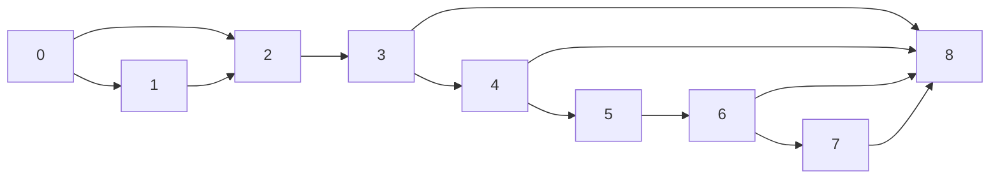

<h1>Rule Induction</h1>

Why not just directly learn rules, instead of first making a decision tree and then turning it into a set of rules? The answer to this question will come in 2 parts:

1.  Propositional rules
2.  First-order rules


<h1>Learning Sets Of Rules</h1> 

A famous example is from [Walmart](https://www.walmart.com/), where the data miners realized that: 

>   A set of customers who buy diapers, purchase beers as well. :baby: :beer:

The explanation for this situation is that, fathers who are buying diapers for their kids, may tend to buy beers to compensate for the pain of life.

Rules are very easy to understand popular in data mining:

-   **Variable size:** Any boolean function can be presented.
-   **Deterministic:** Rules are just a simple implication.
-   **Discrete and continuous parameters:** Confidence, coverage and numbers like these can be attached to rules.

Learning algorithms for rule sets can be described as:

-   **Constructive search:** The rule set is built by adding rules; each rule is constructed by adding conditions.
-   **Eager:** First give a data base, then extract all the rules possible, and finally apply the rules when the time comes.
-   **Batch:** Rules are mostly learned in batch mode.

The funny thing is that, in the previous example, Walmart decided to put the beer section as far away as possible from the diapers section, in order to maximize the chances of persuading fathers to purchase extra stuff whilst walking the aisle. The actions you take based on the rules are a whole different issue, but the first step is to discover the associations.


<h1>Rule Set Hypothesis Space</h1>

Like decision trees, rules are not a mathematically complicated representation. 

-   **Each rule is a conjunction of tests.** Each test has the form $ x_j = v,\ x_j \le v $ or $\ x_j \ge v $ where $\ v $ is a value for $\ x_j $ that appears in the training data.
    $$
    x_1 = Sunny \ \and \ x_2 \le 75 \% \Rightarrow y = 1
    $$
    
-   **A rule set is a disjunction of rules.** Typically all of the rules are for one class _(e.g. $\ y = 1 $​)_. An example is classified into $ y = 1 $​ if **any** rule is satisfied.
    $$
    \begin{align}
    	x_1 = Sunny \ \and \ x_2 \le 75 \% \Rightarrow y = 1 \\
    	x_1 = Overcast \Rightarrow y = 1 \\
    	x_1 = Rain \ \and \ x_3 \le 20 \Rightarrow y = 1
    \end{align}
    $$


<h1>Relationship To Decision Trees</h1>

You can turn a set of rules, into a truth table, and then transform that into a decision tree. Since a decision tree may be larger than a set of rules, you can't just easily turn decision trees into rule sets and vice versa; there's a snag. 

A small set of rules can correspond to a big decision tree, because of the $ Replication \ Problem $​ .
$$
x_1 \and x_2 \Rightarrow y = 1 \qquad \qquad x_3 \and x_4 \Rightarrow y = 1 \qquad \qquad x_5 \and x_6 \Rightarrow y = 1
$$


If we allow a [decision graph](https://www.bayesserver.com/docs/introduction/decision-graphs), then a decision tree graph won't suffer from a blob of set of rules. However, these graphs host a number of problems that make them inefficient. 

As we can see, even though the rules are simple, the size of the tree grows exponentially with the number of rules. In general, converting a set of rules into a decision tree might cause an exponential blowup. In this regard, rules have a serious advantage compared to decision trees.


<h1>Learning A Single Rule</h1>

How can we propose a set of rules? For example, we have a bank, and they want to decide whether a customer is a good credit risk. Probably, the first thing to consider is a rule that has a highly predictive feature, such as the person's total net worth in this case.

We grow a rule by starting with an empty rule and adding tests one at a time until the rule **covers** only positive examples.

$\ \begin{aligned}&\large \textbf{GrowRule} (S)\\& R = \{ \ \} \\&\textbf{repeat} \\&\qquad\textrm{choose best test}\ x_j \Theta v \ \textrm{to add to}\  R, \textrm{where}\ \Theta \in \{= , \neq , \leq , \ge \} \\ & \qquad S := S - (\textrm{all examples that do not satisfy}\ R \cup \{ x_j \Theta v \}) \\ & \textbf{until}\ S \ \textrm{contains only positive examples} \end{aligned} $

---

A question might be asked, what if we have added every single feature to a rule, but there is still a mixture of positive and negative examples? Might this situation happen? **Absolutely!** 

Consider this, we have 2 patients, with exactly the same symptoms. Now, one of them might have the flue, and the other doesn't. This can happen all the time. Therefore, there's a similarity between this and the induction on decision trees. You might have one rule that can capture a certain portion of the population, but what if you want to find out the other people, who can be valid candidates in your research? It's like when a single rule covers a small portion of positive examples _(they were counted for)_, but now there are still a bunch of other positive examples that the rule hasn't covered, but we still need to find. The next thing to do, is to find another rule that can cover as many positive examples as possible, which is accurate as much as possible _(meaning, it covers as less negative examples as possible)_.   

---


# Learning A Set Of Rules (Separate-and-Conquer)

To summarize what we just learned, we have an outer loop that calls the inner loop, the inner loop is growing a single rule, the outer rule will throw out the learned rules until there are no positive examples left.

$\ \ \begin{aligned}&\large \textbf{GrowRuleSet} (S)\\& A = \{ \ \} \\&\textbf{repeat} \\&\qquad R := \textrm{GrowRule}(S) \\ & \qquad \textrm{Add}\ R \ \textrm{to} \ A \\ & \qquad S := S - (\textrm{all positive examples that satisfy}\ R ) \\ & \textbf{until}\ S \ \textrm{is empty} \\ & \textbf{return}\ A \end{aligned} $

---


# Choosing The Best Test

-   Current rule $\ R$​ covers $ m_0$​ negative examples and $ m_1$​ positive examples.

    $\ \textrm{Let}\ p = \frac{m_1}{m_0 + m_1}$

-   Proposed rule $\ R \cup \{ x_j \Theta v \}$ covers $\ m_{0}^{'}$ and $\ m_{1}^{'}$ examples.

    $\ \textrm{Let}\ p = \frac{m_{1}^{'}}{m_{0}^{'} + m_{1}^{'}}$

-   $\ \textrm{Gain} = m_{1}^{'}[(-p \lg p) - (-p^{'} \lg p^{'})]$

We want to reduce our surprise to the point where we are _certain_, but we also want the rule to cover many examples. This formula tries to implement this trade-off.

---


# More Thorough Search Procedures

All of our algorithms so far have used greedy algorithms. Finding the smallest set of rules is **NP-Hard**. But there are some more thorough search procedures that can produce better rule sets.

1.  **Round-Robin replacement:** After growing a complete rule set, we can delete the first rule, compute the set $S$​ of training examples not covered by any rule, and one or more new rules, to cover $S$​. This can be repeated with each of the original rules. This process allows a later rule to *"capture"* the positive examples of a rule that was learned earlier. 
2.  **Back-fitting:** After each new rule is added to the rule set, we perform a few iterations to Round-Robin replacement, since it typically converges quickly. We repeat this process of growing a new rule and ten performing Round-Robin replacement until all positive examples are covered.
3.  **Beam search:** Instead of growing one new rule, we grow $B$​ new rules. We consider adding each possible test to each rule and keep the best $B$​ resulting rules. When no more tests can be added, we choose the best of the $\ B$​ rules and add it to the rule set.

---


# Probability Estimates From Small Numbers

When $\ m_0$ and $\ m_1$ are very small, we can end up with:
$$
p = \frac{m_1}{m_0 + m_1}
$$
being very unreliable, or even zero.

## Two Possible Fixes

1.  **Laplace estimate:** Add 1/2 to the numerator and 1 to the denominator.
    $$
    p = \frac{m_1 + 0.5}{m_0 + m_1 + 1}
    $$
    This is essentially saying that in the absence of any evidence, we expect $p = 1/2$​, but our belief is very weak _(equivalent to 1/2 of an example)_. 

2.  **General prior estimate:** If you have a prior belief that $p = 0.25$​, you can add any number $k$​ to the numerator and $4k$​ to the denominator.
    $$
    p = \frac{m_1 + k}{m_0 + m_1 + 4k}
    $$
    The larger $k$​ is, the stronger our prior belief becomes.

Many authors have added 1 to both the numerator and denominator in rule learning cases _(weak prior belief that $p = 1$​)_.

---

Laplace made an example out of the possibility of the sun not coming out one day, also known as [The Sunrise Problem](https://en.wikipedia.org/wiki/Sunrise_problem), and how probable that would be. At first, when there was no sun, the first time that the sun would come out would make its probability equal to 1. Then, for the second day, it would be $\large \frac{1}{2}$​. Then, when it comes out again, it would be $\large \frac{2}{3}$​, and then $\large \frac{3}{4}$​ and so on and so forth. However, you can never be infinitely surprised if the sun doesn't come out one day, since you always know that there is a small chance of this happening, which is $\ \large \frac{1}{n}$​, where $\ n$​ is a large number, such as the age of our solar system.

Or for instance, the famous **Inductivist Turkey** theory from [Bertrand Russell](https://en.wikipedia.org/wiki/Bertrand_Russell) which can be found on [Tuning In To Safety](https://www.tuningintosafety.com/blog/2020/1/16/safety-and-the-inductivist-turkey)'s blog, in which the Turkey was confident that he would be fed for the rest of his life, even though his throat was cut open before thanksgiving. With Laplace's estimation, we can always have the possibility of being wrong in the back of our minds. 

---


# Learning Rules For Multiple Classes

What if we have more than one class?

There are two possibilities:

1.   **Ordered rules** (decision list)
     -   It literally makes a big ```if{...} else{...}``` statement.
     -   We can have some quantitative measures of how good the rules are. 
2.   **Weighted votes** (e.g. $\textrm{weight}\ = \textrm{accuracy} \times \textrm{coverage}$​ )
     -   All the rules get to vote.
     -   The majority will win, even if the first rule states otherwise, since there is somewhat a _democracy_ in this method.
     -   The better rules have more weight, and the class with more weight wins.

---


# Learning First-Order Rules

Why do that? Until now, the computers haven't been able to achieve impressive milestones. Decision trees are in essence a bunch of ```if{...} else{...}``` statements, which is hardly a general approach to programming. Now, if we apply some knowledge to the rules we already have and take ideas to learn completely general purposes, we might find something new. 

Now, why should we even try to change the method? Let's start with the concept of **Ancestors**.  

-   Can learn sets of rules such as:
    $$
    \begin{align*}
    	& \textrm{Ancestor}(x, y) \leftarrow \textrm{Parent}(x, y) \\
    	& \textrm{Ancestor}(x, y) \leftarrow \textrm{Parent}(x, z) \and \textrm{Ancestor}(z, y)
    \end{align*}
    $$
    
-   The ```Prolog``` programming language:

    >   Programs are sets of such rules mentioned above.


---


# First-Order Rule For Classifying Web Pages

This example is from a rule induction system used back in 1997 for classifying web pages. It was learned from a dataset of web pages.

$\ \begin{align*} & \textrm{course}(A) \leftarrow \\ & \qquad \textrm{has-word(A, instructor),} \\ & \qquad \neg \ \textrm{has-word(A, good),} \\ & \qquad \textrm{link-form(A, B),} \\ & \qquad \neg \ \textrm{link-form(B, C)} \\ \end{align*} $

>   Train: 31/31, Test: 31/34


---


# FOIL (First-Order Inductive Learning)

Same as propositional separate-and-conquer, expect:

-   Different candidate specializations (literals)
-   Different evaluation function

Predicting whether a new substance is viable or not, can be a better approach compared to the expensive trial & testing methods. If you have a trial that can cause millions of dollars and fails, maybe you can predict that some drug has harmful side effects and  it should be not developed. For example, there exist robot biologists like [Adam and Eve](https://ui.adsabs.harvard.edu/abs/2017APS..MARX49001K/abstract) that use inducting logic programming, starting with some knowledge of biology, and then carry out experiments. They are in control and refine the rules based off of the results of the previous experiments. They are a complete automated scientists. 

---

## Specializing Rules In FOIL

**Learning rule:** $P(x_1, x_2, \ldots , x_k) \leftarrow L_1, L_2, \ldots , L_n$​

Candidate specializations add new literal of form:

-   $Q(v_1, v_2, \ldots , v_r)$​ , where at least one of the $v_i$​ in the created literal must already exist as a variable in the rule.
-   $Equal(x_j, x_k)$​ , where $x_j$​ and $x_k$​ are variables already presenting the rule.
-   The negation of either of the above forms of literals.

---

## Information Gain In FOIL

$$
FoilGain(L, R) \equiv t (\log_2 \frac{p_1}{p_1 + n_1} - \log_2 \frac{p_0}{p_0 + n_0})
$$

>   **Where:**
>
>   -   $L$​ is the candidate literal to add to rule $R$​
>   -   $p_0 =$​  number of positive bindings of $R$​
>   -   $n_0 =$​ number of negative bindings of $R$​
>   -   $p_1 =$​ number of positive bindings of $R + L$​
>   -   $n_1 =$​ number of negative bindings of $R + L$​
>   -   $t =$​ number of positive bindings of $\ R$​ also covered by $R + L$​


:grey_question:

>**Q:** What are the examples of _negative binding_?
>
>**A:** Suppose we have a database of people. In it, we have $Parent(x, y)$​ where $x$​ is a parent of $y$​ . Now if $Parent(A, B)$​ is in the database, it's a positive binding. Now there are 2 possible meanings of negative bindings:
>
>1.   Anything that **is not** in the database, is a negative binding. This means that a lot of possible bindings are negative, since an exponential amount of bindings are more likely not in a regular database.
>2.   The statement is a negative binding if the statement **NOT** appears. And if the statement doesn't appear, it's neither positive, nor negative.

---

## FOIL Example

To learn reachability, the concept of $node(x)\ \textbf{is reachable}\ from\ node(y)$, we can use the **FOIL** method on a graph.




$$
x \rightarrow y \qquad \qquad \textrm{repersents}\ \qquad \qquad LinkedTo(x, y)
$$


---


# Target Function

-   $CanReach(x, y)\ \textbf{true}\ \textrm{iff directed path from}\ x\ \textrm{to}\ y$ instances
-   Pairs of nodes, e.g. $\langle 1, 5 \rangle$ , with graph described by literals $LinkedTo(0, 1),\ \neg LinkedTo(0, 8)$ & etc.

**Hypothesis space:**

>   Each $h \in H$​ is a set of *Horn* clauses using predicates $LinkedTo(.,.)$ (and $CanReach(.,.)$).


---


# Induction As Inverted Deduction

Induction is finding $h$ such that:
$$
(\forall \langle x_i, f(x_i) \rangle \in D)\ B\ \and h \and x_i\ \vdash f(x_i) 
$$
Where:

-   $x_i$ is the $i$th training instance
-   $f(x_i)$ is the target function value for $x_i$
-   $B$ is other background knowledge

---

:anger: ***Note***

The symbol $\large \vdash$ (or ```\vdash``` in Latex):

>    A **partition** of a positive integer n is a multi-set of positive integers that sum to n. We denote the number of partitions of n by $\large p_n$​.
>
>   We can write:
>   $$
>   \lambda : n = n_1 + n_2 + \cdots + n_k \qquad \textrm{or} \qquad \lambda \vdash n
>   $$
>   As stated by user ```@W.R.P.S``` on [StackExchange](https://math.stackexchange.com/a/2281178).

>   $\lambda \vdash n$ means that:
>   $$
>   \begin{align}
>   &\textrm{if}\ \lambda = (\lambda_1, \lambda_2, \dots, \lambda_k) \\
>   &\textrm{then}\ \sum_{i = 1}^{k} \lambda_i = n
>   \end{align}
>   $$
>   As stated by user ```@JMP``` on [StackExchange](https://math.stackexchange.com/a/2281078).

---

